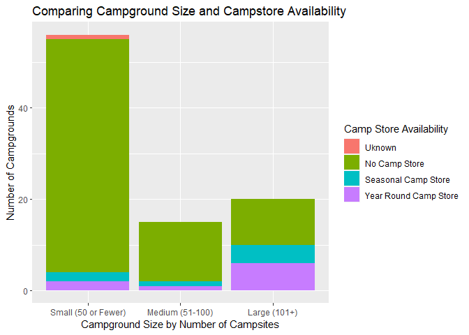
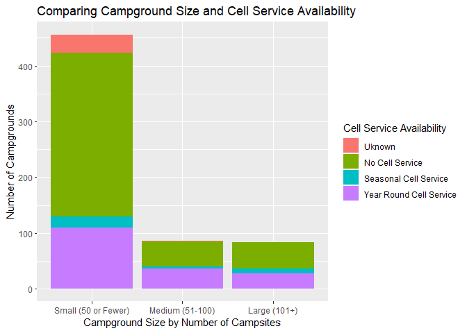
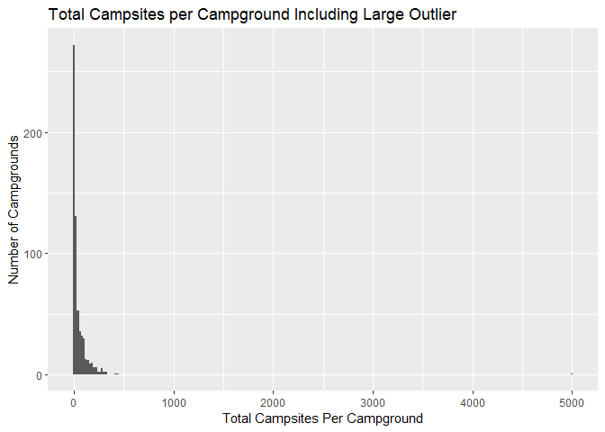
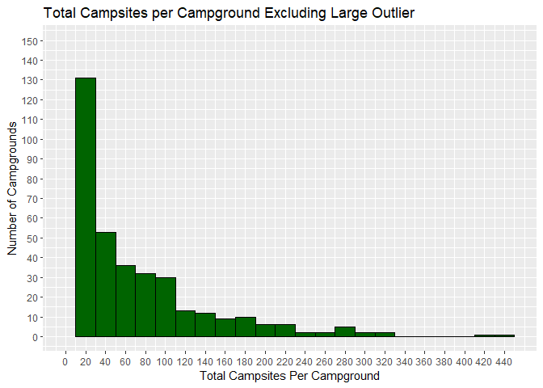
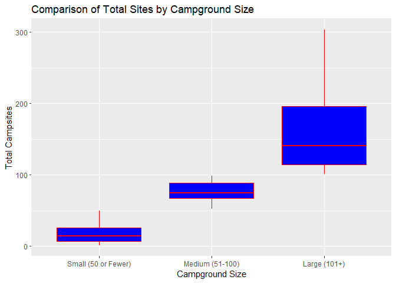
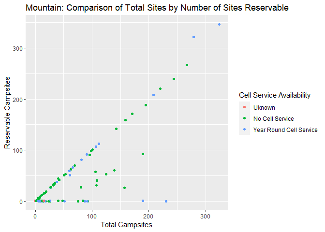
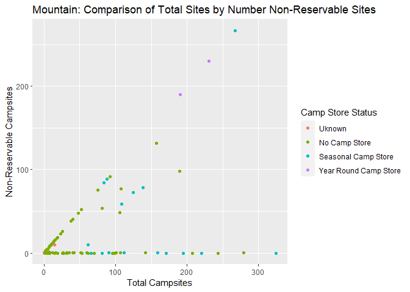

National Parks API Vignette
================
Kelley Breeze and Zhiyuan Yang
2022-09-22

-   <a href="#lets-learn-how-to-use-apis"
    id="toc-lets-learn-how-to-use-apis">Let’s Learn How To Use APIs!</a>
    -   <a href="#requirements" id="toc-requirements">Requirements</a>
    -   <a href="#national-parks-service-api"
        id="toc-national-parks-service-api">National Parks Service API</a>
    -   <a href="#a-quick-note-about-api-keys-and-renviron"
        id="toc-a-quick-note-about-api-keys-and-renviron">A Quick Note About API
        Keys and <code>.Renviron</code></a>
    -   <a href="#writing-functions-to-contact-the-api"
        id="toc-writing-functions-to-contact-the-api">Writing Functions to
        Contact the API</a>
        -   <a
            href="#learning-how-to-create-a-function-to-contact-and-return-data-from-an-api"
            id="toc-learning-how-to-create-a-function-to-contact-and-return-data-from-an-api">Learning
            How to Create a Function to Contact and Return Data From an API</a>
        -   <a href="#getstate-helper-function"
            id="toc-getstate-helper-function"><code>getState</code> Helper
            Function</a>
        -   <a href="#contacting-the-parks-endpoint-and-allowing-for-modifications"
            id="toc-contacting-the-parks-endpoint-and-allowing-for-modifications">Contacting
            the <code>parks</code> Endpoint and Allowing for Modifications</a>
        -   <a href="#contacting-the-events-endpoint-and-allowing-for-modifications"
            id="toc-contacting-the-events-endpoint-and-allowing-for-modifications">Contacting
            the <code>events</code> Endpoint and Allowing for Modifications</a>
        -   <a
            href="#contacting-the-thingstodo-endpoint-and-allowing-for-modifications"
            id="toc-contacting-the-thingstodo-endpoint-and-allowing-for-modifications">Contacting
            the <code>thingstodo</code> Endpoint and Allowing for Modifications</a>
        -   <a
            href="#contacting-the-campgrounds-endpoint-and-allowing-for-modifications"
            id="toc-contacting-the-campgrounds-endpoint-and-allowing-for-modifications">Contacting
            the <code>campgrounds</code> Endpoint and Allowing for Modifications</a>
    -   <a href="#data-exploration" id="toc-data-exploration">Data
        Exploration</a>
    -   <a href="#creating-new-variables-as-a-function-of-other-variables"
        id="toc-creating-new-variables-as-a-function-of-other-variables">Creating
        New Variables as a Function of Other Variables</a>
        -   <a href="#creating-variables-with-the-cleaningdata-funtion"
            id="toc-creating-variables-with-the-cleaningdata-funtion">Creating
            Variables with the <code>cleaningData</code> Funtion</a>
        -   <a href="#getcleancampground-wrapper-function"
            id="toc-getcleancampground-wrapper-function"><code>getCleanCampground()</code>
            Wrapper Function</a>
        -   <a
            href="#pulling-data-from-the-api-using-our-data-obtaining-function-getcleancampground"
            id="toc-pulling-data-from-the-api-using-our-data-obtaining-function-getcleancampground">Pulling
            Data From the API Using Our Data Obtaining Function
            <code>getCleanCampground()</code></a>
    -   <a href="#numerical-summaries" id="toc-numerical-summaries">Numerical
        Summaries</a>
        -   <a
            href="#creating-numerical-summaries-for-quantivative-variables-at-each-setting-of-a-categorical-variable"
            id="toc-creating-numerical-summaries-for-quantivative-variables-at-each-setting-of-a-categorical-variable">Creating
            Numerical Summaries for Quantivative Variables at Each Setting of a
            Categorical Variable</a>
        -   <a href="#contingency-tables" id="toc-contingency-tables">Contingency
            Tables</a>
    -   <a href="#data-visualization-with-ggplot2"
        id="toc-data-visualization-with-ggplot2">Data Visualization with
        <code>ggplot2</code></a>
        -   <a href="#creating-bar-plots" id="toc-creating-bar-plots">Creating Bar
            Plots</a>
        -   <a href="#creating-a-histogram" id="toc-creating-a-histogram">Creating a
            Histogram</a>
        -   <a href="#creating-a-boxplot" id="toc-creating-a-boxplot">Creating a
            Boxplot</a>
        -   <a href="#creating-scatterplots" id="toc-creating-scatterplots">Creating
            Scatterplots</a>

# Let’s Learn How To Use APIs!

This vignette is dedicated to helping better understand APIs.
Specifically, we will be looking at how to contact an API using
user-generated functions to query, parse and return well structured
data. The second portion of this vignette will look at how to use
functions to do some exploratory data analysis on the data obtained from
the API.

## Requirements

In order to follow along with this vignette, the user will need to load
the following packages using the `library()` function.

1.  The `jsonlite` package - The `jsonlite` package will allow us to
    contact the API via URL and help to parse the data returned from our
    API. The National Parks API only returns data in the form of JSON
    files, so the `jsonlite` package will work nicely with this API. If
    you are working with another API it will be important to understand
    what type of data the API will return and identify the appropriate
    package to parse your raw data that your API returns.  
2.  The `tidyverse` package - The `tidyverse` package will allow us to
    perform basic exploratory data analysis.  
3.  The `stringr` package will help with error handling for our state
    names/abbreviations. We can use this to work with strings provided
    by the user to the state argument to help identify and reformat user
    provided information.

In addition to the libraries listed above the user will need to create
their own `.Renviron` file to store their private API Key to protect it
from accidentally being shared publicly on github. You will want to make
sure that you add `.Renviron` to your `.gitignore` file so that it will
not be committed to github. Within the `.Renviron` file you can store
your API key using the following line of code: `apiKey="YourNPSAPIKey"`.
More detail on API keys and the `.Renviron` file can be found below in
the **Quick Note About API Keys and `.Renviron`** section.

``` r
library(jsonlite)
library(tidyverse)
library(stringr)
```

## National Parks Service API

**Background Information on the National Parks Service API**

For this vignette we are using the [National Parks Service’s
API](https://www.nps.gov/subjects/developer/api-documentation.htm). This
API is designed to provide data about US National Parks and their
facilities, events, news, alerts, activities, and much more. With over
20 different endpoints, this API provides a wide array of different
types of data that one might be interested in working with when trying
to learn about how to interact with and use APIs in R. Users do need an
API key (provided for free if you register) to use the National Parks
API. It returns data JSON format only.

## A Quick Note About API Keys and `.Renviron`

Most APIs will require a user to enter an API key when contacting the
API. An API key is unique to each user. For some APIs these are provided
free and are able to be used for essentially unlimited calls to an API.
In other cases, a user may be limited in the number of calls allowed to
an API or may even be charged for access to the APIs data. In any case,
you **SHOULD ALWAYS KEEP YOUR API KEY PRIVATE!** The easiest way to do
this when working on a project in Rstudio/github is to create a
`.Renviron` file in your working directory for your project that stores
your API key. You can then update your `.gitignore` to include your
`.Renviron` file, thereby allowing you to access your API key for use
during calls to the API, while at the same time keeping your API key
secret and preventing the key from being uploaded to github. You can add
files directly to your `.gitignore` file or you can use menu options in
RStudio.

<center>


</center>

You can also store other useful objects in `.Reviron`, such as a
baseURL, that you can then access for use in different functions that
you create to contact your API. This prevents having to rewrite the same
baseURL over and over again, and can also allow you to easily update
functions that use this baseURL if the API itself decides to change the
baseURL required.

## Writing Functions to Contact the API

We first need to write functions to contact the API an return
well-formatted, parsed data in the form of data frames. We will
demonstrate how to write functions that allow the user to customize
their query and return specific data. Additionally, we will show how to
tackle error handling and allow for a more flexible user interface that
allows the user to specify state by either the two letter state
abbreviation, or the full state name.

### Learning How to Create a Function to Contact and Return Data From an API

**NOTE: The purpose of the `getEndpointData()` function is to
demonstrate how one would go about constructing a function to contact a
user specified endpoint of an API and to return parsed data via the
`fromJSON` function of the `jsonlite` package. As this function is for
demonstration purposes only, we will not use it after this point in the
vignette.**

In order to contact an API a user must send a URL in the correct format
during the call to the API. You can find specifics for how your API
wants the URL request formatted by looking at the documentation for your
API. The `getEndpointData()` function provides an example of how we can
construct our `searchURL` from the user specified `endpoint`. Knowing
how to correctly format a URL from user input is the first step in
writing functions to work with APIs. Notice that within the
`getEndpointData()` function we are using `Sys.getenv()` to access our
`apiKey` and our `baseURL` that have been stored in our `.Renviron`
file. This protects the privacy of our API key and makes later changes
to our baseURL much easier to handle. In this example, the
`getEndpointData()` function demonstrates how to contact an API to
return initial data from an endpoint using the `fromJSON()` function
from the `jsonlite` package. This function will allow a user to specify
any endpoint from the National Parks Service API and return formatted
data from that endpoint. The `getEndpointData()` function will format
our request to the API with the specified endpoint, contact the API to
and return and parse the data into a more usable format.

``` r
getEndpointInfo<- function(endpoint){
  limit<- "50"
  apiKey<-Sys.getenv("apiKey")
  baseURL<-Sys.getenv("baseURL")
  searchURL<- paste0(baseURL, endpoint, "?","&", apiKey)
  #At this point we have built our URL query string given the user input of endpoint. If we were returning data from the activities endpoint the searchURL that the function is generating at this point looks like the code below:
  
  #https://developer.nps.gov/api/v1/activities?api_key=YOUR_API_KEY
  
  #We then use this URL to return the data we want from our API using the fromJSON function from the jsnolite package.
  endpointInfo<- fromJSON(searchURL)
  
  return(endpointInfo)
  }
```

Let’s see what the data looks like from the `getEndpointInfo()`
function. When we use the `str()` function to take a look at what our
function returns on our `actitivites` endpoint, we can see the it
returns a list of 4 elements containing our total results(`40`), the
limit of the number of results that would be returned (`50`), the start
of our results (`0`), and then our `data`. This shows that to access the
information that we need from this endpoint we need to specify to return
`activities$data` in our function. Lets revise our initial function so
that we are only returning the `data` element of our endpoint.

``` r
str(getEndpointInfo("activities"))
```

    ## List of 4
    ##  $ total: chr "40"
    ##  $ limit: chr "50"
    ##  $ start: chr "0"
    ##  $ data :'data.frame':   40 obs. of  2 variables:
    ##   ..$ id  : chr [1:40] "09DF0950-D319-4557-A57E-04CD2F63FF42" "13A57703-BB1A-41A2-94B8-53B692EB7238" "5F723BAD-7359-48FC-98FA-631592256E35" "7CE6E935-F839-4FEC-A63E-052B1DEF39D2" ...
    ##   ..$ name: chr [1:40] "Arts and Culture" "Astronomy" "Auto and ATV" "Biking" ...

\*\*Updated to return just our `data` element from our specified
endpoint.

``` r
getEndpointData<- function(endpoint){
  limit<- "50"
  apiKey<-Sys.getenv("apiKey")
  baseURL<-Sys.getenv("baseURL")
  searchURL<- paste0(baseURL, endpoint, "?", "&", apiKey)
  endpointData<- fromJSON(searchURL)
  
  return(endpointData$data)
  }
```

**Ok, now to look again to see what the new returned results look like
from our `getEndPointData` function.**

``` r
str(getEndpointData("activities"))
```

    ## 'data.frame':    40 obs. of  2 variables:
    ##  $ id  : chr  "09DF0950-D319-4557-A57E-04CD2F63FF42" "13A57703-BB1A-41A2-94B8-53B692EB7238" "5F723BAD-7359-48FC-98FA-631592256E35" "7CE6E935-F839-4FEC-A63E-052B1DEF39D2" ...
    ##  $ name: chr  "Arts and Culture" "Astronomy" "Auto and ATV" "Biking" ...

We can see that the updated function will return a dataframe object from
the `activities` endpoint with 40 observations on two variables, in this
case the activity `id` and the activity `name`. We have successfully
returned only the `data` portion from the `actitivites` endpoint. This
is what we will want to work with from our endpoints when we move on to
the data exploration and analysis steps. Again, the `getEndpointInfo()`
and `getEndpointData()` functions written here are simply to demonstrate
how you would want to construct a simple call to an API. We will not be
using these specific functions going forward in the vignette, although
the `getEndpointData()` function was very convenient for quickly looking
through the types of information found at each endpoint and allowing us
to narrow down which endpoints might be good to use for our data
exploration and analysis steps.

### `getState` Helper Function

The `getState` helper function will allow us to handle different types
of inputs for our state value, including a two state abbreviation or a
state name that are both not case sensitive. We want to allow a user to
specify state using either a two letter state code or the full state
name (not case sensitive). If no state is specified the `getState`
function will return a `NULL` value for `retState`, which will be
important when we use this helper function in future calls to the
National Parks API. In a call to the National Parks API, a `NULL` value
for the state argument will return information on all states. The
`getState` function will return an error message if a user did not
specify a valid value for a state, and provide information about correct
formatting for the state argument.

``` r
getState <- function(state) {
  if(is.null(state)) {
    return(NULL)
  }
  
  retState <-NULL
  
  # State is a state name, find abbreviation.
  if(str_to_title(state) %in% state.name) {
    # Match state code with state name using state.abb and state.name built in to R.
    retState <- state.abb[match(str_to_title(state),state.name)]
  } else if(toupper(state) %in% state.abb) {
    retState <- toupper(state)
  } else {
    stop("ERROR: Value for state argument was not a valid US state name or state two letter abbreiation. Try again. For example, NC or North Carolina will return campsites in North Carolina. NOTE: state argument is NOT case sensitive!")
  }
}
```

### Contacting the `parks` Endpoint and Allowing for Modifications

The `parks` endpoint on the National Parks API returns information about
the national parks including addresses, contacts, hours of operation,
websites, activities and more. The `getParksInfo` function contacts the
`parks` endpoint and allows the user to enter up to three modifications
of that endpoint. The modifications available for the `parks` endpoint
allow a user to specify the state returned (`state`), specify the number
of results returned (`limit`), and to enter a search term to apply (such
as hiking or mountains) that will return data from the API that match
the `searchTerm` entered. The default value for the `state` modification
is `NULL`, which will result in data from all states being returned. The
default value for the `limit` modification is `30`, which will limit the
results returned to 30. The default value for the `searchTerm`
modification is `NULL`, and will return results from the `parks`
endpoint without limiting by a `searchTerm`. Note that we are using the
`getState()` function to ensure that the state value entered is a valid
value and to return an error if a non-state is entered. We are also
relying on our `.Renviron` file to retrieve our `baseURL` and our
`apiKey`.

``` r
getParksInfo <- function(state=NULL, limit=30, searchTerm=NULL) {
  searchURL <- paste0(Sys.getenv("baseURL"), "parks?", Sys.getenv("apiKey"), "&")

  searchState <- getState(state)
  
  if(!is.null(searchState)) {
    searchURL <- paste0(searchURL, "stateCode=", searchState, "&")
  }
  
  searchURL <- paste0(searchURL, "limit=", limit, "&")
  
  if(!is.null(searchTerm)){
    searchURL<- paste0(searchURL, "q=", searchTerm)
  }

  parks<- fromJSON(searchURL)
  
  return(parks$data)
}
```

#### Testing `getParksInfo()` Function with Different Modifications

**Using `getParksInfo()` with the default values for `state`, `limit`,
and `searchTerm`.**

``` r
getParksDefault<- getParksInfo()

head(getParksDefault)
```

<div data-pagedtable="false">

<script data-pagedtable-source type="application/json">
{"columns":[{"label":[""],"name":["_rn_"],"type":[""],"align":["left"]},{"label":["id"],"name":[1],"type":["chr"],"align":["left"]},{"label":["url"],"name":[2],"type":["chr"],"align":["left"]},{"label":["fullName"],"name":[3],"type":["chr"],"align":["left"]},{"label":["parkCode"],"name":[4],"type":["chr"],"align":["left"]},{"label":["description"],"name":[5],"type":["chr"],"align":["left"]},{"label":["latitude"],"name":[6],"type":["chr"],"align":["left"]},{"label":["longitude"],"name":[7],"type":["chr"],"align":["left"]},{"label":["latLong"],"name":[8],"type":["chr"],"align":["left"]},{"label":["activities"],"name":[9],"type":["list"],"align":["right"]},{"label":["topics"],"name":[10],"type":["list"],"align":["right"]},{"label":["states"],"name":[11],"type":["chr"],"align":["left"]},{"label":["contacts"],"name":[12],"type":["df[,2]"],"align":["right"]},{"label":["entranceFees"],"name":[13],"type":["list"],"align":["right"]},{"label":["entrancePasses"],"name":[14],"type":["list"],"align":["right"]},{"label":["fees"],"name":[15],"type":["list"],"align":["right"]},{"label":["directionsInfo"],"name":[16],"type":["chr"],"align":["left"]},{"label":["directionsUrl"],"name":[17],"type":["chr"],"align":["left"]},{"label":["operatingHours"],"name":[18],"type":["list"],"align":["right"]},{"label":["addresses"],"name":[19],"type":["list"],"align":["right"]},{"label":["images"],"name":[20],"type":["list"],"align":["right"]},{"label":["weatherInfo"],"name":[21],"type":["chr"],"align":["left"]},{"label":["name"],"name":[22],"type":["chr"],"align":["left"]},{"label":["designation"],"name":[23],"type":["chr"],"align":["left"]}],"data":[{"1":"77E0D7F0-1942-494A-ACE2-9004D2BDC59E","2":"https://www.nps.gov/abli/index.htm","3":"Abraham Lincoln Birthplace National Historical Park","4":"abli","5":"For over a century people from around the world have come to rural Central Kentucky to honor the humble beginnings of our 16th president, Abraham Lincoln. His early life on Kentucky's frontier shaped his character and prepared him to lead the nation through Civil War. Visit our country's first memorial to Lincoln, built with donations from young and old, and the site of his childhood home.","6":"37.5858662","7":"-85.67330523","8":"lat:37.5858662, long:-85.67330523","9":"<df[,2] [14 × 2]>","10":"<df[,2] [9 × 2]>","11":"KY","12":"<df[,2] [6 × 2]>","13":"<df[,3] [1 × 3]>","14":"<df[,0] [0 × 0]>","15":"<list [0]>","16":"The Birthplace Unit of the park is located approximately 2 miles south of the town of Hodgenville on U.S. Highway 31E South. The Boyhood Home Unit at Knob Creek is located approximately 10 miles northeast of the Birthplace Unit of the park.","17":"http://www.nps.gov/abli/planyourvisit/directions.htm","18":"<df[,4] [2 × 4]>","19":"<df[,7] [2 × 7]>","20":"<df[,5] [4 × 5]>","21":"There are four distinct seasons in Central Kentucky. However, temperature and weather conditions can vary widely within those seasons. Spring and Fall are generally pleasant with frequent rain showers. Summer is usually hot and humid. Winter is moderately cold with mixed precipitation.","22":"Abraham Lincoln Birthplace","23":"National Historical Park","_rn_":"1"},{"1":"6DA17C86-088E-4B4D-B862-7C1BD5CF236B","2":"https://www.nps.gov/acad/index.htm","3":"Acadia National Park","4":"acad","5":"Acadia National Park protects the natural beauty of the highest rocky headlands along the Atlantic coastline of the United States, an abundance of habitats, and a rich cultural heritage. At 4 million visits a year, it's one of the top 10 most-visited national parks in the United States. Visitors enjoy 27 miles of historic motor roads, 158 miles of hiking trails, and 45 miles of carriage roads.","6":"44.409286","7":"-68.247501","8":"lat:44.409286, long:-68.247501","9":"<df[,2] [46 × 2]>","10":"<df[,2] [31 × 2]>","11":"ME","12":"<df[,2] [6 × 2]>","13":"<df[,3] [3 × 3]>","14":"<df[,3] [1 × 3]>","15":"<list [0]>","16":"From Boston take I-95 north to Augusta, Maine, then Route 3 east to Ellsworth, and on to Mount Desert Island. For an alternate route, continue on I-95 north to Bangor, Maine, then take I-395 to U.S. Route 1A east to Ellsworth. In Ellsworth, take Route 3 to Mount Desert Island.","17":"http://www.nps.gov/acad/planyourvisit/directions.htm","18":"<df[,4] [1 × 4]>","19":"<df[,7] [2 × 7]>","20":"<df[,5] [4 × 5]>","21":"Located on Mount Desert Island in Maine, Acadia experiences all four seasons. Summer temperatures range from 45-90F (7-30C). Fall temperatures range from 30-70F (-1-21C). Typically the first frost is in mid-October and first snowfall begins in November and can continue through April with an average accumulation of 73 inches (185 cm). Winter temperatures range from 14-35F (-10 - 2C). Spring temperatures range from 30-70F (-1-21C).","22":"Acadia","23":"National Park","_rn_":"2"},{"1":"E4C7784E-66A0-4D44-87D0-3E072F5FEF43","2":"https://www.nps.gov/adam/index.htm","3":"Adams National Historical Park","4":"adam","5":"From the sweet little farm at the foot of Penn’s Hill to the gentleman’s country estate at Peace field, Adams National Historical Park is the story of “heroes, statesman, philosophers … and learned women” whose ideas and actions helped to transform thirteen disparate colonies into one united nation.","6":"42.2553961","7":"-71.01160356","8":"lat:42.2553961, long:-71.01160356","9":"<df[,2] [6 × 2]>","10":"<df[,2] [2 × 2]>","11":"MA","12":"<df[,2] [6 × 2]>","13":"<df[,3] [1 × 3]>","14":"<df[,0] [0 × 0]>","15":"<list [0]>","16":"Traveling on U.S. Interstate 93, take exit 7 - Route 3 South to Braintree and Cape Cod. Take the first exit off Route 3 south - exit 42 - and follow signs toward Quincy Center. Continue straight on Burgin Parkway through six traffic lights. At the seventh traffic light, turn right onto Dimmock Street. Follow Dimmock Street one block and turn right onto Hancock Street. The National Park Service Visitor Center, located at 1250 Hancock Street on your left. Validated parking is in the garage to the rear.","17":"http://www.nps.gov/adam/planyourvisit/directions.htm","18":"<df[,4] [1 × 4]>","19":"<df[,7] [2 × 7]>","20":"<df[,5] [8 × 5]>","21":"Be prepared for hot, humid weather. The historic homes are not air conditioned. While the visitor center remains open all year, the historic homes are closed from November 1 through April 30.","22":"Adams","23":"National Historical Park","_rn_":"3"},{"1":"1A47416F-DAA3-4137-9F30-14AF86B4E547","2":"https://www.nps.gov/afam/index.htm","3":"African American Civil War Memorial","4":"afam","5":"Over 200,000 African-American soldiers and sailors served in the U.S. Army and Navy during the Civil War. Their service helped to end the war and free over four million slaves. The African American Civil War Memorial honors their service and sacrifice.","6":"38.9166","7":"-77.026","8":"lat:38.9166, long:-77.026","9":"<df[,2] [2 × 2]>","10":"<df[,2] [4 × 2]>","11":"DC","12":"<df[,2] [6 × 2]>","13":"<df[,3] [1 × 3]>","14":"<df[,3] [1 × 3]>","15":"<list [0]>","16":"The memorial is located at the corner of Vermont Avenue, 10th St, and U Street NW, near the U Street/African-American Civil War Memorial/Cardozo Metro Station.","17":"http://www.nps.gov/afam/planyourvisit/directions.htm","18":"<df[,4] [1 × 4]>","19":"<df[,7] [2 × 7]>","20":"<df[,5] [5 × 5]>","21":"Washington DC gets to see all four seasons. Humidity will make the temps feel hotter in summer and colder in winter. Spring (March - May) Temp: Average high is 65.5 degrees with a low of 46.5 degrees Summer (June - August) Temp: Average high is 86 degrees with a low of 68.5 degrees Fall (September - November) Temp: Average high is 68 degrees with a low of 51.5 degrees Winter (December - February) Temp: Average high is 45 degrees with a low of 30 degrees (Source: www.usclimatedata.com)","22":"African American Civil War Memorial","23":"","_rn_":"4"},{"1":"E6E1D22A-7A89-47F8-813C-B611059A8CF9","2":"https://www.nps.gov/afbg/index.htm","3":"African Burial Ground National Monument","4":"afbg","5":"African Burial Ground is the oldest and largest known excavated burial ground in North America for both free and enslaved Africans. It protects the historic role slavery played in building New York","6":"40.71452681","7":"-74.00447358","8":"lat:40.71452681, long:-74.00447358","9":"<df[,2] [7 × 2]>","10":"<df[,2] [9 × 2]>","11":"NY","12":"<df[,2] [6 × 2]>","13":"<df[,3] [1 × 3]>","14":"<df[,3] [1 × 3]>","15":"<list [0]>","16":"The African Burial Ground National Monument is located on the first floor of the Ted Weiss Federal Building located at 290 Broadway in Lower Manhattan; close to Foley Square and just north of City Hall. Our visitor center is located mid-block on Broadway between the cross streets of Duane Street and Reade Streets.","17":"http://www.nps.gov/afbg/planyourvisit/directions.htm","18":"<df[,4] [2 × 4]>","19":"<df[,7] [2 × 7]>","20":"<df[,5] [5 × 5]>","21":"http://forecast.weather.gov/MapClick.php?CityName=New+York&state=NY&site=OKX&lat=40.7198&lon=-73.993#.Vqj8OvkrJlZ","22":"African Burial Ground","23":"National Monument","_rn_":"5"},{"1":"64B9F127-31ED-43C9-882D-D7CD471AF314","2":"https://www.nps.gov/agfo/index.htm","3":"Agate Fossil Beds National Monument","4":"agfo","5":"In the early 1900s, paleontologists unearthed the Age of Mammals when they found full skeletons of extinct Miocene mammals in the hills of Nebraska -- species previously only known through fragments. At the same time, an age of friendship began between rancher James Cook and Chief Red Cloud of the Lakota. These two unprecedented events are preserved and protected here... at Agate Fossil Beds.","6":"42.42170419","7":"-103.753886","8":"lat:42.42170419, long:-103.753886","9":"<df[,2] [16 × 2]>","10":"<df[,2] [16 × 2]>","11":"NE","12":"<df[,2] [6 × 2]>","13":"<df[,3] [1 × 3]>","14":"<df[,0] [0 × 0]>","15":"<list [0]>","16":"From US 20: 22 miles south of Harrison, NE on State Hwy 29, then three miles east on River Road (paved) From US 26: 34 miles north of Mitchell, NE on State Hwy 29, then three miles east on River Road (paved). From State Hwy 71: 25 miles west on the unpaved portion of River Road.","17":"http://www.nps.gov/agfo/planyourvisit/directions.htm","18":"<df[,4] [2 × 4]>","19":"<df[,7] [2 × 7]>","20":"<df[,5] [5 × 5]>","21":"Summers can be very warm, high 90's to 100 with the frequent afternoon thunderstorms. Plan to hike early and come down from the higher points if storms threaten. Winter temperatures can dip as low as -20 with snow and wind. Heaviest snows can be expected in late Spring.","22":"Agate Fossil Beds","23":"National Monument","_rn_":"6"}],"options":{"columns":{"min":{},"max":[10]},"rows":{"min":[10],"max":[10]},"pages":{}}}
  </script>

</div>

**Using `getParksInfo()` with the default values for `state`, `limit`,
and specifying `searchTerm="redwoods"`.**

``` r
getParksRedwoods<-getParksInfo(searchTerm = "redwoods")

getParksRedwoods
```

<div data-pagedtable="false">

<script data-pagedtable-source type="application/json">
{"columns":[{"label":[""],"name":["_rn_"],"type":[""],"align":["left"]},{"label":["id"],"name":[1],"type":["chr"],"align":["left"]},{"label":["url"],"name":[2],"type":["chr"],"align":["left"]},{"label":["fullName"],"name":[3],"type":["chr"],"align":["left"]},{"label":["parkCode"],"name":[4],"type":["chr"],"align":["left"]},{"label":["description"],"name":[5],"type":["chr"],"align":["left"]},{"label":["latitude"],"name":[6],"type":["chr"],"align":["left"]},{"label":["longitude"],"name":[7],"type":["chr"],"align":["left"]},{"label":["latLong"],"name":[8],"type":["chr"],"align":["left"]},{"label":["activities"],"name":[9],"type":["list"],"align":["right"]},{"label":["topics"],"name":[10],"type":["list"],"align":["right"]},{"label":["states"],"name":[11],"type":["chr"],"align":["left"]},{"label":["contacts"],"name":[12],"type":["df[,2]"],"align":["right"]},{"label":["entranceFees"],"name":[13],"type":["list"],"align":["right"]},{"label":["entrancePasses"],"name":[14],"type":["list"],"align":["right"]},{"label":["fees"],"name":[15],"type":["list"],"align":["right"]},{"label":["directionsInfo"],"name":[16],"type":["chr"],"align":["left"]},{"label":["directionsUrl"],"name":[17],"type":["chr"],"align":["left"]},{"label":["operatingHours"],"name":[18],"type":["list"],"align":["right"]},{"label":["addresses"],"name":[19],"type":["list"],"align":["right"]},{"label":["images"],"name":[20],"type":["list"],"align":["right"]},{"label":["weatherInfo"],"name":[21],"type":["chr"],"align":["left"]},{"label":["name"],"name":[22],"type":["chr"],"align":["left"]},{"label":["designation"],"name":[23],"type":["chr"],"align":["left"]}],"data":[{"1":"126A6227-E39F-44F4-A279-B1EA257CBCDA","2":"https://www.nps.gov/muwo/index.htm","3":"Muir Woods National Monument","4":"muwo","5":"Walk among old growth coast redwoods, cooling their roots in the fresh water of Redwood Creek and lifting their crowns to reach the sun and fog. Federally protected as a National Monument since 1908, this primeval forest is both refuge and laboratory, revealing our relationship with the living landscape. What will you discover in Muir Woods?","6":"37.89658027","7":"-122.5808047","8":"lat:37.89658027, long:-122.5808047","9":"<df[,2] [9 × 2]>","10":"<df[,2] [9 × 2]>","11":"CA","12":"<df[,2] [2 × 2]>","13":"<df[,3] [2 × 3]>","14":"<df[,3] [1 × 3]>","15":"<list [0]>","16":"From San Francisco: Muir Woods is located 11 miles north of the Golden Gate Bridge. Take Hwy 101 North --> Mill Valley/Highway 1/ Stinson Beach Exit --> Follow the signs to Hwy 1 --> Follow the signs to Muir Woods From the East Bay: Take Hwy 580/Richmond/San Rafael Bridge West --> Hwy 101 South --> Take the Stinson Beach/Mill Valley Exit --> Follow the signs to Highway 1 --> Follow the signs to Muir Woods Vehicles over 35 feet long are prohibited. RVs under 35' need an oversized parking spot.","17":"http://www.nps.gov/muwo/planyourvisit/directions.htm","18":"<df[,4] [1 × 4]>","19":"<df[,7] [2 × 7]>","20":"<df[,5] [8 × 5]>","21":"The coast redwood forest is cool most times of the year with temperatures ranging from 40 - 70 F/ 4 - 21 C. From late October to early May expect rain. Summer months (June-August) can be warmer but it is generally cool and dry. Expect heavy fog in the morning, burning off in the afternoon. Some say fall (August-October) is the best weather of the year. But, don't let the weather stop you from having fun. If you're dressed for the elements and wearing sturdy shoes, you will enjoy your walk.","22":"Muir Woods","23":"National Monument","_rn_":"1"},{"1":"041B325C-A34F-4027-8E41-1DF3F9A1D799","2":"https://www.nps.gov/redw/index.htm","3":"Redwood National and State Parks","4":"redw","5":"Most people know Redwood as home to the tallest trees on Earth. But the Parks also protect vast prairies, oak woodlands, wild rivers, and 40 miles of rugged coastline. People have lived in this verdant landscape since time immemorial. Together, the National Park Service and California State Parks are managing and restoring these lands for the inspiration, enjoyment, and education of all.","6":"41.37237268","7":"-124.0318129","8":"lat:41.37237268, long:-124.0318129","9":"<df[,2] [24 × 2]>","10":"<df[,2] [43 × 2]>","11":"CA","12":"<df[,2] [2 × 2]>","13":"<df[,3] [3 × 3]>","14":"<df[,0] [0 × 0]>","15":"<list [0]>","16":"Redwood National and State Parks is located in northernmost coastal California - almost on the Oregon border. The parks are about 60-miles long, with four visitor centers from north to south. We are a six to seven-hour drive (325 miles) north of San Francisco, a six-hour drive (330 miles) south of Portland, OR and a four-hour drive (170 miles) west of Redding, CA.","17":"http://www.nps.gov/redw/planyourvisit/directions.htm","18":"<df[,4] [1 × 4]>","19":"<df[,7] [2 × 7]>","20":"<df[,5] [30 × 5]>","21":"Visitors should be prepared for cooler and damp weather. Dress in layers and expect to get wet. Year-round temperatures along California's redwood coast: mid-40s°F (7°C) to mid-60s°F (18°C). Summer can be foggy, with highs occasionally reaching low 70s°F (20°C). Winters are cooler with considerable rain. October through April averages 60-80 inches of rain over the region.","22":"Redwood","23":"National and State Parks","_rn_":"2"}],"options":{"columns":{"min":{},"max":[10]},"rows":{"min":[10],"max":[10]},"pages":{}}}
  </script>

</div>

**Using `getParksInfo()` entering `"california"` for the `state` value,
`100` for the `limit`, and using the default value for the
`searchTerm`.**

``` r
getParksCA100<-getParksInfo(state = "california", limit = 100)

head(getParksCA100)
```

<div data-pagedtable="false">

<script data-pagedtable-source type="application/json">
{"columns":[{"label":[""],"name":["_rn_"],"type":[""],"align":["left"]},{"label":["id"],"name":[1],"type":["chr"],"align":["left"]},{"label":["url"],"name":[2],"type":["chr"],"align":["left"]},{"label":["fullName"],"name":[3],"type":["chr"],"align":["left"]},{"label":["parkCode"],"name":[4],"type":["chr"],"align":["left"]},{"label":["description"],"name":[5],"type":["chr"],"align":["left"]},{"label":["latitude"],"name":[6],"type":["chr"],"align":["left"]},{"label":["longitude"],"name":[7],"type":["chr"],"align":["left"]},{"label":["latLong"],"name":[8],"type":["chr"],"align":["left"]},{"label":["activities"],"name":[9],"type":["list"],"align":["right"]},{"label":["topics"],"name":[10],"type":["list"],"align":["right"]},{"label":["states"],"name":[11],"type":["chr"],"align":["left"]},{"label":["contacts"],"name":[12],"type":["df[,2]"],"align":["right"]},{"label":["entranceFees"],"name":[13],"type":["list"],"align":["right"]},{"label":["entrancePasses"],"name":[14],"type":["list"],"align":["right"]},{"label":["fees"],"name":[15],"type":["list"],"align":["right"]},{"label":["directionsInfo"],"name":[16],"type":["chr"],"align":["left"]},{"label":["directionsUrl"],"name":[17],"type":["chr"],"align":["left"]},{"label":["operatingHours"],"name":[18],"type":["list"],"align":["right"]},{"label":["addresses"],"name":[19],"type":["list"],"align":["right"]},{"label":["images"],"name":[20],"type":["list"],"align":["right"]},{"label":["weatherInfo"],"name":[21],"type":["chr"],"align":["left"]},{"label":["name"],"name":[22],"type":["chr"],"align":["left"]},{"label":["designation"],"name":[23],"type":["chr"],"align":["left"]}],"data":[{"1":"C08AD828-98FF-478E-A63C-614E7534274B","2":"https://www.nps.gov/alca/index.htm","3":"Alcatraz Island","4":"alca","5":"Alcatraz reveals stories of American incarceration, justice, and our common humanity. This small island was once a fort, a military prison, and a maximum security federal penitentiary. In 1969, the Indians of All Tribes occupied Alcatraz for 19 months in the name of freedom and Native American civil rights. We invite you to explore Alcatraz's complex history and natural beauty.","6":"37.82676234","7":"-122.4230206","8":"lat:37.82676234, long:-122.4230206","9":"<df[,2] [5 × 2]>","10":"<df[,2] [17 × 2]>","11":"CA","12":"<df[,2] [6 × 2]>","13":"<df[,3] [3 × 3]>","14":"<df[,0] [0 × 0]>","15":"<list [0]>","16":"The Alcatraz Ferry Terminal is located on The Embarcadero near the intersection of Bay Street at Pier 33.","17":"http://home.nps.gov/alca/planyourvisit/directions.htm","18":"<df[,4] [1 × 4]>","19":"<df[,7] [2 × 7]>","20":"<df[,5] [5 × 5]>","21":"The climate on Alcatraz is unpredictable and can change suddenly. Cold, foggy mornings may give way to sunny afternoons, which in turn can shift quickly back to more fog and blustery winds. The most pleasant weather usually occurs in spring and fall. Summers tend to be cool and foggy, winter is our rainy season. Temperatures on Alcatraz seldom rise above 75°F (24°C) or fall below 38°","22":"Alcatraz Island","23":"","_rn_":"1"},{"1":"2DB09FB7-0408-44C9-8083-8F50039BD6DA","2":"https://www.nps.gov/cabr/index.htm","3":"Cabrillo National Monument","4":"cabr","5":"Climbing out of his boat and onto shore in 1542, Juan Rodriguez Cabrillo stepped into history as the first European to set foot on what is now the West Coast of the United States. In addition to telling the story of 16th century exploration, the park is home to a wealth of cultural and natural resources. Join us and embark on your own Voyage of Exploration.","6":"32.6722503","7":"-117.2415985","8":"lat:32.6722503, long:-117.2415985","9":"<df[,2] [15 × 2]>","10":"<df[,2] [15 × 2]>","11":"CA","12":"<df[,2] [6 × 2]>","13":"<df[,3] [6 × 3]>","14":"<df[,3] [1 × 3]>","15":"<list [0]>","16":"FROM DOWNTOWN SAN DIEGO Take Harbor Drive past the airport Turn left onto Rosecrans Street Turn right onto Canon Street Turn left onto Catalina Blvd. (also known as Cabrillo Memorial Drive) Follow Catalina Blvd. all the way to the end","17":"http://www.nps.gov/cabr/planyourvisit/directionstocabr.htm","18":"<df[,4] [1 × 4]>","19":"<df[,7] [2 × 7]>","20":"<df[,5] [6 × 5]>","21":"Check the current weather from the National Weather Service at https://www.weather.gov/. San Diego's climate is characterized by warm, dry summers and mild winters, with most of the annual precipitation falling between December and March. The city has a mild climate year-round, with an average of 201 days above 70 °F (21 °C) and low rainfall (9–13 inches [230–330 mm] annually).","22":"Cabrillo","23":"National Monument","_rn_":"2"},{"1":"B39C368F-CB27-49EC-B2A9-E6C1552430FB","2":"https://www.nps.gov/cali/index.htm","3":"California National Historic Trail","4":"cali","5":"Follow in the footsteps of over 250,000 emigrants who traveled to the gold fields and rich farmlands of California during the 1840s and 1850s: the greatest mass migration in American history. The California National Historic Trail is over 5,000 miles long and covers portions of 10 states. Step into history along more than 1,000 miles of ruts and traces from travelers and their overland wagons.","6":"42.3999643979","7":"-108.702415369","8":"lat:42.3999643979, long:-108.702415369","9":"<df[,2] [8 × 2]>","10":"<df[,2] [16 × 2]>","11":"CA,CO,ID,KS,MO,NE,NV,OR,UT,WY","12":"<df[,2] [6 × 2]>","13":"<df[,3] [1 × 3]>","14":"<df[,0] [0 × 0]>","15":"<list [0]>","16":"Those portions of the California National Historic Trail authorized by Congress include nearly 2,000 miles of historic trail that was once the primary \"road\" taken by farmers, enterprising business managers, gold-seekers, and fortune hunters who chose to make a new life on the California frontier. The route passes through ten states from Missouri to California.","17":"http://www.nps.gov/cali/planyourvisit/directions.htm","18":"<df[,4] [1 × 4]>","19":"<df[,7] [2 × 7]>","20":"<df[,5] [5 × 5]>","21":"Due to the length of the California National Historic Trail, be sure to consult local weather sources for the region you'll be visiting. Check out the forecast with the National Weather Service and search for the area you'd like to visit: weather.gov","22":"California","23":"National Historic Trail","_rn_":"3"},{"1":"872417E6-2F91-4FDA-89A7-865B51B22332","2":"https://www.nps.gov/camo/index.htm","3":"Castle Mountains National Monument","4":"camo","5":"Castle Mountains represents some of the most unique elements of the Mojave Desert. Nestled between the Nevada state line and Mojave National Preserve, the nearly 21,000 acres of Castle Mountains boasts Joshua tree forests, unbroken natural landscapes, rare desert grasslands, and rich human history. This intriguing area provides serenity and solitude from nearby metropolitan areas.","6":"35.29156348","7":"-115.0935606","8":"lat:35.29156348, long:-115.0935606","9":"<df[,2] [4 × 2]>","10":"<df[,2] [14 × 2]>","11":"CA","12":"<df[,2] [6 × 2]>","13":"<df[,3] [1 × 3]>","14":"<df[,3] [1 × 3]>","15":"<list [0]>","16":"You can approach Castle Mountains from Walking Box Ranch Road off of Nevada State Rd 164 (Nipton Road) or from several unnamed dirt roads off of Lanfair Road in Mojave National Preserve.","17":"http://www.nps.gov/camo/planyourvisit/directions.htm","18":"<df[,4] [1 × 4]>","19":"<df[,7] [2 × 7]>","20":"<df[,5] [2 × 5]>","21":"Weather at Castle Mountains changes with the seasons. Freezing temperatures are expected in winter, with occasional snow. Spring brings mild warm days and cooler nights. With enough rain, wildflowers can carpet the area, making for spectacular displays. Summer months are much hotter, with temperatures nearing 100 degrees Fahrenheit. Strong monsoonal storms in late summer may cause flash-flooding in low-lying areas and can create hazardous road conditions. Fall is a cooler respite after the heat of summer.","22":"Castle Mountains","23":"National Monument","_rn_":"4"},{"1":"5595FC7A-F218-4439-8D2E-F47449838820","2":"https://www.nps.gov/chis/index.htm","3":"Channel Islands National Park","4":"chis","5":"Channel Islands National Park encompasses five remarkable islands and their ocean environment, preserving and protecting a wealth of natural and cultural resources. Isolation over thousands of years has created unique animals, plants, and archeological resources found nowhere else on Earth and helped preserve a place where visitors can experience coastal southern California as it once was.","6":"33.98680093","7":"-119.9112735","8":"lat:33.98680093, long:-119.9112735","9":"<df[,2] [39 × 2]>","10":"<df[,2] [48 × 2]>","11":"CA","12":"<df[,2] [6 × 2]>","13":"<df[,3] [1 × 3]>","14":"<df[,0] [0 × 0]>","15":"<list [0]>","16":"While the mainland visitor center in Ventura is readily accessible by car or public transportation, the islands are only accessible by park concessionaire boats and planes or private boat. Advanced planning is highly recommended.","17":"http://www.nps.gov/chis/planyourvisit/directions.htm","18":"<df[,4] [1 × 4]>","19":"<df[,7] [2 × 7]>","20":"<df[,5] [5 × 5]>","21":"In general, the islands have a Mediterranean climate year-round. Temperatures are relatively stable, with highs averaging in the mid-60s (°F) and lows in the low-50s. However, there are seasonal differences that visitors should take into consideration when visiting the park. In addition, visitors also should be aware that ocean and weather conditions vary considerably from day-to-day and island-to-island. For more information visit: http://www.nps.gov/chis/planyourvisit/weather.htm","22":"Channel Islands","23":"National Park","_rn_":"5"},{"1":"D1EAA1D1-E855-42FF-9D06-8E983413BDE5","2":"https://www.nps.gov/cech/index.htm","3":"César E. Chávez National Monument","4":"cech","5":"Yes, we can! Widely recognized as the most important Latino leader in the United States during the twentieth century, César E. Chávez led farm workers and supporters in the establishment of the country's first permanent agricultural union. His leadership brought sustained international attention to the plight of U.S. farm workers, and secured for them higher wages and safer working conditions","6":"35.22729389","7":"-118.5615781","8":"lat:35.22729389, long:-118.5615781","9":"<df[,2] [2 × 2]>","10":"<df[,2] [10 × 2]>","11":"CA","12":"<df[,2] [6 × 2]>","13":"<df[,3] [1 × 3]>","14":"<df[,0] [0 × 0]>","15":"<list [0]>","16":"The monument is located near the small town of Keene, California on Highway 58. From Highway 58, take exit 138 toward Keene, then turn right on Woodford-Tehachapi Road. César E. Chávez National Monument will be on your left.","17":"http://www.nps.gov/cech/planyourvisit/directions.htm","18":"<df[,4] [1 × 4]>","19":"<df[,7] [2 × 7]>","20":"<df[,5] [5 × 5]>","21":"The climate in this area is mild, with warm, dry summers and cool winters. Average temperatures in July, the warmest month, are in the mid-80s and hot days often reach into the 90s. In winter, frosty mornings are common and roads may be icy.","22":"César E. Chávez","23":"National Monument","_rn_":"6"}],"options":{"columns":{"min":{},"max":[10]},"rows":{"min":[10],"max":[10]},"pages":{}}}
  </script>

</div>

### Contacting the `events` Endpoint and Allowing for Modifications

``` r
getEvents <- function(state=NULL, pageSize=5, searchTerm=NULL) {
  searchURL <- paste0(Sys.getenv("baseURL"), "events?", Sys.getenv("apiKey"), "&")
  
  searchState <- getState(state)
  
  if(!is.null(searchState)) {
    searchURL <- paste0(searchURL, "stateCode=", searchState, "&")
  }
  
  searchURL <- paste0(searchURL, "pageSize=", pageSize, "&")
  
  if(!is.null(searchTerm)){
    searchURL<- paste0(searchURL, "q=", searchTerm)
  }
  
  events<- fromJSON(searchURL)
  
  return(events$data)
}
```

### Contacting the `thingstodo` Endpoint and Allowing for Modifications

The `thingstodo` endpoint has information on suggested things to do
recommended by and for specific national parks. The `getThingsToDo()`
function will allow the user up to three modifications on this endpoint.
The user can specify a state, specify the maximum number of results
returned, and also search the things to do by a specific term (for
example, families may want to search by “kids” to find things to do that
are recommended for kids).

``` r
getThingsToDo <- function(state=NULL, limit=60, searchTerm=NULL) {
  searchURL <- paste0(Sys.getenv("baseURL"), "thingstodo?", Sys.getenv("apiKey"), "&")
  
  searchState <- getState(state)
  
  if(!is.null(searchState)) {
    searchURL <- paste0(searchURL, "stateCode=", searchState, "&")
  }
  
  searchURL <- paste0(searchURL, "limit=", limit, "&")
  
  if(!is.null(searchTerm)){
    searchURL<- paste0(searchURL, "q=", searchTerm)
  }
  
  thingsToDo<- fromJSON(searchURL)
  
  return(thingsToDo$data)
}
```

Let’s see an example of what data will look like when returned from the
`thingstodo` endpoint with a couple of modifications using our function.
The modifications here will return up to 200 results that match our
`searchTerm` `"kids"`. Because we did not enter a state and instead
relied on the default `state` value, we will be returning data from all
states. The `searchTerm = "kids"` will return `141` results from our
API, we can see the first 6 that are returned below.

``` r
thingsToDoKids<- getThingsToDo(limit = 200, searchTerm = "kids")

head(thingsToDoKids)
```

<div data-pagedtable="false">

<script data-pagedtable-source type="application/json">
{"columns":[{"label":[""],"name":["_rn_"],"type":[""],"align":["left"]},{"label":["id"],"name":[1],"type":["chr"],"align":["left"]},{"label":["url"],"name":[2],"type":["chr"],"align":["left"]},{"label":["title"],"name":[3],"type":["chr"],"align":["left"]},{"label":["shortDescription"],"name":[4],"type":["chr"],"align":["left"]},{"label":["images"],"name":[5],"type":["list"],"align":["right"]},{"label":["relatedParks"],"name":[6],"type":["list"],"align":["right"]},{"label":["relatedOrganizations"],"name":[7],"type":["list"],"align":["right"]},{"label":["tags"],"name":[8],"type":["list"],"align":["right"]},{"label":["latitude"],"name":[9],"type":["chr"],"align":["left"]},{"label":["longitude"],"name":[10],"type":["chr"],"align":["left"]},{"label":["geometryPoiId"],"name":[11],"type":["chr"],"align":["left"]},{"label":["amenities"],"name":[12],"type":["list"],"align":["right"]},{"label":["location"],"name":[13],"type":["chr"],"align":["left"]},{"label":["seasonDescription"],"name":[14],"type":["chr"],"align":["left"]},{"label":["accessibilityInformation"],"name":[15],"type":["chr"],"align":["left"]},{"label":["isReservationRequired"],"name":[16],"type":["chr"],"align":["left"]},{"label":["ageDescription"],"name":[17],"type":["chr"],"align":["left"]},{"label":["petsDescription"],"name":[18],"type":["chr"],"align":["left"]},{"label":["timeOfDayDescription"],"name":[19],"type":["chr"],"align":["left"]},{"label":["feeDescription"],"name":[20],"type":["chr"],"align":["left"]},{"label":["age"],"name":[21],"type":["chr"],"align":["left"]},{"label":["arePetsPermittedWithRestrictions"],"name":[22],"type":["chr"],"align":["left"]},{"label":["activities"],"name":[23],"type":["list"],"align":["right"]},{"label":["activityDescription"],"name":[24],"type":["chr"],"align":["left"]},{"label":["locationDescription"],"name":[25],"type":["chr"],"align":["left"]},{"label":["doFeesApply"],"name":[26],"type":["chr"],"align":["left"]},{"label":["longDescription"],"name":[27],"type":["chr"],"align":["left"]},{"label":["reservationDescription"],"name":[28],"type":["chr"],"align":["left"]},{"label":["season"],"name":[29],"type":["list"],"align":["right"]},{"label":["topics"],"name":[30],"type":["list"],"align":["right"]},{"label":["durationDescription"],"name":[31],"type":["chr"],"align":["left"]},{"label":["arePetsPermitted"],"name":[32],"type":["chr"],"align":["left"]},{"label":["timeOfDay"],"name":[33],"type":["list"],"align":["right"]},{"label":["duration"],"name":[34],"type":["chr"],"align":["left"]},{"label":["credit"],"name":[35],"type":["chr"],"align":["left"]}],"data":[{"1":"BF4CD905-AF66-4777-81CD-81CB6E38C43B","2":"https://www.nps.gov/thingstodo/places-to-see-in-one-hour-at-pictured-rocks.htm","3":"Places To See in One Hour","4":"You could easily spend half a day exploring any of these locations, but if you only have an hour to see some quick scenic sites, here are some options!","5":"<df[,7] [1 × 7]>","6":"<df[,6] [1 × 6]>","7":"<df[,0] [0 × 0]>","8":"<chr [14]>","9":"46.564840462200095","10":"-86.34155272389762","11":"","12":"<list [0]>","13":"Locations at each end of the park.","14":"Access to most of these places is available only when there is no snow closing the roads; generally summer and fall.","15":"<strong>Wheelchair accessible places:<\/strong><br /> Sand Point Marsh Trail<br /> Sand Point Beach (with a mobi mat)<br /> Munising Falls<br /> Miners Castle (top two viewing platforms)<br /> Miners Beach (short trail from parking lot to top of beach stairs)<br />  ","16":"false","17":"","18":"Where pets are allowed is mentioned in the text.","19":"<br />  ","20":"There is an entrance fee for the park - but no special activity fee.","21":"","22":"true","23":"<df[,2] [1 × 2]>","24":"Scenic viewing of the park's natural wonders is the focus of this self-guided auto tour. Suggestions for what can be easily seen with just an hour's time.","25":"","26":"false","27":"<strong>COMING FROM MUNISING: (west side of the park)<\/strong><br /> <br /> <strong>Munising Falls / Sand Point<\/strong><br /> Both Munising Falls and the beaches of Sand Point can be enjoyed in an hour. Head east out of Munising on County Road H-58 one mile and turn left on Washington Street. (Watch for road signs to Munising Falls and Sand Point.) The Munising Falls parking lot is across from the hospital. Walk the paved 800-ft. trail to Munising Falls. Afterwards, drive two more miles down Sand Point Road to the beaches at the end. Enjoy stunning views of Grand Island across the bay. Both Munising Falls and Sand Point have plowed roads and parking lots that can be accessed by vehicle in winter. Pets allowed on leash.<br /> <br /> <strong>Sand Point / Sand Point Marsh Trail<\/strong><br /> You can easily spend an hour at Sand Point walking the beach and also exploring the 1/2 mile boardwalk Marsh Trail through some of the park's most beautiful wetlands. See directions to Sand Point above. The wheelchair-accessible Marsh Trail begins at the main Sand Point parking lot. This is a great place for kids, bird watchers, and all nature lovers. Pets not allowed on the Sand Point Marsh Trail.<br /> <br /> <strong>Miners Falls<\/strong><br /> The parking lot for the Miners Falls trail is approximately 9 miles from Munising. Follow County Road H-58 five miles east to Miners Castle Road (H-11). Turn left and go four miles north to the turn-off for Miners Falls. Turn right and drive 1/2 mile to parking lot. From the parking lot, the trail is 1.2 miles round-trip. The gently rolling trail goes through a beautiful northwoods forest, ending at two viewing platforms for Miners Falls. Pets allowed on leash.<br /> <br /> <strong>Miners Castle / Miners Beach<\/strong> <p>You can spend as little or as much time as you like at these two locations - however, they are both doable in an hour. Miners Castle is approximately 11 miles from Munising. Follow County Road H-58 five miles east to Miners Castle Road (H-11). Turn left and go six miles north to Miners Castle. This is the only place where you can drive on the cliffs. The main viewing platform is just a short walk from the parking lot. Allow at least a half hour at Miners Castle if you want to walk to all three viewing platforms. Pets allowed on leash.<\/p> <br /> Once you leave the Miners Castle parking lot, take the first left and drive the road one mile to the Miners Beach parking lot. You can take a quick walk out to the beach just to see the view or spend more time there. Allow at least a half hour if you want to walk west down the beach to Miners River and back. Pets allowed on leash<br />   <p><strong>COMING FROM GRAND MARAIS<\/strong>: <strong>(east side of the park)<\/strong><br /> <br /> <strong>Sable Falls / Sable Beach<\/strong><br /> Drive one mile west of the town of Grand Marais on County Road H-58 to the Sable Falls parking lot. A short walk from the parking lot leads to a long staircase of 168 steps down to the main falls viewing platform. After viewing the falls, continue on the trail along Sable Creek for another 1/4 mile out to Sable Beach. Enjoy the views of the Grand Sable Dunes towering to the left and the expanse of Lake Superior ahead. Pets allowed on leash.<br /> <br /> <strong>Grand Sable Dunes Trail<\/strong><br /> The 0.6 roundtrip trail to the Grand Sable Dunes also begins in the Sable Falls area. Park at the Sable Falls parking lot and walk towards the falls. The intersection of the Grand Sable Dunes Trail begins near the top of the falls. The trail goes through an old homestead field, across Sable Creek, through a forested dune ecosystem, and ends on top of the dunes. Once at the top, walk a short distance to the right for a spectacular view of Lake Superior. The trail is fairly level, but there are some uphill sections of walking in sand. Pets are not allowed on the Grand Sable Dunes Trail.<br /> <br /> <strong>Log Slide<\/strong><br /> The Log Slide area highlights the logging history of this area and provides a stunning view of the Grand Sable Dunes.<strong> <\/strong>Drive approximately 8 miles west of Grand Marais on County Road H-58 to the Log Slide parking lot. Walk the short path towards the dunes and read the interpretive signs along the way. At the intersection of the North Country Trail you can climb the large dune ahead to get various views. Those who don't want to climb in sand can turn left on the North Country Trail and walk just a few yards to the level spur trail to the right (at the end of the wooden fence). Walk out to the edge of the dune for great views of the sand dunes to the right, and the Au Sable Lighthouse to the left. Take care not to get too close to the dune edge. Watch for poison ivy along the trail. Pets are not allowed in the Log Slide area.<\/p>","28":"","29":"<chr [2]>","30":"<df[,2] [1 × 2]>","31":"","32":"true","33":"<chr [4]>","34":"1-1 Hours","35":"","_rn_":"1"},{"1":"9DB7D31C-5F22-4563-8888-5CDC8B0143B9","2":"https://www.nps.gov/thingstodo/hike-sieur-de-monts-to-jesup-path-with-island-explorer-bus.htm","3":"Hike Sieur de Monts to Jesup Path with Island Explorer Bus","4":"The trails from Sieur de Monts to Jesup Path are located adjacent to the Nature Center and the Wild Gardens of Acadia in a wooded area.  ","5":"<df[,7] [1 × 7]>","6":"<df[,6] [1 × 6]>","7":"<df[,0] [0 × 0]>","8":"<chr [0]>","9":"44.36229169925201","10":"-68.20760650064213","11":"fdf20ad0-ae37-5944-b78e-42cf69a15c9f","12":"<list [0]>","13":"Sieur de Monts to Jesup Path and Hemlock Road Loop","14":"","15":"Great for families, kids, and wheel-chair accessible. ","16":"false","17":"","18":"Pets are allowed on a leash. (6-feet or shorter)    ","19":"","20":"A park pass is required for any activity in the park. The pass should be left displayed in personal vehicles. Visitors are not required to carry it with them and will not be asked to show it while on the trail or riding the bus.    ","21":"","22":"false","23":"<df[,2] [1 × 2]>","24":"Disembark the bus at Sieur de Monts to begin the hike. Sieur de Monts has restrooms and water. Stop at the Nature Center for help finding the trial if needed. Start the hike next to the Nature Center just beyond the entrance to the Wild Gardens of Acadia. Cross the wooden footbridge and turn right. Follow the path as it crosses the Hemlock Road Trail and continues straight onto the raised boardwalk.   <br /> <br /> The boardwalk is approximately 3 feet wide and runs through a wetland area composed of red maple, yellow and white birch, sedges, and ferns. Keep an eye out for the impressive variety of lichen, fungus and mosses adhering to the bark of these trees. Visitors can stop at several of benches along the way to rest and take in the beauty, smell the woodland aromas, and listen to the bird song and chatter. Interpretive waysides provide hikers with engaging facts about the wildlife and ecology in the area.    <br /> <br /> As the boardwalk ends at the .4-mile mark, the trail crosses the Hemlock Road Trail again. For a shorter loop, visitors can return to the Nature Center via the Hemlock Road by turning left at the intersection. To complete the full hike, continue straight through the intersection on the gravel path. The canopy opens for the next .3 miles as the trail stretches through the Great Meadow portion, with splendid views of Dorr Mountain and Kebo Mountain to the west. The 100-acre Great Meadow is the largest freshwater wetland in the park where an abundancy of grasses, sedges and wildflowers thrive. Wetland insects, amphibians, birds and other wildlife delight the senses, particularly during the warmer months. Further down the trail be aware that the trail becomes uneven with exposed roots and rocks.  <br /> <br /> As there are no crosswalks where the trail crosses Park Loop Road, use caution when crossing. After crossing the road, the trail connects with the Great Meadow Loop. Turn right and continue until the next trail junction. Then, turn right again and cross back over the Park Loop Road onto the Hemlock Road Trail. Follow Hemlock Road for .2 miles back into the Great Meadow. Here, you will find a shaded arbor of lovely grey birch with more views of the surrounding meadow. The path recrosses the Jessup Path, then continue straight through the intersection where Hemlock Road lives up to its name. This .4-mile section of the trail is lined with shade loving evergreen trees that, in turn, provide cooling shade on a hot day. For a return trip to the Nature Center, turn right at the intersection with the Jessup Path again.<br /> <br /> Other sites include the Wild Gardens of Acadia, the historic Abbe Museum, and the Nature Center where passport stamp collectors can receive a stamp. Explore a park trails map or talk to a ranger at the Nature Center to find other trails that begin in Sieur de Monts.     <br /> <br /> <b>Photography<\/b>-Sieur de Monts is an ideal area for photographing wooded areas, historical structure, birds, and gardens.  <br /> <br /> <b>Birdwatching-<\/b>Sieur de Monts is an idyllic spot for birdwatching, especially in the morning hours.    <br /> <br /> <b>Passport Stamp Collecting<\/b>- Visitors can collect a passport stamp from Sieur de Monts Nature Center at mile 0.0 at the start of the trek.     <br /> <br /> <b>Historic Structures<\/b>-Take time to view the Nature Center, Wild Gardens of Acadia, and Sieur de Monts Spring, and the historic Abbe Museum structure.    <br /> <br /> <b>Talk to a Ranger<\/b>-Enter the Nature Center and ask your questions or get help with Jr. Ranger activities.     <br /> <br /> <b>Jr Ranger Activities<\/b>-Many activities in the Jr. Ranger book can be completed at Sieur de Monts     <br /> <br /> <b>Restrooms<\/b>- There are accessible bathrooms across the parking lot from the trailhead.  ","25":"<b>Hiking:<\/b> Disembark the bus at Sieur de Monts to begin the hike. Sieur de Monts has restrooms and water. Stop at the Nature Center for help finding the trial if needed. Start the hike next to the Nature Center just beyond the entrance to the Wild Gardens of Acadia. Cross the wooden footbridge and turn right. Follow the path as it crosses the Hemlock Road Trail and continues straight onto the raised boardwalk.   <br /> <br /> The boardwalk is approximately 3 feet wide and runs through a wetland area composed of red maple, yellow and white birch, sedges, and ferns. Keep an eye out for the impressive variety of lichen, fungus and mosses adhering to the bark of these trees. Visitors can stop at several of benches along the way to rest and take in the beauty, smell the woodland aromas, and listen to the bird song and chatter. Interpretive waysides provide hikers with engaging facts about the wildlife and ecology in the area.    <br /> <br /> As the boardwalk ends at the .4-mile mark, the trail crosses the Hemlock Road Trail again. For a shorter loop, visitors can return to the Nature Center via the Hemlock Road by turning left at the intersection. To complete the full hike, continue straight through the intersection on the gravel path. The canopy opens for the next .3 miles as the trail stretches through the Great Meadow portion, with splendid views of Dorr Mountain and Kebo Mountain to the west. The 100-acre Great Meadow is the largest freshwater wetland in the park where an abundancy of grasses, sedges and wildflowers thrive. Wetland insects, amphibians, birds and other wildlife delight the senses, particularly during the warmer months. Further down the trail be aware that the trail becomes uneven with exposed roots and rocks.  <br /> <br /> As there are no crosswalks where the trail crosses Park Loop Road, use caution when crossing. After crossing the road, the trail connects with the Great Meadow Loop. Turn right and continue until the next trail junction. Then, turn right again and cross back over the Park Loop Road onto the Hemlock Road Trail. Follow Hemlock Road for .2 miles back into the Great Meadow. Here, you will find a shaded arbor of lovely grey birch with more views of the surrounding meadow. The path recrosses the Jessup Path, then continue straight through the intersection where Hemlock Road lives up to its name. This .4-mile section of the trail is lined with shade loving evergreen trees that, in turn, provide cooling shade on a hot day. For a return trip to the Nature Center, turn right at the intersection with the Jessup Path again.<br /> <br /> Other sites include the Wild Gardens of Acadia, the historic Abbe Museum, and the Nature Center where passport stamp collectors can receive a stamp. Explore a park trails map or talk to a ranger at the Nature Center to find other trails that begin in Sieur de Monts.    Several trails start at Sieur de Monts. Hikers can access more trails varying in difficulty providing varied views. By hiking with the use of the Island Explorer Bus, these trails are transformed from out-and-back hikes to a scenic trek across Acadia National Park.         <br /> <br /> <b>BUS INFORMATION:<\/b>   The Hull’s Cove Visitor Center and Village Green in Bar Harbor are the primary bus hubs on the island. Both have buses that will take you to Sieur de Monts.      <br /> <br /> Departure from Hull’s Cove Visitor Center: Take the #4 Loop Road Bus and exit the bus at Sieur de Monts.  The trip takes approx. 15 minutes.     <br /> <br /> Alternatively, depart from the Village Green or Blackwoods Campground: Take the #10 Blackwoods Bus and exit the bus at Sieur de Monts. The trip takes approx. 20 minutes.    <br /> <br /> Return: The #4 or #5 bus to the Visitors Center from the same spot you were dropped off. Alternatively, pick up the #10 bus back to the Village Green or Blackwoods campground.     <br /> <br /> Note:  Island Explorer bus operations start mid-June and continue till mid-October.  Schedules are subject to change.  Refer to the website for latest information. <a href=\"http://www.exploreacadia.com/\">www.exploreacadia.com<\/a>     <br /> <br /> Bus Stop (mile 0.0 Sieur de Monts: #4 and #10)   <br /> Restroom (mile 0.0 Sieur de Monts) There are accessible bathrooms across the parking lot from the trailhead.  <br /> Water (mile 0.0 Sieur de Monts)   <br /> Bus Stop (mile 4.1 Sand Beach: #4)   <br /> Water (mile 4.1 Sand Beach)   ","26":"false","27":"The Jesup Path and Hemlock Road Loop consists of two mostly level trail consisting of boardwalk and compressed crushed gravel creating a figure-8 for a 1.5-mile round trip hike made possible by the Island Explorer Bus. The loop runs through stands of white birch and hemlock and into the Great Meadow beyond Sieur de Monts. The hike offers benches and pullouts with views of Dorr Mountain interspersed in this walk. Great for families, kids, and wheel-chair accessible. Restrooms available.      <b> <\/b><br /> <br /> This hike provides a tranquil stroll in a wooded area of the park accessible by almost anyone. Accessing the starting point of this trail by the Island Explorer is relatively easy since the Sieur de Monts drop off point is one of the first stops from the Hulls Cove Visitors Center. Additionally, the starting and ending point of this walk use the same bus location, making this hike easy to navigate. Before starting the walk, visitors can explore the heart of Acadia at Sieur de Monts, by checking out the exhibits and talking to a ranger at the Nature Center and viewing the Sieur de Monts Spring, the original Abbe Museum structure, the George B. Dorr Memorial, and the Wild Gardens of Acadia. This is also an excellent spot for birdwatching. Open, grassy fields beside the Nature Center are ideal for young children to run and play.    <br /> <br /> Sieur de Monts, often referred to as the \"Heart of Acadia.\" Includes Sieur de Monts Spring and spring house, Nature Center, Wild Gardens of Acadia, Abbe Museum(closed), the tarn, Great Meadow Wetland, and access to multiple historic memorial paths. It is the first major stopping point along the Park Loop Road.  At Sieur de Monts you can learn the natural and cultural history of Acadia through interpretive signs and hike trails of various lengths and difficulty and enjoy birdwatching. In the summer months you can speak with park staff at the Nature Center. This area serves as a memorial to George Dorr for his work toward the creation of the park and his direction from 1916–1944 as its first superintendent.    ","28":"","29":"<chr [3]>","30":"<df[,2] [2 × 2]>","31":"This trail has almost no elevation gain along the 1.5-mile walk, although there are gentle rises in elevation making it accessible to almost anyone. The trails consist of boardwalks and fire roads with crushed gravel.     ","32":"true","33":"<chr [3]>","34":"1-2 Hours","35":"","_rn_":"2"},{"1":"0585F7CF-63AE-4AFE-90CD-3D514CA48DEA","2":"https://www.nps.gov/thingstodo/kid-friendly-hikes-at-mount-rainier.htm","3":"Kid-Friendly Hikes at Mount Rainier","4":"Looking for kid friendly hikes to do while visiting Mount Rainier? This list should help you find the right hike for your group depending on where you are in the park.","5":"<df[,7] [1 × 7]>","6":"<df[,6] [1 × 6]>","7":"<df[,0] [0 × 0]>","8":"<chr [10]>","9":"","10":"","11":"","12":"<list [0]>","13":"Parkwide","14":"Some of the trails listed are in areas that receive large amounts of snow that lingers into July. Check in at a visitor center to learn what trails are snow free and more accessible.","15":"Trails in the park are typically dirt and broken up by rock or log steps and often have some form of elevation gain. Myrtle falls trail is paved and suitable for wheelchairs with help and strollers. The two Emmons Vista overlooks each have a wayside sign. Approximately half of the un-paved Trail of the Shadows (roughly 0.3 miles) is wheelchair accessible, though the trail can be covered in deep snow in winter. Many roads in the park close to vehicles during the winter.","16":"false","17":"Suitable for all ages.","18":"No, pets are not allowed on trails. Service Animals are allowed.","19":"Most trails are best to do dawn, day, dusk. Trails at Sunrise provide opportunities to see stars at night if interested, just make sure to have a light source and back up light source to be able to see to stay on trail.","20":"Park entrance fee required. No fees for the activity.","21":"","22":"false","23":"<df[,2] [1 × 2]>","24":"Kid-friendly day hiking options are available in the developed areas of the park.","25":"There are kid-friendly hikes in all areas of the park. See main text for recommendations and details.","26":"true","27":"<p>Remember to stay on the maintained trail and do not pick any flowers no matter how pretty they might be! Check trail conditions before heading out on your hike, as some of these trails are under snow for a good section of the year.<\/p> <h4>Longmire Area<\/h4> <p><b>Twin Firs Trail<\/b>: 0.4 miles/0.6 km loop trail. Average hiking time: 20 min. Discover some old growth trees as you walk along this trail. Trail begins about 4 miles after the Nisqually Entrance.<\/p> <p><b>Trail of Shadows<\/b>: 0.7 miles/1.1 km loop trail. Average hiking time: 30 min. Enjoy exploring some of the early history of the Longmire Springs Resort as well as viewing the Longmire Meadow. Tail begins across the main park road from the Longmire Museum.<\/p> <h4>Paradise Area<\/h4> <p><b>Myrtle Falls<\/b>: 1 mile/1.6 km round trip, 100 feet elevation gain. Average hiking time: 35 min. Hike out to see a waterfall with a view of Mount Rainier behind it if clouds are not blocking the view. The trailhead is located on the north side of the upper parking lot, next to the visitor center.<\/p> <p><b>Nisqually Vista<\/b>: 1.2 miles/2 km round-trip, 200 feet elevation gain. Average hiking time: 45 min. Explore views of the Nisqually glacier. Trailhead is located at the northwest end of the lower parking lot.<\/p> <h4>Ohanapecosh area<\/h4> <p><b>Silver Falls<\/b> - Please note: Fatalities have occurred near the falls. For your safety, stay behind the fences and on the trails at all times! Silver Falls can be accessed from three trailheads:<\/p> <ul> <li> <p><b>From Ohanapecosh Campground: <\/b>2.7 mile/ 4.3 km loop, 300 feet elevation gain. Average hiking time: 90 min. Enjoy views of a forest on your way to see a waterfall. This loop starts from the “B” loop of the Ohanapecosh Campground. At the falls, cross the bridge and follow the signs back to the campground.<\/p> <\/li> <li> <p><b>From Stevens Canyon: <\/b>1 mile/1.6 km round-trip, 300 feet elevation change.  Average hiking time: 45 min. Trailhead is located just northwest of the Stevens Canyon Entrance Station (across the road from the trailhead for Grove of the Patriarchs).<\/p> <\/li> <li> <p><b>From SR123: <\/b>0.6 mile/0.96 km round-trip, 300 feet elevation change. Average hiking time: 45 min. Drive 1.6 miles north from the Ohanapecosh Campground on State Route 123. Park at the pullout on the west side of the road. Hike 0.3 mile down the steep trail to the junction with the loop trail, turn right at the junction, and continue 75 yards to the falls.<\/p> <\/li> <\/ul> <h4>Sunrise Area<\/h4> <p><b>Tipsoo Lake<\/b>: 0.5 mile/ 0.8 km round-trip. Average hiking time: 20 min. As you hike around the lake, enjoy views of Tipsoo Lake as well as views of Mount Rainier if it is clear and wildflowers if they are in bloom. Tipsoo Lake is off limits for fishing and wading/swimming as it is protected amphibian habitat. Did you see any amphibians on your hike? This popular area also has sensitive riparian vegetation. Please stay on the trails! Trail starts at the Tipsoo Lake trailhead, located off SR410 by Chinook Pass.<\/p> <p><b>Silver Forest Trail<\/b>: 2 miles/3.2 km round-trip, 150 feet elevation gain. Average hiking time 45 min. Enjoy views of Mount Rainier, Emmons Glacier, White River Valley, and wildflower meadows as you hike along this trail. Trail starts on the south side of the Sunrise parking lot, follow the Sunrise Rim Trail, then when the trail splits stay to the left towards Emmons Vista and Silver Forest. There are two Emmons Vista Viewpoints at the beginning of the Silver Forest Trail, make sure to check those out!<\/p> <p><b>Emmons Vista Overlooks<\/b>: 1 mile/1.6 km round-trip. Average hiking time 30 min. Enjoys views of Mount Rainier, the Emmons Glacier, and the White River Valley from these two viewpoints. Both viewpoints offer interpretive signs. Trail starts on the south side of the Sunrise parking lot, follow the Sunrise Rim Trail, then when the trail splits stay to the left towards Emmons Vista and Silver Forest. The two viewpoints are at the very beginning of the Silver Forest Trail.<\/p> <h4>Carbon River Area<\/h4> <p><b>Carbon River Rain Forest Loop<\/b>: 0.25 mile/0.4 km loop trail. Discover nurse logs and other rainforest characteristics along the self-guided loop trail. Trail located by the Carbon River Entrance.<\/p>","28":"No reservations are needed.","29":"<chr [1]>","30":"<df[,2] [7 × 2]>","31":"Hikes will range in average hiking time from 20 min to 90 min. However, some hikes may take longer or shorter depending on how fast the group hikes and how many breaks are taken for pictures, rest, etc. Driving time between the different hikes may vary depending on road work.","32":"false","33":"<chr [3]>","34":"20-90 Minutes","35":"","_rn_":"3"},{"1":"4053AA6D-7EF5-4607-B60F-BEC4682EB5DC","2":"https://www.nps.gov/thingstodo/family-friendly-paradise-activities.htm","3":"Family-Friendly Paradise Activities","4":"Whether you’re pushing a stroller or traveling with grandparents, Paradise offers activities the whole family can enjoy together.","5":"<df[,7] [1 × 7]>","6":"<df[,6] [1 × 6]>","7":"<df[,3] [1 × 3]>","8":"<chr [16]>","9":"","10":"","11":"","12":"<list [0]>","13":"Paradise Area","14":"While Paradise remains open throughout the winter, there is often deep snow and limited services well into spring. These activites are best suited for snow-free conditions from June to October.","15":"<p>Park roads are often narrow, steep, and winding. Most roads do not have shoulders and road edges may be abrupt. Pullouts are usually paved. ADA accessible restrooms and facilities are available in the Paradise area. Service animals are allowed on trails and in buildings.<\/p> <p>The paved trails in Paradise are approximately 6-8 feet across. Edges of the trails can be rough with some short drops due to erosion and trails are often bordered by a low rope to discourage off-trail hiking during the summer. Trails are completely snow-covered in winter, with patches of snow and ice lingering into June or July. As the trails climb in elevation, paved trails give way to narrower dirt trails often broken by rock steps and uneven terrain.<\/p> <p>There is a ramp to access the trails in the upper parking lot. The portion of the Skyline Trail to Myrtle Falls and most of the Nisqually Vista Trail have a medium-to-gentle slope.<\/p>","16":"false","17":"Suitable for all ages.","18":"Pets on a leash are allowed at the Paradise Picnic Area and along the Paradise Valley Loop Road. Pets are not allowed on any trails.","19":"Paradise can be enjoyed any time of day from June to October, including for night sky viewing. However, overnight camping in Paradise is not permitted. The closest campground is Cougar Rock Campground.","20":"Park entrance fee required. No fees for the activities. ","21":"","22":"false","23":"<df[,2] [1 × 2]>","24":"Hiking, sightseeing, learning, and other activties for suitable for families with small children.","25":"Paradise is located 19 miles (30 km) east of the Nisqually Entrance and 12 miles (19 km) east of Longmire.","26":"true","27":"<p paraeid=\"{8a993089-7169-4de7-9a33-a2e033faaf46}{59}\" paraid=\"395390927\">Family outings can be tricky to coordinate if each person has different interests and abilities. Thankfully, Paradise is a place for your family to explore and discover together. Choose from a variety of hikes and scenic viewpoints, opportunities for learning, and places to sit back and relax with one another.  <\/p> <h3 paraeid=\"{8a993089-7169-4de7-9a33-a2e033faaf46}{61}\" paraid=\"986311000\">Hiking <\/h3> <p lang=\"EN-US\" paraeid=\"{4ac34772-baba-4e06-addb-da08c213c919}{18}\" paraid=\"1987817712\" xml:lang=\"EN-US\">Paradise offers a wide variety of hiking trails, ranging from easy to strenuous. With the help of a <a href=\"https://www.nps.gov/mora/planyourvisit/upload/2019-Paradise-Area-Trails_508.pdf\">Paradise Area Trails Map<\/a>, you can make a loop of your choice with meadows and mountain views. Wherever you decide to go, remember to stay on the trail at all times to avoid trampling wildflowers. <strong>Don't be a meadow stomper!<\/strong> <\/p> <p lang=\"EN-US\" paraeid=\"{329c6336-7bf2-49c2-9642-187a9d7b28bf}{177}\" paraid=\"5002755\" xml:lang=\"EN-US\">There are plenty of ways for you to either extend hikes or meander along less-busy trails through the meadows. Take special note of the<strong> Waterfall Trail <\/strong>and <strong>Avalanche Lily Trail<\/strong>. These connect several of the other trails in the area and provide excellent opportunities to continue exploring without gaining much elevation and remaining in stroller-friendly terrain. <\/p> <p lang=\"EN-US\" paraeid=\"{f8baf059-95bf-45ce-a735-d87cad5b9ede}{241}\" paraid=\"1791088873\" xml:lang=\"EN-US\">The two most popular hikes for families are the <strong>Nisqually Vista Trail<\/strong> and the <strong>Skyline Trail to Myrtle Falls<\/strong>. Each of these trails are about a mile long and paved with less than 200 feet of elevation gain. Both are suitable for strollers, and Myrtle Falls can be traveled in a wheelchair with assistance. <\/p> <h3 lang=\"EN-US\" paraeid=\"{3d1cab99-ed43-4031-8206-5d096db975e3}{172}\" paraid=\"1531643175\" xml:lang=\"EN-US\">Learning Activities <\/h3> <p lang=\"EN-US\" paraeid=\"{3d1cab99-ed43-4031-8206-5d096db975e3}{174}\" paraid=\"334609766\" xml:lang=\"EN-US\">Most learning opportunities are self-guided with the use of free activities and guides. The<strong> Jackson Visitor Center<\/strong> is the best place to get started. You can connect with rangers here to get Junior Ranger books, Citizen Ranger Quests, brochures and information, watch the park film, and maybe even participate in a ranger-led activity during your visit. <\/p> <p lang=\"EN-US\" paraeid=\"{3d1cab99-ed43-4031-8206-5d096db975e3}{176}\" paraid=\"2046978569\" xml:lang=\"EN-US\"><strong>Junior Ranger book<\/strong> – Kids three years and up can enjoy and learn from the activities in the Junior Ranger book. Participants earn a Junior Ranger badge.  <\/p> <p lang=\"EN-US\" paraeid=\"{3d1cab99-ed43-4031-8206-5d096db975e3}{178}\" paraid=\"1799849972\" xml:lang=\"EN-US\"><strong>Citizen Ranger Quests<\/strong> – The whole family can solve problems and explore together by completing Quests. Get a stamp and certificate for each Quest and receive a special patch if you finish all four. <\/p> <p lang=\"EN-US\" paraeid=\"{3d1cab99-ed43-4031-8206-5d096db975e3}{180}\" paraid=\"857474646\" xml:lang=\"EN-US\"><strong>Historic Buildings<\/strong> – The Paradise Inn and the Guide House are both historic buildings in the Paradise area that are open to the public. While both are still in use for providing services, you are welcome to visit and admire the history these buildings share. <\/p> <h3 lang=\"EN-US\" paraeid=\"{31c0d36c-0b1c-446c-920a-c3e66e4094af}{86}\" paraid=\"1671078056\" xml:lang=\"EN-US\">Eating and Relaxing <\/h3> <p lang=\"EN-US\" paraeid=\"{6118c713-2520-44d7-acf2-fb56db838463}{187}\" paraid=\"1778045535\" xml:lang=\"EN-US\">When it’s time for a break, there are several options for food and places to rest. Be sure to check <a href=\"https://www.nps.gov/mora/planyourvisit/hours.htm\">current hours of operation<\/a>. Some locations are closed seasonally and hours can vary.<\/p> <p lang=\"EN-US\" paraeid=\"{d71e2c85-0f34-499d-a3e6-eb8558608ed8}{161}\" paraid=\"1515914924\" xml:lang=\"EN-US\"><strong>Paradise Picnic Area<\/strong> – A large picnic area with tables and restrooms. This is often used as overflow parking for Paradise, so you may choose to park here initially, or walk here from one of the other parking lots. Please use sidewalks, crosswalks, and designated walking paths. <\/p> <p lang=\"EN-US\" paraeid=\"{31c0d36c-0b1c-446c-920a-c3e66e4094af}{241}\" paraid=\"465672447\" xml:lang=\"EN-US\"><strong>Paradise Camp Deli & Gift Shop in the Jackson Visitor Center<\/strong>  – Stop here for cold and packaged items like sandwiches, chips, and soft drinks. There are a few tables outside the visitor center, although they tend to fill more quickly than the Paradise Picnic Area.<\/p> <p lang=\"EN-US\" paraeid=\"{ad17e9d9-66fa-415b-be23-ef46bd4981a8}{118}\" paraid=\"1293810803\" xml:lang=\"EN-US\"><strong>Paradise Inn<\/strong> – The Paradise Inn has both a café and a restaurant. The restaurant is full-service while the café serves food-to-go. If the family needs a warm, dry place to relax, all are welcome to enjoy the inn lobby. <\/p> <h3 lang=\"EN-US\" paraeid=\"{0d69c5f7-f235-475d-9178-238b9944e7e5}{135}\" paraid=\"1729604032\" xml:lang=\"EN-US\">Roadside Activities <\/h3> <p lang=\"EN-US\" paraeid=\"{23ec4ee9-65ad-49ab-9dce-82fca2f7fcaa}{131}\" paraid=\"594427771\" xml:lang=\"EN-US\">Want to explore without hiking? These scenic viewpoints can be reached by car and require little to no walking to take in the beauty of the Paradise area. <\/p> <p lang=\"EN-US\" paraeid=\"{0d69c5f7-f235-475d-9178-238b9944e7e5}{202}\" paraid=\"1916186512\" xml:lang=\"EN-US\"><strong>Paradise Valley Loop Road<\/strong> – Take the drive along the one-way Paradise Valley Loop Road for meadow and mountain views. The shoulder of the road may also be used as a wheelchair-, stroller-, and dog-friendly walk. Dogs must be on a leash no longer than six feet.  <\/p> <p lang=\"EN-US\" paraeid=\"{0b924e07-29b9-4690-b783-66fc5ba33bd3}{127}\" paraid=\"1000084498\" xml:lang=\"EN-US\"><strong>Inspiration Point <\/strong>– After driving the Paradise Valley Loop Road, turn left and drive to the first large pullout on your right. Enjoy spectacular views of Mount Rainier and the Tatoosh Range. <\/p> <p lang=\"EN-US\" paraeid=\"{b490ed5a-fe66-49be-961a-40abd6455822}{33}\" paraid=\"1539185971\" xml:lang=\"EN-US\"><strong>Reflection Lakes<\/strong> – Continue past Inspiration Point for a mile to Reflection Lakes on your left. The flat, paved sidewalk is ideal for viewing. Parking may be limited. Please stay on trail if leaving the sidewalk. No designated trail approaches the water’s edge. Fishing and wading are not permitted in the Reflection Lakes.  <\/p> <p lang=\"EN-US\" paraeid=\"{0b924e07-29b9-4690-b783-66fc5ba33bd3}{103}\" paraid=\"328599204\" xml:lang=\"EN-US\"><strong>Night Sky Viewing<\/strong> – If your family enjoys stargazing together, the Paradise Plaza and parking lot make excellent viewing areas of the night sky. Bring layers as even summer nights can get chilly, and there are no fires allowed in the area.<\/p>","28":"","29":"<chr [2]>","30":"<df[,2] [11 × 2]>","31":"Duration varies widely depending on the combination of activities.","32":"false","33":"<chr [4]>","34":"2-6 Hours","35":"","_rn_":"4"},{"1":"09749A0F-8490-47E8-834C-471A6BE2F3E4","2":"https://www.nps.gov/thingstodo/hike-the-wilkinson-trail.htm","3":"Hike the Wilkinson Trail","4":"Saratoga National Historical Park preserves the sites associated with the 1777 Battles of Saratoga. Follow the footsteps of those before you as you hike along hallowed ground.","5":"<df[,7] [1 × 7]>","6":"<df[,6] [1 × 6]>","7":"<df[,0] [0 × 0]>","8":"<chr [9]>","9":"43.01359953551576","10":"-73.6492984452149","11":"","12":"<list [0]>","13":"Saratoga National Historical Park (Battlefield)","14":"<p>The grounds of Saratoga National Historical Park are open daily, year-round, from sunrise to sunset.<\/p> <h4>Check for ticks<\/h4> <p>While we do our best to maintain the trails to mitigate tick exposure, and best trail practice recommends remaining toward the center of the trail, we always encourage our visitors to routinely check for ticks during and after their hike.<\/p> <h4>Winter (December to April):<\/h4> <p>During winter months, the trail may be slick as continued use packs the snow down. Snowshoes and other traction devices are <strong>highly recommended<\/strong>. Weather and conditions permitting, NPS staff will groom trails throughout the park for purposes of snowshoeing or cross country skiing.<\/p>","15":"<h4>The Wilkinson Trail is NOT accessible.<\/h4> The trail consists of various terrain including grass, gravel, stone steps, and wooded pathways.  <h4>Visitor Center<\/h4> <p><strong>Parking:<\/strong> two spaces available in main parking lot at bottom of ramp. Ramp has a steep incline to visitor center; additional parking is available on Roosevelt Rd.<\/p> <p><strong>Restrooms:<\/strong> partially accessible indoor restrooms are available in the visitor center - a handicap stall is available, but there is no automatic door. A partially accessible outdoor portable toilet is available in the lower level of the visitor center parking area near the tour road entrance.<\/p> <p><strong>Water:<\/strong> water fountains located inside visitor center between restrooms and one located outside off ramp from main parking lot. Water contains sodium in excess of 20 mg/L<\/p> <p> <\/p>","16":"false","17":"","18":"<p>Dogs are welcome. Canines are great hiking companions and we want for everyone to enjoy their experience. Please remember that this is a National Park and these are hallowed grounds. When visiting with your dog, please:<\/p> <ul> <li>Keep them on a 6-foot leash at all times;<\/li> <li>Pick up their poop, bags are available at the trailhead;<\/li> <li>Remain on designated trails.<\/li> <\/ul> <h4>Wildlife<\/h4> <p>Watch out for wildlife on the trail. Deer can be tame as you approach; do not attempt to interact with wildlife (you or your dog), give them space.<\/p>","19":"<p>The grounds of Saratoga National Historical Park are open daily, year-round, from sunrise to sunset.<\/p>","20":"","21":"","22":"true","23":"<df[,2] [1 × 2]>","24":"<p>Sections of the trail are shaded under tree canopy, while other sections are in open fields with little to no protection from the elements.<br />  <\/p> <p>While there isn't much elevation change along the trail, there are some steep inclines and downhill sections which may prove challenging to some. One section, between <strong>\"Station I\" <\/strong>and <strong>\"Station J\"<\/strong>, includes a steep set of stone stairs.<br />  <\/p> <p>Benches are placed sporadically throughout the trail, so feel free to take a load off and enjoy the views!<\/p>","25":"<p>A 4.2-mile trail through open fields and wooded areas; the trail contains a mixed of mowed grass paths and firm forest floor with tree roots.<br />  <\/p>","26":"false","27":"<p>Saratoga National Historical Park preserves the sites associated with the 1777 Battles of Saratoga. Follow the footsteps of those before you as you hike along hallowed ground.<br /> <br /> The grounds of Saratoga National Historical Park are open daily, year-round, from sunrise to sunset.<br /> <br /> Stop by the visitor center to grab a trail map or <a href=\"https://www.nps.gov/sara/planyourvisit/upload/Wilkinson-Trail-Hiking-Guide-1042022_Stop-6-Detour_Accessible.pdf\">print off your own map<\/a> of the Wilkinson Trail. <\/p> <h2>What to Expect<\/h2> <h3>BRING WATER!<\/h3> <p>There is no water available along the trail and fountains are turned off during the winter months.<\/p> <h4>NOTE<\/h4> <p>Streams within the park are not recommended for you or your dog to drink from.<\/p> <h3>Need a shorter hike?<\/h3> <p>Consider the <strong>Liaison Trail<\/strong> \"shortcut\" which reduces the hike to just under 2 miles. This \"shortcut\" is identified by a small sign labeled \"Liaison Trail\" and cuts across the historic Freeman Farm area between \"Station F\" and \"Station N\".<\/p> <ul> <\/ul> <h4>Learn along the way<\/h4> <p>There are 14 lettered \"stations\" (A-N) along the 4.2-mile trail which serve as trailmarkers and reference points for audio tour. The audio tour is available through a <a href=\"https://sara.oncell.com/en/index.html\">website<\/a> on your mobile device or <a href=\"https://www.nps.gov/sara/learn/photosmultimedia/multimedia.htm#wilkinson_trail\">downloadable mp3s<\/a>. There is also a <a href=\"https://www.nps.gov/sara/learn/photosmultimedia/multimedia.htm#wilkinson_kid\">kids tour<\/a> that takes you along the shortcut Liaison Trail. This isn’t a race, so take your time, enjoy your surroundings, and learn a little history!<\/p>","28":"","29":"<chr [4]>","30":"<df[,2] [28 × 2]>","31":"","32":"true","33":"<chr [1]>","34":"1-3 Hours","35":"","_rn_":"5"},{"1":"C32411FF-623F-46A0-9DC0-6F0F6FE96363","2":"https://www.nps.gov/thingstodo/earn-a-junior-ranger-badge.htm","3":"Earn a Junior Ranger Badge","4":"Becoming a Junior Ranger means learning more about the history, resources, and communities within the 72 mile stretch of the Mississippi National River and Recreation Area. Junior Rangers help our park rangers by learning about the park and sharing what they’ve learned with others, exploring the park, and by helping to protect its resources.","5":"<df[,7] [1 × 7]>","6":"<df[,6] [1 × 6]>","7":"<df[,0] [0 × 0]>","8":"<chr [3]>","9":"44.942918","10":"-93.098497","11":"","12":"<list [0]>","13":"Mississippi River Visitor Center","14":"","15":"Junior Ranger activities at the Mississippi River Visitor Center include audio descriptions and all activity locations are accessible within the visitor center. ","16":"false","17":"","18":"","19":"Friday and Saturday: 9:00 a.m. to 6:00 p.m.<br /> Sunday: 9:00 a.m. to 5:00 p.m","20":"","21":"","22":"false","23":"<df[,2] [1 × 2]>","24":"","25":"<p>The Mississippi River Visitor Center is located in the lobby of the Science Museum of Minnesota in downtown St. Paul, Minnesota. Parking is available at the Museum's <a href=\"http://www.smm.org/directions/\">parking garage<\/a> on Chestnut Street and <a href=\"http://www.metrotransit.org/\">MetroTransit<\/a> has bus stops on many different routes converging in downtown St. Paul within a few blocks of the Visitor Center.<br />  <\/p> <ul> <li> <p>Walk-up address: 120 Kellogg Blvd West, St. Paul, MN 55102<\/p> <\/li> <li> <p>Parking address: 198 N Chestnut St, St Paul, MN 55102<\/p> <\/li> <\/ul>","26":"false","27":"Are you interested in learning more about the Mississippi National River and Recreation Area? Did you know that our park has many different resources, including historical artifacts, natural beauty, and recreational opportunities? Learn about the resources within our park by participating in our Junior Ranger Program! This program helps visitors of all ages learn more about the Twin Cities’ own National Park Unit!  <br /> <br /> The activities and information included in our program apply to anyone with an interest in the park. This includes areas of interest such as historic communities, the rise of the milling industry in Minneapolis, river recreation opportunities, geology, and much more!  Becoming a Junior Ranger for our park means learning more about the history, resources, and communities within the 72 mile stretch of the Mississippi National River and Recreation Area. <br /> <br /> Junior Rangers help our park rangers by learning about the park and sharing what they’ve learned with others, exploring the park, and by helping to protect its resources.  You can pick up a free Junior Ranger Booklet at our visitor center, which is located in the lobby of the Science Museum of Minnesota. There are several general Junior Ranger Booklets available upon request, relating to activities within our park, such as fishing, underwater exploration, and even paleontology! Upon completion of any of the booklets, please visit the <a href=\"https://www.nps.gov/thingstodo/visit-the-mississippi-river-visitor-center.htm\">Mississippi River Visitor Center<\/a> to receive your booklet-specific badge! You can also work on digital versions of Junior Ranger books like<a href=\"https://www.nps.gov/subjects/fishing/junior-ranger-fishing.htm\"> Let’s Go Fishing!<\/a>, <a href=\"https://www.nps.gov/subjects/underwater/underwater-explorer.htm\">Underwater Explorer<\/a>, <a href=\"https://www.nps.gov/articles/hispresjuniorrranger.htm\">Historic Preservation<\/a>, and <a href=\"https://www.nps.gov/subjects/fossils/junior-paleontologist.htm\">Paleontology<\/a>. <br /> <br /> Too busy exploring the park to come back to the Visitor Center? No problem! You can mail your book to the park. You can also <a href=\"https://www.nps.gov/miss/contacts.htm\">contact us via email<\/a> if you would like to send a scanned copy OR photos of your hard work. Once the form is submitted, a ranger will reply via email, and then you can attach a file.","28":"","29":"<chr [4]>","30":"<df[,2] [1 × 2]>","31":"","32":"false","33":"<chr [1]>","34":"10-15 Minutes","35":"","_rn_":"6"}],"options":{"columns":{"min":{},"max":[10]},"rows":{"min":[10],"max":[10]},"pages":{}}}
  </script>

</div>

### Contacting the `campgrounds` Endpoint and Allowing for Modifications

This function allows user to access the `campgrounds` endpoint on the
National Parks Service API. They can specify three modifications of this
endpoint, one for `state`, a second for `limit`, and a third for
`searchTerm` that will allow a user to search by a certain term (this
could be related to a type of activity, a park name, etc). If no
information is entered for these, the default will return information
for all states (`state=NULL`), will `limit` the results to `40`, and the
default value for `searchTerm` will also be `NULL`, which will not limit
our returned results by any term.

``` r
getCampgrounds <- function(state=NULL, limit=40, searchTerm=NULL) {
  searchURL <- paste0(Sys.getenv("baseURL"), "campgrounds?", Sys.getenv("apiKey"), "&")
  
  searchState <- getState(state)
  
  if(!is.null(searchState)) {
    searchURL <- paste0(searchURL, "stateCode=", searchState, "&")
  }
  
  searchURL <- paste0(searchURL, "limit=", limit, "&")
  
  if(!is.null(searchTerm)){
    searchURL<- paste0(searchURL, "q=", searchTerm)
  }
  
  campgrounds<- fromJSON(searchURL)
  
  return(campgrounds$data)
}
```

Before we move on to the next step, let’s take a look at what our data
looks like when returned using the`getCampgrounds()` function:

1.  Using defaults  
2.  When a user specifies a state and number of results to return  
3.  When a user specifies a `searchTerm`

**`getCampgrounds()` using defaults**

``` r
head(getCampgrounds())
```

<div data-pagedtable="false">

<script data-pagedtable-source type="application/json">
{"columns":[{"label":[""],"name":["_rn_"],"type":[""],"align":["left"]},{"label":["id"],"name":[1],"type":["chr"],"align":["left"]},{"label":["url"],"name":[2],"type":["chr"],"align":["left"]},{"label":["name"],"name":[3],"type":["chr"],"align":["left"]},{"label":["parkCode"],"name":[4],"type":["chr"],"align":["left"]},{"label":["description"],"name":[5],"type":["chr"],"align":["left"]},{"label":["latitude"],"name":[6],"type":["chr"],"align":["left"]},{"label":["longitude"],"name":[7],"type":["chr"],"align":["left"]},{"label":["latLong"],"name":[8],"type":["chr"],"align":["left"]},{"label":["audioDescription"],"name":[9],"type":["chr"],"align":["left"]},{"label":["isPassportStampLocation"],"name":[10],"type":["chr"],"align":["left"]},{"label":["passportStampLocationDescription"],"name":[11],"type":["chr"],"align":["left"]},{"label":["passportStampImages"],"name":[12],"type":["list"],"align":["right"]},{"label":["geometryPoiId"],"name":[13],"type":["chr"],"align":["left"]},{"label":["reservationInfo"],"name":[14],"type":["chr"],"align":["left"]},{"label":["reservationUrl"],"name":[15],"type":["chr"],"align":["left"]},{"label":["regulationsurl"],"name":[16],"type":["chr"],"align":["left"]},{"label":["regulationsOverview"],"name":[17],"type":["chr"],"align":["left"]},{"label":["amenities"],"name":[18],"type":["df[,14]"],"align":["right"]},{"label":["contacts"],"name":[19],"type":["df[,2]"],"align":["right"]},{"label":["fees"],"name":[20],"type":["list"],"align":["right"]},{"label":["directionsOverview"],"name":[21],"type":["chr"],"align":["left"]},{"label":["directionsUrl"],"name":[22],"type":["chr"],"align":["left"]},{"label":["operatingHours"],"name":[23],"type":["list"],"align":["right"]},{"label":["addresses"],"name":[24],"type":["list"],"align":["right"]},{"label":["images"],"name":[25],"type":["list"],"align":["right"]},{"label":["weatherOverview"],"name":[26],"type":["chr"],"align":["left"]},{"label":["numberOfSitesReservable"],"name":[27],"type":["chr"],"align":["left"]},{"label":["numberOfSitesFirstComeFirstServe"],"name":[28],"type":["chr"],"align":["left"]},{"label":["campsites"],"name":[29],"type":["df[,8]"],"align":["right"]},{"label":["accessibility"],"name":[30],"type":["df[,13]"],"align":["right"]},{"label":["lastIndexedDate"],"name":[31],"type":["chr"],"align":["left"]}],"data":[{"1":"EA81BC45-C361-437F-89B8-5C89FB0D0F86","2":"https://www.nps.gov/amis/planyourvisit/camping.htm","3":"277 North Campground","4":"amis","5":"17 sites each with a covered picnic table and a BBQ grill. The sites are suitable for tents or RVs. No drinking water or hookups available.","6":"29.5108900007192","7":"-100.907309999953","8":"{lat:29.5108900007192, lng:-100.907309999953}","9":"17 sites each with a covered picnic table and a BBQ grill. The sites are suitable for tents or RVs. No drinking water or hookups available.","10":"0","11":"","12":"<list [0]>","13":"582AB459-28A8-453A-B22E-BAD481E92098","14":"No reservations required.","15":"","16":"","17":"Groundfires are not permitted in the park. Each campsite has a grill.","18":"<df[,14] [6 × 14]>","19":"<df[,2] [6 × 2]>","20":"<df[,3] [2 × 3]>","21":"","22":"","23":"<df[,0] [0 × 0]>","24":"<df[,0] [0 × 0]>","25":"<df[,6] [2 × 6]>","26":"","27":"0","28":"17","29":"<df[,8] [6 × 8]>","30":"<df[,13] [6 × 13]>","31":"","_rn_":"1"},{"1":"1241C56B-7003-4FDF-A449-29DA8BCB0A41","2":"","3":"Abrams Creek Campground","4":"grsm","5":"Abrams Creek Campground - elevation 1,125 feet (343m) - is located beside beautiful Abrams Creek in a remote and secluded setting. The climate is moderate, characterized by mild winters and hot, humid summers. Flush toilets and drinking water are available. There are no hookups or showers at the campground. Hammocks are allowed over the footprint of the campsite. Limited to trees 10 inches in diameter with adequate padding around the tree and only 2 hammocks may be suspended from tree.","6":"35.61074664664336","7":"-83.93318327404131","8":"{lat:35.61074664664336, lng:-83.93318327404131}","9":"Mountain ranges and a pristine creek are the backdrop for your camping adventure at Abrams Creek. At 1,125 ft, Abrams Creek provides a moderate climate, characterized by mild winters and hot, humid summers with moderate rainfall. Beautiful Abrams Creek flows beside the campground offering the camper the peaceful sounds of rippling water. Abrams Creek Campground offers a traditional outdoor camping experience with the added convenience of flush toilets and drinking water. There are no hookups or showers at the campground. Hiking trails and fishing streams are easily accessible from the site.","10":"0","11":"","12":"<list [0]>","13":"166CDAB3-554B-4409-B2F0-211650614BA0","14":"Campsite reservations are required and may be made up to six months in advance.","15":"https://www.recreation.gov/camping/campgrounds/273847","16":"http://www.nps.gov/grsm/planyourvisit/campregs.htm","17":"All food and equipment used to prepare and store food must be kept sealed in a vehicle or in a camping unit constructed of solid, non-pliable material or as otherwise directed at all times when not in use. Campfires are permitted only in fire grates. You may collect wood in the park only if it is on the ground and dead. Only heat-treated firewood that is bundled and certified by the United States Department of Agriculture (USDA) or a state agency may be brought into the park. Quiet hours are in effect from 10 pm to 6 am. Generator use is prohibited from 8 pm to 8 am. Your stay is limited to 14 consecutive days at a time. You may have up to six people per campsite.","18":"<df[,14] [6 × 14]>","19":"<df[,2] [6 × 2]>","20":"<df[,3] [1 × 3]>","21":"","22":"","23":"<df[,4] [1 × 4]>","24":"<df[,7] [2 × 7]>","25":"<df[,6] [1 × 6]>","26":"This campground is in the mountains and weather can rapidly change from warm and sunny to cold and rainy. Be prepared with layers and rain gear in all seasons.","27":"16","28":"0","29":"<df[,8] [6 × 8]>","30":"<df[,13] [6 × 13]>","31":"","_rn_":"2"},{"1":"ABDC6E2A-9959-4A4C-9DB6-EEF66E7C95B8","2":"https://www.recreation.gov/camping/campgrounds/233321?q=Adirondack%20Shelters","3":"Adirondack Shelters","4":"cato","5":"Reservations Required. No Walk Ins. There are two shelters that offer the bare minimum with regard to outdoor accommodation. Available year-round, the Adirondack Shelters located near the northern most point of the park, provide a destination for true nature immersion and an alternative to drive-up camping. A moderate three-mile uphill hike over rocky and gently rolling terrain starting at Camp Round Meadow will lead you to these three-sided shelters.","6":"39.67775041640082","7":"-77.48462720159597","8":"{lat:39.67775041640082, lng:-77.48462720159597}","9":"The Adirondack shelters are three-walled and roofed structures on platforms about 2 feet off the ground. They are surrounded by forest and each has a fire ring.","10":"0","11":"","12":"<list [0]>","13":"99E8FA77-1BB9-4EE9-916B-A824CE21A0DC","14":"Reservations can be made at www.recreation.gov or by calling 877-444-6777.","15":"https://www.recreation.gov/camping/campgrounds/233321?q=Adirondack%20Shelters","16":"http://www.nps.gov/cato/learn/management/superintendent-s-compendium.htm","17":"Minimum age for permittees is 18. Alcohol is prohibited. Horses, bicycles or other vehicles may not be taken to the shelter. Pets are prohibited. Fireworks or similar devices are prohibited. All drinking water must be carried in. Dead and down wood may be collected for firewood. Fires are permitted only in fireplace rings provided. Stoves or heaters should not be used in the shelters. Dishes and clothing should not be washed in natural water sources. Dispose of waste water at least 500 feet from the shelter site. All trash, including food scraps, must be carried out. Quiet hours are 10:00 p.m. until 6:00 a.m. Length of stay is limited to 7 calendar days or 14 days total in a calendar year.","18":"<df[,14] [6 × 14]>","19":"<df[,2] [6 × 2]>","20":"<df[,3] [1 × 3]>","21":"Campers must park at Round Meadow (14840 Manahan Road, Sabillasville, MD 21780) and hike approximately 3 miles to the Adirondack shelters.","22":"http://www.nps.gov/cato/planyourvisit/round-meadow-directions.htm","23":"<df[,4] [1 × 4]>","24":"<df[,7] [1 × 7]>","25":"<df[,6] [1 × 6]>","26":"Summer (June-Aug) average temperature is between 61 and 81 degrees Fahrenheit. Fall (Sep-Nov) average temperature is between 45 and 64 degrees Fahrenheit. Fall foliage is at its peak in mid-October Winter (Dec-Feb) average temperature is between 24 and 41 degrees Fahrenheit. Winter snowfall is between 5-12\" per month. Spring (March-May) average temperature is between 41 and 63 degrees Fahrenheit. Average precipitation is approximately 4 inches per month. (Source: usclimatedata.com)","27":"2","28":"0","29":"<df[,8] [6 × 8]>","30":"<df[,13] [6 × 13]>","31":"","_rn_":"3"},{"1":"4F9ED6A5-3ED1-443D-9E4C-859D7988F199","2":"https://www.nps.gov/bica/planyourvisit/afterbay-campground.htm","3":"Afterbay Campground","4":"bica","5":"- Near Fort Smith, Montana - Open All Year! - $30 per night fee - 22 RV and tent sites are located on the south shore of Afterbay lake - All sites have fire rings and picnic tables - Composting vault toilets - All sites are back in (not pull through) - All sites have electric and water - RV dump station available across the road near the Headquarters building","6":"45.315438210045016","7":"-107.94165891102676","8":"{lat:45.315438210045016, lng:-107.94165891102676}","9":"","10":"0","11":"","12":"<list [0]>","13":"7F24B353-91F9-56B7-83CB-47807B7C6080","14":"Please place a reservation for your site by calling 406-666-2333 during normal operating hours or after hours call 406-679-5599.","15":"","16":"","17":"1. Overnight stays/camping in park is only allowed in established sites 2. Check-out is 12:00 pm 3. Quiet hours from 10:00 pm to 6:00 am; idling of motor vehicles is prohibited during quiet hours 4. Generators permitted from 8 am to 8 pm 5. Campsite occupancy may not exceed 14 cumulative days within a 28-day period 6. Collection of firewood is prohibited within the park 7. No attaching or tying items to trees 8. Pets must be leashed at all times and may not be left unattended","18":"<df[,14] [6 × 14]>","19":"<df[,2] [6 × 2]>","20":"<df[,3] [1 × 3]>","21":"Take 313 through the town of Fort Smith, MT and follow the brown and white sign to Afterbay Campground. It will be on the right side of 313 just past the NPS Headquarters building.","22":"https://www.google.com/maps/dir//Afterbay+South+Campground,+Fort+Smith,+MT+59035/@45.3135083,-107.9382166,15z/data=!4m8!4m7!1m0!1m5!1m1!1s0x5349b60ef11e2427:0x5360e17333e34042!2m2!1d-107.9417086!2d45.3154533","23":"<df[,4] [1 × 4]>","24":"<df[,7] [2 × 7]>","25":"<df[,6] [4 × 6]>","26":"For the most recent weather forecast please look up Fort Smith, MT.","27":"22","28":"0","29":"<df[,8] [6 × 8]>","30":"<df[,13] [6 × 13]>","31":"","_rn_":"4"},{"1":"9FAE941D-D7E8-4F36-A28F-8556628242BA","2":"https://www.nps.gov/ozar/planyourvisit/akers-campground.htm","3":"Akers Group Campground","4":"ozar","5":"Group campsites, located at Akers Ferry. The campground is located north of the junction of Highway KK and Highway K.","6":"37.3764551871","7":"-91.5615463252","8":"{lat:37.3764551871, lng:-91.5615463252}","9":"","10":"0","11":"","12":"<list [0]>","13":"","14":"Reservations may be made online at http://www.recreation.gov. If sites have not been reserved, they are available on a first-come-first-serve basis.","15":"https://www.recreation.gov/camping/campgrounds/234442","16":"http://www.nps.gov/ozar/learn/management/lawsandpolicies.htm","17":"Laws and policies governing park campgrounds can be found in the Superintendent's Compendium on the park website.","18":"<df[,14] [6 × 14]>","19":"<df[,2] [6 × 2]>","20":"<df[,3] [1 × 3]>","21":"","22":"","23":"<df[,4] [1 × 4]>","24":"<df[,7] [2 × 7]>","25":"<df[,6] [2 × 6]>","26":"Ozark National Scenic Riverways is located in southeast Missouri. Summer temperatures generally range from 75-100 degrees with high humidity. Winter temperatures generally range from 0-50 degrees with periods of intermittent freezing and snow.","27":"4","28":"4","29":"<df[,8] [6 × 8]>","30":"<df[,13] [6 × 13]>","31":"","_rn_":"5"},{"1":"6EAB2A34-0D56-4A15-99E2-E41C06B0FF86","2":"https://www.nps.gov/orpi/planyourvisit/alamo-canyon.htm","3":"Alamo Canyon Primitive Campground","4":"orpi","5":"Primitive, four-site campground at the mouth of Alamo Canyon. No RVs, trailers or generators.","6":"32.072943","7":"-112.728093","8":"{lat:32.072943, lng:-112.728093}","9":"Alamo Campground is nestled against small, rocky mountains and located right at the opening of Alamo Canyon. The campground includes four primitive sites, each with a picnic table and standing grill. Thick stands of organ pipe cacti and saguaros surround the campground. To the south of the campground is a wash where the canyon exits; the wash is full of desert greenery. In the center of the campground is a small informational bulletin board, and close by is a vault toilet restroom.","10":"0","11":"","12":"<list [0]>","13":"","14":"All sites are first-come, first-served. Self-registration takes places at the campground.","15":"","16":"http://www.nps.gov/orpi/planyourvisit/alamo-canyon.htm","17":"$12 entrance fee is required, and can be paid at the self registration station. Length of stay is limited to 7 consecutive days. Campers must park in the space provided at their assigned campsite. Generators are not allowed. Checkout time is 11am. No ground fires are allowed. Fires are allowed in the raised grills, or in raised fire pans that are at least 6 inches off the ground.","18":"<df[,14] [6 × 14]>","19":"<df[,2] [6 × 2]>","20":"<df[,3] [2 × 3]>","21":"Campground is located at the end of the Alamo Canyon Road. Road junction with Highway 85 is located halfway between milepost 65 and 66 on the eastern side of the highway. There is no road sign. The road begins on the north side of the concrete bridge that crosses the wash. Road is suitable for all cars.","22":"http://www.nps.gov/orpi/planyourvisit/alamo-canyon.htm","23":"<df[,4] [1 × 4]>","24":"<df[,7] [2 × 7]>","25":"<df[,6] [10 × 6]>","26":"Winter temperatures are mild, with daytime highs in the 60s and lows in the 40s. Summer temperatures are hot, with daytime highs often exceeding 110F.","27":"0","28":"4","29":"<df[,8] [6 × 8]>","30":"<df[,13] [6 × 13]>","31":"","_rn_":"6"}],"options":{"columns":{"min":{},"max":[10]},"rows":{"min":[10],"max":[10]},"pages":{}}}
  </script>

</div>

**`getCampgrounds()` looking at California and limiting results to 20**

``` r
head(getCampgrounds("CA", 20))
```

<div data-pagedtable="false">

<script data-pagedtable-source type="application/json">
{"columns":[{"label":[""],"name":["_rn_"],"type":[""],"align":["left"]},{"label":["id"],"name":[1],"type":["chr"],"align":["left"]},{"label":["url"],"name":[2],"type":["chr"],"align":["left"]},{"label":["name"],"name":[3],"type":["chr"],"align":["left"]},{"label":["parkCode"],"name":[4],"type":["chr"],"align":["left"]},{"label":["description"],"name":[5],"type":["chr"],"align":["left"]},{"label":["latitude"],"name":[6],"type":["chr"],"align":["left"]},{"label":["longitude"],"name":[7],"type":["chr"],"align":["left"]},{"label":["latLong"],"name":[8],"type":["chr"],"align":["left"]},{"label":["audioDescription"],"name":[9],"type":["chr"],"align":["left"]},{"label":["isPassportStampLocation"],"name":[10],"type":["chr"],"align":["left"]},{"label":["passportStampLocationDescription"],"name":[11],"type":["chr"],"align":["left"]},{"label":["passportStampImages"],"name":[12],"type":["list"],"align":["right"]},{"label":["geometryPoiId"],"name":[13],"type":["chr"],"align":["left"]},{"label":["reservationInfo"],"name":[14],"type":["chr"],"align":["left"]},{"label":["reservationUrl"],"name":[15],"type":["chr"],"align":["left"]},{"label":["regulationsurl"],"name":[16],"type":["chr"],"align":["left"]},{"label":["regulationsOverview"],"name":[17],"type":["chr"],"align":["left"]},{"label":["amenities"],"name":[18],"type":["df[,14]"],"align":["right"]},{"label":["contacts"],"name":[19],"type":["df[,2]"],"align":["right"]},{"label":["fees"],"name":[20],"type":["list"],"align":["right"]},{"label":["directionsOverview"],"name":[21],"type":["chr"],"align":["left"]},{"label":["directionsUrl"],"name":[22],"type":["chr"],"align":["left"]},{"label":["operatingHours"],"name":[23],"type":["list"],"align":["right"]},{"label":["addresses"],"name":[24],"type":["list"],"align":["right"]},{"label":["images"],"name":[25],"type":["list"],"align":["right"]},{"label":["weatherOverview"],"name":[26],"type":["chr"],"align":["left"]},{"label":["numberOfSitesReservable"],"name":[27],"type":["chr"],"align":["left"]},{"label":["numberOfSitesFirstComeFirstServe"],"name":[28],"type":["chr"],"align":["left"]},{"label":["campsites"],"name":[29],"type":["df[,8]"],"align":["right"]},{"label":["accessibility"],"name":[30],"type":["df[,13]"],"align":["right"]},{"label":["lastIndexedDate"],"name":[31],"type":["chr"],"align":["left"]}],"data":[{"1":"E7CC7363-9C34-42ED-B3F0-769BB39E9400","2":"https://www.recreation.gov/camping/anacapa-island/r/campgroundDetails.do?contractCode=NRSO&parkId=70984","3":"Anacapa Island Campground","4":"chis","5":"Primitive camping is available (seven sites; $15 per night per site; reservations required). Picnic table, food storage box, and pit toilet are provided. No water is available. Distance from landing to campground is one-half mile and includes a 157-stair climb. WARNING: Western gulls nest on Anacapa Island From April through mid-August. During this time, visitors will encounter seabird rookery conditions: guano, strong odor, constant noise, bird carcasses, and birds protecting their territory.","6":"34.0143426535482","7":"-119.367763068282","8":"{lat:34.0143426535482, lng:-119.367763068282}","9":"This campground is set amongst the native plants on the south side of the island. There are 7 sites that are marked by railroad ties. A table and picnic table are located at each site. A bathroom sits near the entrance to the campground.","10":"0","11":"","12":"<list [0]>","13":"1F7B2583-AC0B-4CFB-B09A-C54B48867E2C","14":"Advanced camping reservations are required for all of the park's campgrounds. There are no entrance fees to visit the park. However, a reservation fee of $15.00 is charged for camping on the islands. For six of the sites, this fee covers up to four people. For one of the sites, it covers up to six people. Reservations can be made by calling (877) 444-6777 or through http://www.recreation.gov/","15":"https://www.recreation.gov/camping/campgrounds/232502","16":"http://www.nps.gov/chis/learn/management/lawsandpolicies.htm","17":"","18":"<df[,14] [6 × 14]>","19":"<df[,2] [6 × 2]>","20":"<df[,3] [1 × 3]>","21":"Anacapa Island Campground is only accessible by boat. Visit our island transportation webpage for more information: http://www.nps.gov/chis/planyourvisit/island-transportation.htm The hike to the campground is 157 stairs and .5 miles from the boat landing.","22":"http://www.nps.gov/chis/planyourvisit/island-transportation.htm","23":"<df[,4] [1 × 4]>","24":"<df[,7] [2 × 7]>","25":"<df[,6] [1 × 6]>","26":"Campers should be prepared for a variety of weather conditions. Sturdy, low-profile tents, stakes, and line for securing tents to ground or table. Fog can occur on the islands during any season producing cool, damp conditions. There are no trees or shade on Anacapa. Overexposure to the wind and sun can be a serious problem. Visitors are advised to bring supplies for an extra day in case boats are unable to pick up campers due to sea conditions. Current weather: http://channelislands.noaa.gov/news/kiosk.html","27":"7","28":"0","29":"<df[,8] [6 × 8]>","30":"<df[,13] [6 × 13]>","31":"","_rn_":"1"},{"1":"BC707FA3-F575-4734-8E62-34689982F615","2":"https://www.nps.gov/seki/planyourvisit/atwell.htm","3":"Atwell Mill Campground","4":"seki","5":"The campground is situated along the East Fork of the Kaweah River in a once logged sequoia grove. There are limited services at Silver City Resort, 1.7 miles (3 km) east of the campground. More extensive services can be found in Three Rivers, 23 miles (37 km) west of Atwell Mill Campground (approximately 1.5 hours away). The Atwell-Hockett Trail begins here.","6":"36.4646681174428","7":"-118.66967218847","8":"{lat:36.4646681174428, lng:-118.66967218847}","9":"","10":"0","11":"","12":"<list [0]>","13":"CCD1DDF8-0FC8-4696-AAA9-6DB31A0A232C","14":"All sites are reservation only. Reservations for all campsites can be made up to one month in advance of your stay. Reservations open for the season on April 25, one month in advance of the campground opening date of May 25.","15":"","16":"https://www.nps.gov/seki/planyourvisit/cg_regs.htm","17":"Black bears are active in this area. Food and scented items must be stored properly to protect bears and other wildlife. When you arrive at the campground, be prepared to store all food and scented items in metal food-storage boxes provided at each site. http://www.nps.gov/seki/planyourvisit/bears.htm","18":"<df[,14] [6 × 14]>","19":"<df[,2] [6 × 2]>","20":"<df[,3] [2 × 3]>","21":"Atwell Mill Campground is located 19 miles (31 km) from Highway 198 on Mineral King Road, which turns off in Three Rivers, and 6 miles (10 km) before the end of the road. The road is primarily unpaved, narrow, winding, and deeply rutted in places. It is not advised for longer vehicles, especially recreational vehicles. No RVs or trailers are permitted in the campground.","22":"","23":"<df[,4] [1 × 4]>","24":"<df[,7] [2 × 7]>","25":"<df[,6] [4 × 6]>","26":"This campground is at 6,650 feet (2,027 m). Summers are usually warm and sunny, however the weather can change at any time. Be prepared for three-season camping, even in summer.","27":"21","28":"21","29":"<df[,8] [6 × 8]>","30":"<df[,13] [6 × 13]>","31":"","_rn_":"2"},{"1":"D82D2D01-80E6-4394-BEC0-C41ECAC12798","2":"https://www.nps.gov/seki/planyourvisit/azalea.htm","3":"Azalea Campground","4":"seki","5":"Azalea Campground is 3.5 miles (5.6 km) from the Kings Canyon entrance in the Grant Grove area. The campground is under open stands of evergreen trees. Services can be found in Grant Grove Village. Seasonal site availability varies with snow cover and demand. Dates are approximate and may change without notice: -20 sites are open from early October until mid-April -40-88 sites are open from mid-April through early May -110 sites are open from mid-May through early October.","6":"36.741334351","7":"-118.967776777","8":"{lat:36.741334351, lng:-118.967776777}","9":"","10":"0","11":"","12":"<list [0]>","13":"4064BDAD-C201-46B9-A887-F3B606572CA0","14":"All campsites in Azalea Campground are reservation only, beginning May 25. Reservations open on April 25. You may reserve sites up to one month in advance of your stay. There are only 21 sites open in winter and 110 sites in summer.","15":"https://www.recreation.gov/camping/campgrounds/10124502","16":"https://www.nps.gov/seki/planyourvisit/cg_regs.htm","17":"Black bears are active in this area. Food and scented items must be stored properly to protect bears and other wildlife. When you arrive at the campground, be prepared to store all food and scented items in metal food-storage boxes provided at each site. http://www.nps.gov/seki/planyourvisit/bears.htm","18":"<df[,14] [6 × 14]>","19":"<df[,2] [6 × 2]>","20":"<df[,3] [2 × 3]>","21":"","22":"","23":"<df[,4] [1 × 4]>","24":"<df[,7] [2 × 7]>","25":"<df[,6] [3 × 6]>","26":"This campground is at 6,500 feet (1,980 m). Summers are usually warm and sunny, however the weather can change at any time. Be prepared for three-season camping, even in summer. Winters are cold and snowy.","27":"110","28":"0","29":"<df[,8] [6 × 8]>","30":"<df[,13] [6 × 13]>","31":"","_rn_":"3"},{"1":"07E7E764-4D4F-4615-ADEB-28AB6BD87471","2":"https://www.nps.gov/jotr/planyourvisit/belle-campground.htm","3":"Belle Campground","4":"jotr","5":"This small (18 site) campground is at an elevation of 3,800 ft (1,158 m). First-come, first-served. Pit toilets. No water so bring plenty of your own. Belle is a great campground to see dark night skies.","6":"34.0019373491","7":"-116.019762032","8":"{lat:34.0019373491, lng:-116.019762032}","9":"Belle Campground is a desert campground nestled among rock formations. The campground is made up of a single dirt road with a loop at the end with camping spots to accommodate tents and RVs. Each camping spot has a dirt parking area, picnic table, fire pit, and campsite marker. The ground is hard and rocky. Throughout the campground there are many Joshua trees, small trees, and shrubs. Scattered around the campground you can find trash and recycling cans as well as two bathrooms.","10":"0","11":"","12":"<list [0]>","13":"5CE0F4DF-FD44-443A-AA79-33E69A8BFB8B","14":"Sites are first-come, first-served, year-round.","15":"","16":"https://www.nps.gov/jotr/planyourvisit/camping-regulations.htm","17":"A maximum of six people, three tents, and two vehicles may occupy an individual campsite. Some sites only have enough parking for one vehicle. A vehicle towing a trailer, popup, tent trailer, or fifth wheel, or a motorhome towing a vehicle, is considered two vehicles. Camping fees must be paid within one hour of selecting a campsite. Check in and check out are at noon. There is a 30-day camping limit each year. Only 14 of these nights may take place from October-May. All tents, tarps, and other camping equipment must be set up within 25 feet (7.6 m) of the picnic table or fire grate. Food must be stored securely where wildlife cannot get to it. Any scented or odorous items, including sunscreen and toiletries, must be secured as if they were food. Campsites left vacant for 24 hours will be treated as vacant. Holding or reserving campsites for persons not present is not allowed. Pets must remain on leash at all times and may not be left unattended. No slacklines in campgrounds.","18":"<df[,14] [6 × 14]>","19":"<df[,2] [6 × 2]>","20":"<df[,3] [2 × 3]>","21":"From the North Entrance: Continue along Park Blvd and turn left onto Pinto Basin Road. Drive approximately 1.5 miles south along Pinto Basin Road. Turn left into Belle Campground at the Belle Campground sign. From the West Entrance: Drive along Park Blvd and turn right onto Pinto Basin Road. Turn left into Belle Campground at the Belle Campground sign. From the South : Drive north on Pinto Basin Road. Turn right at Belle Campground.","22":"http://www.nps.gov/jotr/planyourvisit/directions.htm","23":"<df[,4] [1 × 4]>","24":"<df[,7] [2 × 7]>","25":"<df[,6] [5 × 6]>","26":"Days are typically clear with less than 25% humidity. Temperatures are most comfortable in the spring and fall, with an average high/low of 85 and 50°F (29 and 10°C) respectively. Winter brings cooler days, around 60°F (15°C), and freezing nights. It occasionally snows at higher elevations. Summers are hot, over 100°F (38°C) during the day and may cool to around 75°F (24°C) at night. Weather can change quickly. Check a weather forecast before camping.","27":"0","28":"18","29":"<df[,8] [6 × 8]>","30":"<df[,13] [6 × 13]>","31":"","_rn_":"4"},{"1":"2AFC7456-747A-4F35-8572-418E6E103989","2":"https://www.recreation.gov/camping/campgrounds/272229","3":"Bicentennial Campground","4":"goga","5":"Bicentennial Campground is the easiest to reach campground in Golden Gate, approximately 100 yards from the parking area near Battery Wallace. The campground is a great location for those wanting to camp near the city. There is a moderate short hill to climb to/from the campground from the parking area. It is downhill to the site and uphill back to the parking area.","6":"37.8245721146453","7":"-122.526725469915","8":"{lat:37.8245721146453, lng:-122.526725469915}","9":"","10":"0","11":"","12":"<list [0]>","13":"4AF06FA2-820E-4646-9C4A-77B5F1FCF8E9","14":"Reservations can be made up to three months before your arrival and may extend up to two days beyond this 3-month booking window. You can reserve directly from this page via a partnership with recreation.gov by clicking the green 'reserve' button. A recreation.gov account is required to make a reservation. The reservation fee at Bicentennial Campground increases to $25 on January 1. Please follow local guidelines regarding COVID-19. There is no water on the campground, so bring your own water, soap, and hand sanitizer. We urge visitors to continue to practice Leave No Trace principles, including by packing out their trash, to keep outdoor spaces safe.","15":"https://www.recreation.gov/camping/campgrounds/272229","16":"https://www.nps.gov/goga/planyourvisit/outdooractivities.htm","17":"Maximum stay is three nights per year. No pets allowed. No car camping. 3 people per overnight site. Check fire restrictions, such as Red Flag Warnings or Spare the Air Days, before grilling.","18":"<df[,14] [6 × 14]>","19":"<df[,2] [6 × 2]>","20":"<df[,3] [1 × 3]>","21":"Upon entering the Marin Headlands via the Baker-Barry Tunnel, drive until you reach Field Road. Turn left onto Field Road, drive less than 0.5 miles uphill and make the first left turn you can, followed by a right. You will see signs for Bicentennial Campground. Either parallel park on the road or in the small dirt pull-out.","22":"","23":"<df[,4] [1 × 4]>","24":"<df[,7] [2 × 7]>","25":"<df[,6] [5 × 6]>","26":"Temperatures are mild year-round. Expect lows from 50-55 degrees and highs from 60-65. Fog is prevalent in the summer months from May - Sept. It is best to bring clothing that can be layered.","27":"3","28":"0","29":"<df[,8] [6 × 8]>","30":"<df[,13] [6 × 13]>","31":"","_rn_":"5"},{"1":"BF423B82-7FE4-4101-B86D-9FE12E2315B4","2":"","3":"Black Canyon Group and Equestrian Campground","4":"moja","5":"While the campgrounds at Mid Hills and Hole-in-the-Wall accommodate a maximum of 8 people and 2 vehicles per site, the Black Canyon Equestrian & Group Campground (located across the road from Hole-in-the-Wall Information Center) is ideal for larger groups. The campsite is available to groups of 15-50 people and reservations are required. Call (760) 252-6101 to make a reservation up to 12 months in advance.","6":"35.0486255634651","7":"-115.382956822183","8":"{lat:35.0486255634651, lng:-115.382956822183}","9":"","10":"0","11":"","12":"<list [0]>","13":"958187A4-DF58-4561-9043-364EC62231DA","14":"Reservation are required. Reservations are made up to 12 months in advance by calling (760) 252-6101","15":"","16":"http://www.nps.gov/moja/learn/management/lawsandpolicies.htm","17":"The Superintendent's Compendium is a compilation of designations, closures, permit requirements, and other restrictions made by the superintendent, in addition to what is contained in Title 36 of the Code of Federal Regulations (Chapter 1, Parts 1 through 7 and 34), and other applicable federal statutes and regulations. As of February 22, 2010, federal law allows people who can legally possess firearms under applicable federal, state, and local laws, to legally possess firearms in this park. It is the responsibility of visitors to understand and comply with all applicable state, local, and federal firearms laws before entering this park. As a starting point, visit the California Attorney General's website. Federal law also prohibits firearms in certain facilities in this park; those places are marked with signs at all public entrances.","18":"<df[,14] [6 × 14]>","19":"<df[,2] [6 × 2]>","20":"<df[,3] [1 × 3]>","21":"","22":"","23":"<df[,4] [1 × 4]>","24":"<df[,7] [2 × 7]>","25":"<df[,6] [5 × 6]>","26":"At 4,400 feet in elevation, Hole-in-the-Wall is a respite from summer heat at lower elevations. In late summer, strong monsoon storms can drop large amounts of rain and flood low-lying areas, making roads in and out of the campground hazardous. Fall brings cooler temperatures and marks the beginning of hunting season. Winter brings freezing temperatures and occasional snow.","27":"2","28":"0","29":"<df[,8] [6 × 8]>","30":"<df[,13] [6 × 13]>","31":"","_rn_":"6"}],"options":{"columns":{"min":{},"max":[10]},"rows":{"min":[10],"max":[10]},"pages":{}}}
  </script>

</div>

**`getCampgrounds()` using the `searchTerm="redwoods"`**

``` r
getCampgrounds(searchTerm = "redwoods")
```

<div data-pagedtable="false">

<script data-pagedtable-source type="application/json">
{"columns":[{"label":[""],"name":["_rn_"],"type":[""],"align":["left"]},{"label":["id"],"name":[1],"type":["chr"],"align":["left"]},{"label":["url"],"name":[2],"type":["chr"],"align":["left"]},{"label":["name"],"name":[3],"type":["chr"],"align":["left"]},{"label":["parkCode"],"name":[4],"type":["chr"],"align":["left"]},{"label":["description"],"name":[5],"type":["chr"],"align":["left"]},{"label":["latitude"],"name":[6],"type":["chr"],"align":["left"]},{"label":["longitude"],"name":[7],"type":["chr"],"align":["left"]},{"label":["latLong"],"name":[8],"type":["chr"],"align":["left"]},{"label":["audioDescription"],"name":[9],"type":["chr"],"align":["left"]},{"label":["isPassportStampLocation"],"name":[10],"type":["chr"],"align":["left"]},{"label":["passportStampLocationDescription"],"name":[11],"type":["chr"],"align":["left"]},{"label":["passportStampImages"],"name":[12],"type":["list"],"align":["right"]},{"label":["geometryPoiId"],"name":[13],"type":["chr"],"align":["left"]},{"label":["reservationInfo"],"name":[14],"type":["chr"],"align":["left"]},{"label":["reservationUrl"],"name":[15],"type":["chr"],"align":["left"]},{"label":["regulationsurl"],"name":[16],"type":["chr"],"align":["left"]},{"label":["regulationsOverview"],"name":[17],"type":["chr"],"align":["left"]},{"label":["amenities"],"name":[18],"type":["df[,14]"],"align":["right"]},{"label":["contacts"],"name":[19],"type":["df[,2]"],"align":["right"]},{"label":["fees"],"name":[20],"type":["list"],"align":["right"]},{"label":["directionsOverview"],"name":[21],"type":["chr"],"align":["left"]},{"label":["directionsUrl"],"name":[22],"type":["chr"],"align":["left"]},{"label":["operatingHours"],"name":[23],"type":["list"],"align":["right"]},{"label":["addresses"],"name":[24],"type":["list"],"align":["right"]},{"label":["images"],"name":[25],"type":["list"],"align":["right"]},{"label":["weatherOverview"],"name":[26],"type":["chr"],"align":["left"]},{"label":["numberOfSitesReservable"],"name":[27],"type":["chr"],"align":["left"]},{"label":["numberOfSitesFirstComeFirstServe"],"name":[28],"type":["chr"],"align":["left"]},{"label":["campsites"],"name":[29],"type":["df[,8]"],"align":["right"]},{"label":["accessibility"],"name":[30],"type":["df[,13]"],"align":["right"]},{"label":["lastIndexedDate"],"name":[31],"type":["chr"],"align":["left"]}],"data":[{"1":"1734D80A-77AA-4392-A53B-36206595BDCC","2":"https://www.reservecalifornia.com/CaliforniaWebHome/Facilities/SearchViewUnitAvailabity.aspx","3":"Elk Prairie Campgound","4":"redw","5":"Located in the heart of Prairie Creek Redwoods State Park.","6":"41.3598248532","7":"-124.029432767","8":"{lat:41.3598248532, lng:-124.029432767}","9":"","10":"0","11":"","12":"<list [0]>","13":"7A86D064-9C9E-4E70-A4BF-3034A067E13A","14":"Year-round reservations available from Reserve California ph 1800 444-7275","15":"https://www.reservecalifornia.com/CaliforniaWebHome/","16":"","17":"The designated \"Hike and Bike\" camping sites are only for those visitors that hike in, or bicycle in. Visitors arriving by any vehicle may not use the \"Hike and Bike\" sites.","18":"<df[,14] [4 × 14]>","19":"<df[,2] [4 × 2]>","20":"<df[,3] [1 × 3]>","21":"We are a six to seven hour drive north of San Francisco. This campground is located on the southern end of the Newton B. Drury Scenic Parkway. The closest exit off HWY 101 is exit #753.","22":"https://www.nps.gov/redw/planyourvisit/basicinfo.htm","23":"<df[,4] [1 × 4]>","24":"<df[,7] [2 × 7]>","25":"<df[,6] [7 × 6]>","26":"","27":"75","28":"0","29":"<df[,8] [4 × 8]>","30":"<df[,13] [4 × 13]>","31":"","_rn_":"1"},{"1":"2D58DB61-4744-4A49-8012-A1C53FD6E3BE","2":"https://www.reservecalifornia.com/CaliforniaWebHome/Facilities/SearchViewUnitAvailabity.aspx","3":"Gold Bluffs Beach Campground","4":"redw","5":"Located on the coast within Prairie Creek Redwoods State Park - in the southern part of the parks. Access is on with a narrow, dirt road. Recreational vehicles and trailers are not advised.","6":"41.3822173891","7":"-124.069882187","8":"{lat:41.3822173891, lng:-124.069882187}","9":"","10":"0","11":"","12":"<list [0]>","13":"DCD156E4-F3FB-4EF3-B813-E199E7230F58","14":"Reservations recommended year-round from Reserve California. Ph 1800-444-7275","15":"https://www.reservecalifornia.com/CaliforniaWebHome/","16":"https://www.nps.gov/places/gbbbackcountrysites.htm","17":"The designated \"Hike and Bike\" backcountry site is only for those visitors that hike in, or bicycle in. It is a minimum of a 5-mile hike, or ten-mile ride to get to the site. Free backcountry permits are required for hikers intending to using the site. Visitors arriving by any motorized vehicle may not use any of the Parks' hike and bike campsites.","18":"<df[,14] [4 × 14]>","19":"<df[,2] [4 × 2]>","20":"<df[,3] [1 × 3]>","21":"We are located a six to seven hour drive north of San Francisco. To reach the campground, take the Davison Road / HWY 101 turn-off which is 3 miles north of Orick, CA. Davison Road then continues for ten miles of dirt and gravel.","22":"https://www.nps.gov/redw/planyourvisit/basicinfo.htm","23":"<df[,4] [1 × 4]>","24":"<df[,7] [2 × 7]>","25":"<df[,6] [5 × 6]>","26":"","27":"26","28":"0","29":"<df[,8] [4 × 8]>","30":"<df[,13] [4 × 13]>","31":"","_rn_":"2"},{"1":"A2B6DE41-CD49-4109-9EB4-AA32B6A82568","2":"https://www.reservecalifornia.com/CaliforniaWebHome/Facilities/SearchViewUnitAvailabity.aspx","3":"Jedediah Smith Campground","4":"redw","5":"Located 9 miles east of Crescent City. The northernmost of the four campgrounds in the parks. $35 fee. Discounts with different national and state passes. 86 sites. Flush toilets and showers. No electric, no water or sewer hookups. Dump station available.","6":"41.7957264763","7":"-124.086447444","8":"{lat:41.7957264763, lng:-124.086447444}","9":"","10":"0","11":"","12":"<list [0]>","13":"FD73944B-D546-42E6-A993-320252FC9EE8","14":"Reservations are made through the California State Parks at Reserve California. 1800 444-7275","15":"http://www.parks.ca.gov/?page_id=413","16":"","17":"","18":"<df[,14] [4 × 14]>","19":"<df[,2] [4 × 2]>","20":"<df[,3] [2 × 3]>","21":"We are a six to seven hour drive north of San Francisco. This campground is just off HWY 199, and is located 1-mile west of Hiouchi, California.","22":"https://www.nps.gov/redw/planyourvisit/basicinfo.htm","23":"<df[,4] [1 × 4]>","24":"<df[,7] [1 × 7]>","25":"<df[,6] [7 × 6]>","26":"","27":"86","28":"0","29":"<df[,8] [4 × 8]>","30":"<df[,13] [4 × 13]>","31":"","_rn_":"3"},{"1":"6656707B-F876-4334-9150-730DC35BAC97","2":"http://www.parks.ca.gov/?page_id=414","3":"Mill Creek Campground","4":"redw","5":"Located in Del Norte Coast Redwoods State Park. This is 6.7 miles south of Crescent City. Campsites are surrounded by maple, alder and second-growth redwood trees.","6":"41.7027241694","7":"-124.097784631","8":"{lat:41.7027241694, lng:-124.097784631}","9":"","10":"0","11":"","12":"<list [0]>","13":"58225624-E6DB-4F7C-B623-F8C38CB8DBBE","14":"Reservations are recommended and made 48-hours in advance through Reserve California. 1-800-444-7275. When using the reservation system search for \"DEL NORTE COAST REDWOODS SP, CA\"","15":"https://www.reservecalifornia.com/CaliforniaWebHome/","16":"","17":"","18":"<df[,14] [4 × 14]>","19":"<df[,2] [4 × 2]>","20":"<df[,3] [1 × 3]>","21":"We are a six to seven hour drive north of San Francisco. This campground is off HWY 101, and is 6.7 miles south of Crescent City, CA.","22":"https://www.nps.gov/redw/planyourvisit/basicinfo.htm","23":"<df[,4] [1 × 4]>","24":"<df[,7] [1 × 7]>","25":"<df[,6] [6 × 6]>","26":"","27":"145","28":"0","29":"<df[,8] [4 × 8]>","30":"<df[,13] [4 × 13]>","31":"","_rn_":"4"}],"options":{"columns":{"min":{},"max":[10]},"rows":{"min":[10],"max":[10]},"pages":{}}}
  </script>

</div>

## Data Exploration

Next, we will walk through some basic exploratory data analysis. For
this section we will focus on data that we will collect from the
`campgrounds` endpoint, using the `getCleanCampground()` function that
we will create below. In the data exploration steps we will demonstrate:

1.  How to pull data from multiple calls to our data obtaining function
    (using our `getCleanCampground()` function).  
2.  How to create a new variable that is a function of other variables
    (our `cleaningData()` function).  
3.  How to create contingency tables based on data returned from the
    API.  
4.  How to create numerical summaries for quantitative variables at each
    setting of a categorical variable.  
5.  How to create plots with nice labels and titles, utilizing coloring,
    grouping, etc. and including the following plot types:
    -   Bar plots  
    -   Histograms  
    -   Box plots  
    -   Scatter plots

## Creating New Variables as a Function of Other Variables

**Reformatting Variables**

The data from the API needs some reformatting before it can be used for
our analysis. All data was read in as character data, so we will need to
coerce some of this data to numeric for our analysis. We also want to
demonstrate how you might create some new variables from existing
variables. We will do this in a couple of different ways, through the
creation of a new variable for campground size (small, medium, or large)
as well as creating new variables for `cellService` and `campStore` that
will be factors with specified levels.

### Creating Variables with the `cleaningData` Funtion

The `cleaningData` function will take the output from the
`getCampgrouns()` function and create new numeric variables from the
variables `walkBoatTo`, `rvOnly`, `electricalHookups`,
`numberOfSitesReservable`, `numberOfSitesFirstComeFirstServe`, and
`totalSites`. The purpose of this is to transform character data (how
these variables were read in) to numeric data so that we can perform
some exploratory data analysis. We will also convert two variables
(`cellService` and `campStore`) to factors with 4 levels each. This
function will also use the new `totalSites` numeric variable to create a
new campsite size variable `campgroundSize` that classifies campgrounds
as small if there are fewer than 50 campsites, medium if there are
between 50 and 100 campsites, and large if there are more that 100
campsites.

``` r
cleaningData<- function(getCampgroundsOutput){
  CampgroundData<- getCampgroundsOutput%>%
    mutate(
      boatOrWalk = as.numeric(campsites$walkBoatTo),
      RVonly = as.numeric(campsites$rvOnly),
      electric = as.numeric(campsites$electricalHookups),
      reservable = as.numeric(numberOfSitesReservable),
      noReservation = as.numeric(numberOfSitesFirstComeFirstServe),
      cellService = factor(amenities$cellPhoneReception, 
                            levels=c("", "No", "Yes - seasonal", "Yes - year round"), 
                            labels = c("Uknown", "No Cell Service", "Seasonal Cell Service", "Year Round Cell Service")),
      campStore = factor(amenities$campStore, 
                          levels=c("", "No", "Yes - seasonal", "Yes - year round"), 
                          labels = c("Uknown", "No Camp Store", "Seasonal Camp Store", "Year Round Camp Store" )),
      totalSites = as.numeric(campsites$totalSites),
      campgroundSize = if_else(totalSites>100, "Large",
                         if_else(totalSites>50, "Medium", "Small"))
      )
    
  return(CampgroundData)
}
```

### `getCleanCampground()` Wrapper Function

Next, we will combine our `getCampgrounds()` function and our
`cleaningData()` function into one call that will allow us to return
data that can be easily used for our data exploration.

``` r
getCleanCampground<- function(state=NULL, limit=50, searchTerm=NULL){
  campgroundData<- getCampgrounds(state, limit, searchTerm)
  cleanCampData<- cleaningData(campgroundData)
  
  return(cleanCampData)
}
```

Let’s test this out to make sure things are working as expected. Here we
are specifying the state as California and that we want to limit the
results to 100. Everything looks good, so we are ready to move on to
working with the data from our API!

``` r
head(getCleanCampground("CA", limit = 100))
```

<div data-pagedtable="false">

<script data-pagedtable-source type="application/json">
{"columns":[{"label":[""],"name":["_rn_"],"type":[""],"align":["left"]},{"label":["id"],"name":[1],"type":["chr"],"align":["left"]},{"label":["url"],"name":[2],"type":["chr"],"align":["left"]},{"label":["name"],"name":[3],"type":["chr"],"align":["left"]},{"label":["parkCode"],"name":[4],"type":["chr"],"align":["left"]},{"label":["description"],"name":[5],"type":["chr"],"align":["left"]},{"label":["latitude"],"name":[6],"type":["chr"],"align":["left"]},{"label":["longitude"],"name":[7],"type":["chr"],"align":["left"]},{"label":["latLong"],"name":[8],"type":["chr"],"align":["left"]},{"label":["audioDescription"],"name":[9],"type":["chr"],"align":["left"]},{"label":["isPassportStampLocation"],"name":[10],"type":["chr"],"align":["left"]},{"label":["passportStampLocationDescription"],"name":[11],"type":["chr"],"align":["left"]},{"label":["passportStampImages"],"name":[12],"type":["list"],"align":["right"]},{"label":["geometryPoiId"],"name":[13],"type":["chr"],"align":["left"]},{"label":["reservationInfo"],"name":[14],"type":["chr"],"align":["left"]},{"label":["reservationUrl"],"name":[15],"type":["chr"],"align":["left"]},{"label":["regulationsurl"],"name":[16],"type":["chr"],"align":["left"]},{"label":["regulationsOverview"],"name":[17],"type":["chr"],"align":["left"]},{"label":["amenities"],"name":[18],"type":["df[,14]"],"align":["right"]},{"label":["contacts"],"name":[19],"type":["df[,2]"],"align":["right"]},{"label":["fees"],"name":[20],"type":["list"],"align":["right"]},{"label":["directionsOverview"],"name":[21],"type":["chr"],"align":["left"]},{"label":["directionsUrl"],"name":[22],"type":["chr"],"align":["left"]},{"label":["operatingHours"],"name":[23],"type":["list"],"align":["right"]},{"label":["addresses"],"name":[24],"type":["list"],"align":["right"]},{"label":["images"],"name":[25],"type":["list"],"align":["right"]},{"label":["weatherOverview"],"name":[26],"type":["chr"],"align":["left"]},{"label":["numberOfSitesReservable"],"name":[27],"type":["chr"],"align":["left"]},{"label":["numberOfSitesFirstComeFirstServe"],"name":[28],"type":["chr"],"align":["left"]},{"label":["campsites"],"name":[29],"type":["df[,8]"],"align":["right"]},{"label":["accessibility"],"name":[30],"type":["df[,13]"],"align":["right"]},{"label":["lastIndexedDate"],"name":[31],"type":["chr"],"align":["left"]},{"label":["boatOrWalk"],"name":[32],"type":["dbl"],"align":["right"]},{"label":["RVonly"],"name":[33],"type":["dbl"],"align":["right"]},{"label":["electric"],"name":[34],"type":["dbl"],"align":["right"]},{"label":["reservable"],"name":[35],"type":["dbl"],"align":["right"]},{"label":["noReservation"],"name":[36],"type":["dbl"],"align":["right"]},{"label":["cellService"],"name":[37],"type":["fct"],"align":["left"]},{"label":["campStore"],"name":[38],"type":["fct"],"align":["left"]},{"label":["totalSites"],"name":[39],"type":["dbl"],"align":["right"]},{"label":["campgroundSize"],"name":[40],"type":["chr"],"align":["left"]}],"data":[{"1":"E7CC7363-9C34-42ED-B3F0-769BB39E9400","2":"https://www.recreation.gov/camping/anacapa-island/r/campgroundDetails.do?contractCode=NRSO&parkId=70984","3":"Anacapa Island Campground","4":"chis","5":"Primitive camping is available (seven sites; $15 per night per site; reservations required). Picnic table, food storage box, and pit toilet are provided. No water is available. Distance from landing to campground is one-half mile and includes a 157-stair climb. WARNING: Western gulls nest on Anacapa Island From April through mid-August. During this time, visitors will encounter seabird rookery conditions: guano, strong odor, constant noise, bird carcasses, and birds protecting their territory.","6":"34.0143426535482","7":"-119.367763068282","8":"{lat:34.0143426535482, lng:-119.367763068282}","9":"This campground is set amongst the native plants on the south side of the island. There are 7 sites that are marked by railroad ties. A table and picnic table are located at each site. A bathroom sits near the entrance to the campground.","10":"0","11":"","12":"<list [0]>","13":"1F7B2583-AC0B-4CFB-B09A-C54B48867E2C","14":"Advanced camping reservations are required for all of the park's campgrounds. There are no entrance fees to visit the park. However, a reservation fee of $15.00 is charged for camping on the islands. For six of the sites, this fee covers up to four people. For one of the sites, it covers up to six people. Reservations can be made by calling (877) 444-6777 or through http://www.recreation.gov/","15":"https://www.recreation.gov/camping/campgrounds/232502","16":"http://www.nps.gov/chis/learn/management/lawsandpolicies.htm","17":"","18":"<df[,14] [6 × 14]>","19":"<df[,2] [6 × 2]>","20":"<df[,3] [1 × 3]>","21":"Anacapa Island Campground is only accessible by boat. Visit our island transportation webpage for more information: http://www.nps.gov/chis/planyourvisit/island-transportation.htm The hike to the campground is 157 stairs and .5 miles from the boat landing.","22":"http://www.nps.gov/chis/planyourvisit/island-transportation.htm","23":"<df[,4] [1 × 4]>","24":"<df[,7] [2 × 7]>","25":"<df[,6] [1 × 6]>","26":"Campers should be prepared for a variety of weather conditions. Sturdy, low-profile tents, stakes, and line for securing tents to ground or table. Fog can occur on the islands during any season producing cool, damp conditions. There are no trees or shade on Anacapa. Overexposure to the wind and sun can be a serious problem. Visitors are advised to bring supplies for an extra day in case boats are unable to pick up campers due to sea conditions. Current weather: http://channelislands.noaa.gov/news/kiosk.html","27":"7","28":"0","29":"<df[,8] [6 × 8]>","30":"<df[,13] [6 × 13]>","31":"","32":"7","33":"0","34":"0","35":"7","36":"0","37":"No Cell Service","38":"No Camp Store","39":"7","40":"Small","_rn_":"1"},{"1":"BC707FA3-F575-4734-8E62-34689982F615","2":"https://www.nps.gov/seki/planyourvisit/atwell.htm","3":"Atwell Mill Campground","4":"seki","5":"The campground is situated along the East Fork of the Kaweah River in a once logged sequoia grove. There are limited services at Silver City Resort, 1.7 miles (3 km) east of the campground. More extensive services can be found in Three Rivers, 23 miles (37 km) west of Atwell Mill Campground (approximately 1.5 hours away). The Atwell-Hockett Trail begins here.","6":"36.4646681174428","7":"-118.66967218847","8":"{lat:36.4646681174428, lng:-118.66967218847}","9":"","10":"0","11":"","12":"<list [0]>","13":"CCD1DDF8-0FC8-4696-AAA9-6DB31A0A232C","14":"All sites are reservation only. Reservations for all campsites can be made up to one month in advance of your stay. Reservations open for the season on April 25, one month in advance of the campground opening date of May 25.","15":"","16":"https://www.nps.gov/seki/planyourvisit/cg_regs.htm","17":"Black bears are active in this area. Food and scented items must be stored properly to protect bears and other wildlife. When you arrive at the campground, be prepared to store all food and scented items in metal food-storage boxes provided at each site. http://www.nps.gov/seki/planyourvisit/bears.htm","18":"<df[,14] [6 × 14]>","19":"<df[,2] [6 × 2]>","20":"<df[,3] [2 × 3]>","21":"Atwell Mill Campground is located 19 miles (31 km) from Highway 198 on Mineral King Road, which turns off in Three Rivers, and 6 miles (10 km) before the end of the road. The road is primarily unpaved, narrow, winding, and deeply rutted in places. It is not advised for longer vehicles, especially recreational vehicles. No RVs or trailers are permitted in the campground.","22":"","23":"<df[,4] [1 × 4]>","24":"<df[,7] [2 × 7]>","25":"<df[,6] [4 × 6]>","26":"This campground is at 6,650 feet (2,027 m). Summers are usually warm and sunny, however the weather can change at any time. Be prepared for three-season camping, even in summer.","27":"21","28":"21","29":"<df[,8] [6 × 8]>","30":"<df[,13] [6 × 13]>","31":"","32":"0","33":"0","34":"0","35":"21","36":"21","37":"No Cell Service","38":"No Camp Store","39":"21","40":"Small","_rn_":"2"},{"1":"D82D2D01-80E6-4394-BEC0-C41ECAC12798","2":"https://www.nps.gov/seki/planyourvisit/azalea.htm","3":"Azalea Campground","4":"seki","5":"Azalea Campground is 3.5 miles (5.6 km) from the Kings Canyon entrance in the Grant Grove area. The campground is under open stands of evergreen trees. Services can be found in Grant Grove Village. Seasonal site availability varies with snow cover and demand. Dates are approximate and may change without notice: -20 sites are open from early October until mid-April -40-88 sites are open from mid-April through early May -110 sites are open from mid-May through early October.","6":"36.741334351","7":"-118.967776777","8":"{lat:36.741334351, lng:-118.967776777}","9":"","10":"0","11":"","12":"<list [0]>","13":"4064BDAD-C201-46B9-A887-F3B606572CA0","14":"All campsites in Azalea Campground are reservation only, beginning May 25. Reservations open on April 25. You may reserve sites up to one month in advance of your stay. There are only 21 sites open in winter and 110 sites in summer.","15":"https://www.recreation.gov/camping/campgrounds/10124502","16":"https://www.nps.gov/seki/planyourvisit/cg_regs.htm","17":"Black bears are active in this area. Food and scented items must be stored properly to protect bears and other wildlife. When you arrive at the campground, be prepared to store all food and scented items in metal food-storage boxes provided at each site. http://www.nps.gov/seki/planyourvisit/bears.htm","18":"<df[,14] [6 × 14]>","19":"<df[,2] [6 × 2]>","20":"<df[,3] [2 × 3]>","21":"","22":"","23":"<df[,4] [1 × 4]>","24":"<df[,7] [2 × 7]>","25":"<df[,6] [3 × 6]>","26":"This campground is at 6,500 feet (1,980 m). Summers are usually warm and sunny, however the weather can change at any time. Be prepared for three-season camping, even in summer. Winters are cold and snowy.","27":"110","28":"0","29":"<df[,8] [6 × 8]>","30":"<df[,13] [6 × 13]>","31":"","32":"0","33":"0","34":"0","35":"110","36":"0","37":"Year Round Cell Service","38":"Year Round Camp Store","39":"110","40":"Large","_rn_":"3"},{"1":"07E7E764-4D4F-4615-ADEB-28AB6BD87471","2":"https://www.nps.gov/jotr/planyourvisit/belle-campground.htm","3":"Belle Campground","4":"jotr","5":"This small (18 site) campground is at an elevation of 3,800 ft (1,158 m). First-come, first-served. Pit toilets. No water so bring plenty of your own. Belle is a great campground to see dark night skies.","6":"34.0019373491","7":"-116.019762032","8":"{lat:34.0019373491, lng:-116.019762032}","9":"Belle Campground is a desert campground nestled among rock formations. The campground is made up of a single dirt road with a loop at the end with camping spots to accommodate tents and RVs. Each camping spot has a dirt parking area, picnic table, fire pit, and campsite marker. The ground is hard and rocky. Throughout the campground there are many Joshua trees, small trees, and shrubs. Scattered around the campground you can find trash and recycling cans as well as two bathrooms.","10":"0","11":"","12":"<list [0]>","13":"5CE0F4DF-FD44-443A-AA79-33E69A8BFB8B","14":"Sites are first-come, first-served, year-round.","15":"","16":"https://www.nps.gov/jotr/planyourvisit/camping-regulations.htm","17":"A maximum of six people, three tents, and two vehicles may occupy an individual campsite. Some sites only have enough parking for one vehicle. A vehicle towing a trailer, popup, tent trailer, or fifth wheel, or a motorhome towing a vehicle, is considered two vehicles. Camping fees must be paid within one hour of selecting a campsite. Check in and check out are at noon. There is a 30-day camping limit each year. Only 14 of these nights may take place from October-May. All tents, tarps, and other camping equipment must be set up within 25 feet (7.6 m) of the picnic table or fire grate. Food must be stored securely where wildlife cannot get to it. Any scented or odorous items, including sunscreen and toiletries, must be secured as if they were food. Campsites left vacant for 24 hours will be treated as vacant. Holding or reserving campsites for persons not present is not allowed. Pets must remain on leash at all times and may not be left unattended. No slacklines in campgrounds.","18":"<df[,14] [6 × 14]>","19":"<df[,2] [6 × 2]>","20":"<df[,3] [2 × 3]>","21":"From the North Entrance: Continue along Park Blvd and turn left onto Pinto Basin Road. Drive approximately 1.5 miles south along Pinto Basin Road. Turn left into Belle Campground at the Belle Campground sign. From the West Entrance: Drive along Park Blvd and turn right onto Pinto Basin Road. Turn left into Belle Campground at the Belle Campground sign. From the South : Drive north on Pinto Basin Road. Turn right at Belle Campground.","22":"http://www.nps.gov/jotr/planyourvisit/directions.htm","23":"<df[,4] [1 × 4]>","24":"<df[,7] [2 × 7]>","25":"<df[,6] [5 × 6]>","26":"Days are typically clear with less than 25% humidity. Temperatures are most comfortable in the spring and fall, with an average high/low of 85 and 50°F (29 and 10°C) respectively. Winter brings cooler days, around 60°F (15°C), and freezing nights. It occasionally snows at higher elevations. Summers are hot, over 100°F (38°C) during the day and may cool to around 75°F (24°C) at night. Weather can change quickly. Check a weather forecast before camping.","27":"0","28":"18","29":"<df[,8] [6 × 8]>","30":"<df[,13] [6 × 13]>","31":"","32":"0","33":"0","34":"0","35":"0","36":"18","37":"No Cell Service","38":"No Camp Store","39":"18","40":"Small","_rn_":"4"},{"1":"2AFC7456-747A-4F35-8572-418E6E103989","2":"https://www.recreation.gov/camping/campgrounds/272229","3":"Bicentennial Campground","4":"goga","5":"Bicentennial Campground is the easiest to reach campground in Golden Gate, approximately 100 yards from the parking area near Battery Wallace. The campground is a great location for those wanting to camp near the city. There is a moderate short hill to climb to/from the campground from the parking area. It is downhill to the site and uphill back to the parking area.","6":"37.8245721146453","7":"-122.526725469915","8":"{lat:37.8245721146453, lng:-122.526725469915}","9":"","10":"0","11":"","12":"<list [0]>","13":"4AF06FA2-820E-4646-9C4A-77B5F1FCF8E9","14":"Reservations can be made up to three months before your arrival and may extend up to two days beyond this 3-month booking window. You can reserve directly from this page via a partnership with recreation.gov by clicking the green 'reserve' button. A recreation.gov account is required to make a reservation. The reservation fee at Bicentennial Campground increases to $25 on January 1. Please follow local guidelines regarding COVID-19. There is no water on the campground, so bring your own water, soap, and hand sanitizer. We urge visitors to continue to practice Leave No Trace principles, including by packing out their trash, to keep outdoor spaces safe.","15":"https://www.recreation.gov/camping/campgrounds/272229","16":"https://www.nps.gov/goga/planyourvisit/outdooractivities.htm","17":"Maximum stay is three nights per year. No pets allowed. No car camping. 3 people per overnight site. Check fire restrictions, such as Red Flag Warnings or Spare the Air Days, before grilling.","18":"<df[,14] [6 × 14]>","19":"<df[,2] [6 × 2]>","20":"<df[,3] [1 × 3]>","21":"Upon entering the Marin Headlands via the Baker-Barry Tunnel, drive until you reach Field Road. Turn left onto Field Road, drive less than 0.5 miles uphill and make the first left turn you can, followed by a right. You will see signs for Bicentennial Campground. Either parallel park on the road or in the small dirt pull-out.","22":"","23":"<df[,4] [1 × 4]>","24":"<df[,7] [2 × 7]>","25":"<df[,6] [5 × 6]>","26":"Temperatures are mild year-round. Expect lows from 50-55 degrees and highs from 60-65. Fog is prevalent in the summer months from May - Sept. It is best to bring clothing that can be layered.","27":"3","28":"0","29":"<df[,8] [6 × 8]>","30":"<df[,13] [6 × 13]>","31":"","32":"3","33":"0","34":"0","35":"3","36":"0","37":"Year Round Cell Service","38":"No Camp Store","39":"3","40":"Small","_rn_":"5"},{"1":"BF423B82-7FE4-4101-B86D-9FE12E2315B4","2":"","3":"Black Canyon Group and Equestrian Campground","4":"moja","5":"While the campgrounds at Mid Hills and Hole-in-the-Wall accommodate a maximum of 8 people and 2 vehicles per site, the Black Canyon Equestrian & Group Campground (located across the road from Hole-in-the-Wall Information Center) is ideal for larger groups. The campsite is available to groups of 15-50 people and reservations are required. Call (760) 252-6101 to make a reservation up to 12 months in advance.","6":"35.0486255634651","7":"-115.382956822183","8":"{lat:35.0486255634651, lng:-115.382956822183}","9":"","10":"0","11":"","12":"<list [0]>","13":"958187A4-DF58-4561-9043-364EC62231DA","14":"Reservation are required. Reservations are made up to 12 months in advance by calling (760) 252-6101","15":"","16":"http://www.nps.gov/moja/learn/management/lawsandpolicies.htm","17":"The Superintendent's Compendium is a compilation of designations, closures, permit requirements, and other restrictions made by the superintendent, in addition to what is contained in Title 36 of the Code of Federal Regulations (Chapter 1, Parts 1 through 7 and 34), and other applicable federal statutes and regulations. As of February 22, 2010, federal law allows people who can legally possess firearms under applicable federal, state, and local laws, to legally possess firearms in this park. It is the responsibility of visitors to understand and comply with all applicable state, local, and federal firearms laws before entering this park. As a starting point, visit the California Attorney General's website. Federal law also prohibits firearms in certain facilities in this park; those places are marked with signs at all public entrances.","18":"<df[,14] [6 × 14]>","19":"<df[,2] [6 × 2]>","20":"<df[,3] [1 × 3]>","21":"","22":"","23":"<df[,4] [1 × 4]>","24":"<df[,7] [2 × 7]>","25":"<df[,6] [5 × 6]>","26":"At 4,400 feet in elevation, Hole-in-the-Wall is a respite from summer heat at lower elevations. In late summer, strong monsoon storms can drop large amounts of rain and flood low-lying areas, making roads in and out of the campground hazardous. Fall brings cooler temperatures and marks the beginning of hunting season. Winter brings freezing temperatures and occasional snow.","27":"2","28":"0","29":"<df[,8] [6 × 8]>","30":"<df[,13] [6 × 13]>","31":"","32":"0","33":"0","34":"0","35":"2","36":"0","37":"No Cell Service","38":"No Camp Store","39":"2","40":"Small","_rn_":"6"}],"options":{"columns":{"min":{},"max":[10]},"rows":{"min":[10],"max":[10]},"pages":{}}}
  </script>

</div>

### Pulling Data From the API Using Our Data Obtaining Function `getCleanCampground()`

The code below sets up a few calls to our data obtaining function
`getCleanCampground()`. We will use our `getCleanCampground()` function
to contact the `campgrounds` endpoint on National Parks API, and return
and clean our data so that we will be able to do numerical summaries and
other data analysis. We will limit our data exploration to the
`campgrounds` endpoint, but this should give a good idea of how you
could go about data exploration using an endpoint of your choosing. In
the calls listed below we will create data frames for later use
throughout the data exploration phase that have the following
modifications:

1.  `campgroundsCA` will contain data on all National Parks campgrounds
    in California. In the call to the API we will specify the `state` as
    `california` and set the limit of results returned to `100`. We will
    not enter a `searchTerm` for this example.  
2.  `campgroundsTX` will contain data on all National Parks campgrounds
    in Texas. In the call to the API we will specify the `state` as `TX`
    and set the limit of results returned to `100`. We will not enter a
    `searchTerm` for this example.  
3.  `campgroundAll` will contain data on all National Parks campgrounds
    in the country. The only input we need to enter here is `limit=700`
    in order to return the complete dataset.  
4.  `campgoundMountains` will return data on all national parks
    campgrounds in the country that match our `searchTerm="mountains"`.
    We have set the `limit` of the results to `200` to make sure that we
    are returning all campgrounds that match our search criteria.

``` r
campgroundsCA<-getCleanCampground("california", 100)

campgroundAll<- getCleanCampground(limit = 700)

campgroundsTX<- getCleanCampground("TX", 100)

campgroundMountains<-getCleanCampground(limit = 200, searchTerm = "mountains")
```

## Numerical Summaries

We are going to look at some numerical summaries related to our campsite
data. We want to see how to create numerical summaries for quantitative
variables at each setting of a categorical variable. One easy way to
achieve this goal is by using `group_by()` with the `summarise()`
function. There are four different examples below. These examples are
meant to demonstrate how to write the code to create these types of
summaries for different variables, and so we will not spend too much
time analyzing the results.

### Creating Numerical Summaries for Quantivative Variables at Each Setting of a Categorical Variable

Ok, so now let’s look at some numeric summaries for `totalSites` across
each setting of our `campgroundSize` variable. We will first look at
this information for campsites in California, and then we will look at
the same summaries for all campsites in the country combined.

**Mean, Median and Standard Deviation of Total Campsites by Campground
Size in California**

We can see that the mean number of campsites at `Large` campgrounds is
just under `160`, for `Medium` campgrounds the mean is about `77`, and
for `Small` campgrounds the mean is `17.5`. We can compare the mean
values to the median values across our data and it tells us that there
is a larger positive skew in the data for our `Large` campgrounds,
likely due to a large outlier in the data in the `Large` campground
group.

``` r
campCASizeSum<- campgroundsCA%>%
  group_by(campgroundSize)%>%
  summarise("Mean Number of Sites" = mean(totalSites), "Median Number of Sites" = median(totalSites), SD = sd(totalSites))

campCASizeSum
```

<div data-pagedtable="false">

<script data-pagedtable-source type="application/json">
{"columns":[{"label":["campgroundSize"],"name":[1],"type":["chr"],"align":["left"]},{"label":["Mean Number of Sites"],"name":[2],"type":["dbl"],"align":["right"]},{"label":["Median Number of Sites"],"name":[3],"type":["dbl"],"align":["right"]},{"label":["SD"],"name":[4],"type":["dbl"],"align":["right"]}],"data":[{"1":"Large","2":"159.75000","3":"140.5","4":"56.53120"},{"1":"Medium","2":"76.80000","3":"75.0","4":"15.14784"},{"1":"Small","2":"17.51786","3":"14.5","4":"13.96618"}],"options":{"columns":{"min":{},"max":[10]},"rows":{"min":[10],"max":[10]},"pages":{}}}
  </script>

</div>

**Mean, Median and Standard Deviation of Total Campsites by Campground
Size in the United States**

Here we can see an even bigger difference between mean number of
campsites and median number of campsites at `Large` campgrounds. This is
due to one large outlier in the dataset, which is a campground called
`Lone Rock Beach Primitive Camping Area` with `totalSites` of `5000`.
More will be discussed about this outlier in the histogram portion of
the vignette.

``` r
campAllSizeSum<- campgroundAll%>%
  group_by(campgroundSize)%>%
  summarise("Mean Number of Sites" = mean(totalSites), "Median Number of Sites" = median(totalSites), SD = sd(totalSites))

campAllSizeSum
```

<div data-pagedtable="false">

<script data-pagedtable-source type="application/json">
{"columns":[{"label":["campgroundSize"],"name":[1],"type":["chr"],"align":["left"]},{"label":["Mean Number of Sites"],"name":[2],"type":["dbl"],"align":["right"]},{"label":["Median Number of Sites"],"name":[3],"type":["dbl"],"align":["right"]},{"label":["SD"],"name":[4],"type":["dbl"],"align":["right"]}],"data":[{"1":"Large","2":"235.78571","3":"161.0","4":"530.87956"},{"1":"Medium","2":"74.74419","3":"74.5","4":"15.83383"},{"1":"Small","2":"12.41667","3":"7.5","4":"12.95511"}],"options":{"columns":{"min":{},"max":[10]},"rows":{"min":[10],"max":[10]},"pages":{}}}
  </script>

</div>

Next we will look at numerical summaries for the `totalSites` variable
across the different settings of our `cellService` variable. Remember,
the `cellService` variable was converted to a factor variable with four
levels (`Uknown`, `No Cell Service`, `Seasonal Cell Service`, and
`Year Round Cell Service`) by the `cleaningData()` function, which was
used in the `getCleanCampground()` wrapper function.

**Mean, Median and Standard Deviation of Total Campsites by Cell Service
Coverage in the United States**

When we look at these summaries we can see some strange things when
comparing our mean and median values. The `cellService` variable has a
lot of values for `totalSites` in all categories (`Uknown`,
`No Cell Service`, `Seasonal Cell Service`, and
`Year Round Cell Service`) of `0`, which is causing our median to be so
much lower than the mean in this example. In addition, we can see that
the `SD` value for all levels of our `cellService` variable is fairly
high. While it is unexpected that so many `totalSites` would have a
value of `0`, particularly given that we are pulling data on
`campgrounds` endpoint, this is an anomaly in the `totalSites` variable
in our dataset. Even though the data was stored in a variable called
`totalSites` when it was returned from the API, these are not in fact
the total number of all campsites within a particular campground. We
perhaps would not have discovered this without this initial data
exploration into some numberic summaries of our `totalSites` variable.

``` r
campAllCellSum<- campgroundAll%>%
  group_by(cellService)%>%
  summarise("Mean Number of Sites" = mean(totalSites), "Median Number of Sites" = median(totalSites), SD = sd(totalSites))

campAllCellSum
```

<div data-pagedtable="false">

<script data-pagedtable-source type="application/json">
{"columns":[{"label":["cellService"],"name":[1],"type":["fct"],"align":["left"]},{"label":["Mean Number of Sites"],"name":[2],"type":["dbl"],"align":["right"]},{"label":["Median Number of Sites"],"name":[3],"type":["dbl"],"align":["right"]},{"label":["SD"],"name":[4],"type":["dbl"],"align":["right"]}],"data":[{"1":"Uknown","2":"8.514286","3":"0.0","4":"22.02188"},{"1":"No Cell Service","2":"52.220779","3":"15.0","4":"258.93124"},{"1":"Seasonal Cell Service","2":"85.968750","3":"21.5","4":"127.97063"},{"1":"Year Round Cell Service","2":"50.241379","3":"20.0","4":"64.18992"}],"options":{"columns":{"min":{},"max":[10]},"rows":{"min":[10],"max":[10]},"pages":{}}}
  </script>

</div>

**Mean, Median and Standard Deviation of Total Campsites by Cell Service
Coverage in Texas**

Here we can see that Texas does not have any campgrounds with
`Seasonal Cell Service`, and so that factor is not included on our
summary table. We can also see that our mean and median values are much
closer together. If we look at the dataset itself we can see that there
are no values in our dataset when the number of campsites is 0.

``` r
campTXCellSum<- campgroundsTX%>%
  group_by(cellService)%>%
  summarise("Mean Number of Sites" = mean(totalSites), "Median Number of Sites" = median(totalSites), SD = sd(totalSites))

campTXCellSum
```

<div data-pagedtable="false">

<script data-pagedtable-source type="application/json">
{"columns":[{"label":["cellService"],"name":[1],"type":["fct"],"align":["left"]},{"label":["Mean Number of Sites"],"name":[2],"type":["dbl"],"align":["right"]},{"label":["Median Number of Sites"],"name":[3],"type":["dbl"],"align":["right"]},{"label":["SD"],"name":[4],"type":["dbl"],"align":["right"]}],"data":[{"1":"Uknown","2":"33.00000","3":"33.0","4":"25.45584"},{"1":"No Cell Service","2":"25.66667","3":"18.5","4":"23.59010"},{"1":"Year Round Cell Service","2":"16.44444","3":"15.0","4":"17.36456"}],"options":{"columns":{"min":{},"max":[10]},"rows":{"min":[10],"max":[10]},"pages":{}}}
  </script>

</div>

### Contingency Tables

Next let’s see how to create a contingency table from our `campgroundCA`
data using the `table()` function. Here we are creating a contingency
table looking at our `campStore` and `campgroundSize` variables from our
`campgroundsCA` data. We can see that across all categories it is much
more common for campgrounds to no camp store than to have either a
seasonal or year round camp store.

``` r
table(campgroundsCA$campgroundSize, campgroundsCA$campStore)
```

    ##         
    ##          Uknown No Camp Store Seasonal Camp Store
    ##   Large       0            10                   4
    ##   Medium      0            13                   1
    ##   Small       1            51                   2
    ##         
    ##          Year Round Camp Store
    ##   Large                      6
    ##   Medium                     1
    ##   Small                      2

Let’s compare this to the same contingency table for all national parks
(not just national parks in California) using the `campgroundsAll` data.
Here we can see the same trends as we saw in the previous table, with it
being more likely that a campground will not have a store than it will
have a camp store. We can also see in these tables that the chances of
having a camp store are higher given you are looking at a large
campground as compared to the chances of having a camp store given that
you are looking at a small campground.

``` r
table(campgroundAll$campgroundSize, campgroundAll$campStore)
```

    ##         
    ##          Uknown No Camp Store Seasonal Camp Store
    ##   Large       1            46                  27
    ##   Medium      1            64                  17
    ##   Small      33           393                  24
    ##         
    ##          Year Round Camp Store
    ##   Large                     10
    ##   Medium                     4
    ##   Small                      6

## Data Visualization with `ggplot2`

### Creating Bar Plots

Let’s create a bar plot to visualize the information from our California
campground and camp store contingency table from above. Here we can see
the number of campgrounds in each of our `camgroundSize` categories, as
well as visualize how this relates to our `campStore` variable. We can
easiliy see that the majority of campgrounds do not have a camp store,
regardless of size. We can also see that of the three types of
campgrounds, the large campgrounds are more likely to have a camp store,
while the small campgrounds are less likely to have a camp store.

``` r
ggplot(campgroundsCA, aes(x=campgroundSize))+
  geom_bar(aes(fill=campStore)) + 
  labs(y="Number of Campgrounds", 
       title= "Comparing Campground Size and Campstore Availability")  + 
  scale_fill_discrete(name="Camp Store Availability") + 
  scale_x_discrete(name = "Campground Size by Number of Campsites", 
                   labels=c("Small (50 or Fewer)", "Medium (51-100)", "Large (101+)"),  
                   limits=c("Small", "Medium", "Large"))
```

<!-- -->

Let’s create a similar bar plot but this time let’s visualize how
`cellService` availability relates to `camgroundSize` for all
campgrounds in the national parks. We see similar trends in cell service
availability. `Large` and `Medium` campgrounds have about the same ratio
of cell service available to not available. The `Small` campgrounds are
much more likely to have no cell service available.

``` r
ggplot(campgroundAll, aes(x=campgroundSize))+
  geom_bar(aes(fill=cellService)) + 
  labs(y="Number of Campgrounds", 
       title= "Comparing Campground Size and Cell Service Availability") + 
  scale_fill_discrete(name="Cell Service Availability")  + 
  scale_x_discrete(name = "Campground Size by Number of Campsites", 
                   labels=c("Small (50 or Fewer)", "Medium (51-100)", "Large (101+)"),  
                   limits=c("Small", "Medium", "Large"))
```

<!-- -->

### Creating a Histogram

Let’s look at a histogram of our `totalSites` variable. In this example
we have on huge outlier, which is a campground with `5000` sites called
`Lone Rock Beach Primitive Camping Area`. Since the campground with the
next highest number of sites is the `Bridge Bay Campground` with `432`
we can reasonably assume that this outlier is likely the result of a
typo during data entry or an anomaly with how this park reports its
data. A quick google search can tell us that the
`Lone Rock Beach Primitive Camping Area` is a very large area that
offers primitive camping only. In looking at the information entered for
some of the other variables, all that have very high numbers, it appears
that these values are not directly tied to actual points on a map or
designated sites. As a result we will remove the single data point for
the `Lone Rock Beach Primitive Camping Area` when creating our
histogram. Before we remove this outlier in our data let’s look at the
impact that this one value has on the creation of our histogram.

``` r
ggplot(campgroundAll, aes(x=totalSites)) + 
  geom_histogram(binwidth = 20) +
  labs(x="Total Campsites Per Campground", y="Number of Campgrounds", title = "Total Campsites per Campground Including Large Outlier")
```

<!-- -->

Now let’s remove the outlier to see how our visualization changes. In
the histogram below we have used `xlim` to set the x-axis values from 0
to 450, as the second highest data point in our set (and the largest one
that we plan on plotting here) is a campground containing `432`
campsites. We will also add color to our bins using the `fill` and
`color` arguments. As we can easily see from this histogram, the vast
majority of the campgrounds returned from the National Parks API have
fewer than 100 campsites.

``` r
ggplot(campgroundAll, aes(x=totalSites)) + 
  geom_histogram(binwidth = 20, fill="dark green", color="black") + 
    scale_x_continuous(breaks = seq(0, 450, 20), limits = c(0, 450)) + 
    scale_y_continuous(breaks = seq(0, 150, 10), limits = c(0, 150)) + 
    labs(x="Total Campsites Per Campground", y="Number of Campgrounds", title = "Total Campsites per Campground Excluding Large Outlier")
```

    ## Warning: Removed 1 rows containing non-finite values
    ## (stat_bin).

    ## Warning: Removed 1 rows containing missing values
    ## (geom_bar).

<!-- -->

### Creating a Boxplot

Boxplots can be useful in getting an idea of the center, spead, and skew
of our data. Boxplots provide a quick and easy way to visualize the five
number summary (minimum, maximum, Q1, Q3, and median values) for our
data. In this example we will see how to create a boxplot from our data,
this time using the `campgroundCA100` data that we returned from our API
earlier. This dataset contains the cleaned data for campgrounds in
California, with information on 91 campgrounds total. Below we can see
boxplots that we created showing information about `totalSites` by the
`campgroundSize` variable. We can see that the `Large` campgrounds have
a larger range in terms of the number of `totalSites` present as
compared to the `Small` and `Medium` campgrounds.

``` r
ggplot(campgroundsCA, aes(x=campgroundSize, y=totalSites)) + 
  geom_boxplot(fill="blue", 
               color="red") + 
  scale_x_discrete(name = "Campground Size", 
                   labels=c("Small (50 or Fewer)", "Medium (51-100)", "Large (101+)"),  
                   limits=c("Small", "Medium", "Large")) + 
  labs(title="Comparison of Total Sites by Campground Size", 
       y="Total Campsites") 
```

<!-- -->

### Creating Scatterplots

The last bit of data exploration we are going to learn how to do is to
create scatterplots of some numeric data and color by one of our other
variables. For both of the scatterplots we will use the data from the
`campgroundMountains` data set.

In this scatterplot we will compare the `totalSites` and `reservable`
sites variables and color by our `cellService` variable for out
`campgroundMountain` data set.

``` r
plot1<- ggplot(campgroundMountains, aes(x=totalSites, y=reservable, color=cellService)) + 
  geom_point(position = "jitter") + 
    labs(title="Mountain: Comparison of Total Sites by Number of Sites Reservable", 
       y="Reservable Campsites",
       x= "Total Campsites") + 
  scale_color_discrete(name = "Cell Service Availability")

plot1
```

<!-- -->

In this scatterplot we will compare the `totalSites` and `noReservation`
sites variables and color by our `campStore` variable for out
`campgroundMountain` data set.

``` r
plot2<- ggplot(campgroundMountains, aes(x=totalSites, y=noReservation, color=campStore)) + 
  geom_point(position = "jitter") + 
      labs(title="Mountain: Comparison of Total Sites by Number Non-Reservable Sites", 
       y="Non-Reservable Campsites",
       x= "Total Campsites") + 
  scale_color_discrete(name = "Camp Store Status")

plot2
```

<!-- -->
