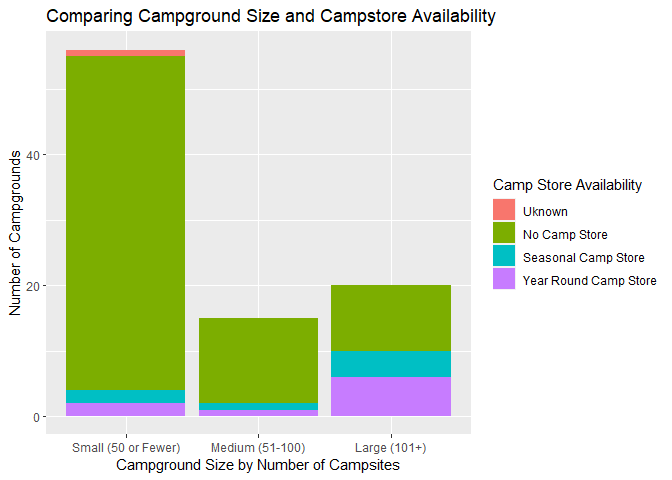
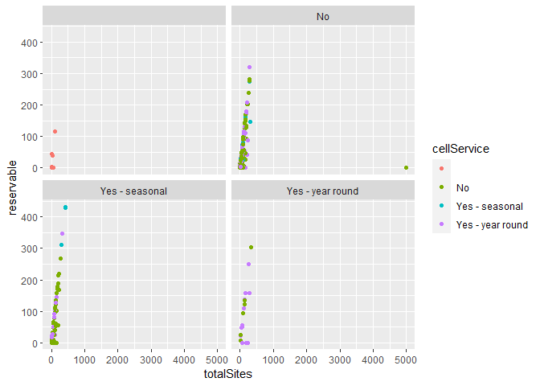
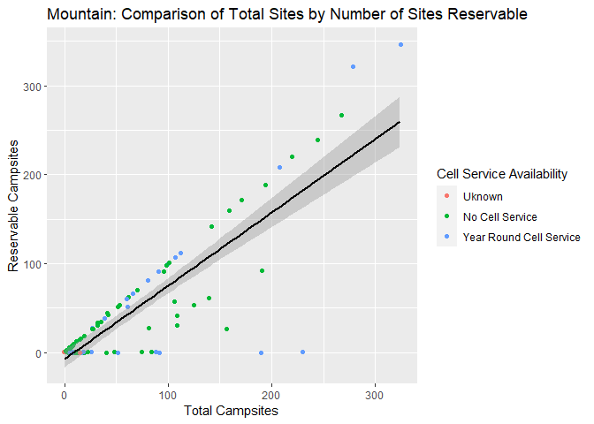
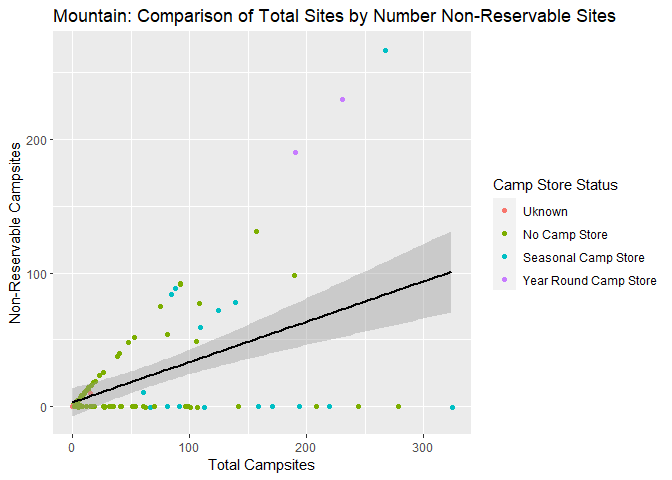

National Parks API Vignette
================
Kelley Breeze and Zhiyuan Yang
2022-09-22

-   <a href="#lets-learn-how-to-use-apis"
    id="toc-lets-learn-how-to-use-apis">Let’s Learn How To Use APIs!</a>
    -   <a href="#requirements" id="toc-requirements">Requirements</a>
    -   <a href="#national-parks-service-api"
        id="toc-national-parks-service-api">National Parks Service API</a>
    -   <a href="#a-quick-note-about-api-keys-and-renviron"
        id="toc-a-quick-note-about-api-keys-and-renviron">A Quick Note About API
        Keys and <code>.Renviron</code></a>
    -   <a href="#writing-functions-to-contact-the-api"
        id="toc-writing-functions-to-contact-the-api">Writing Functions to
        Contact the API</a>
        -   <a
            href="#learning-how-to-create-a-function-to-contact-and-return-data-from-an-api"
            id="toc-learning-how-to-create-a-function-to-contact-and-return-data-from-an-api">Learning
            How to Create a Function to Contact and Return Data From an API</a>
        -   <a href="#getstate-helper-function"
            id="toc-getstate-helper-function"><code>getState</code> Helper
            Function</a>
    -   <a href="#functions-to-contact-the-national-parks-api"
        id="toc-functions-to-contact-the-national-parks-api">Functions to
        Contact the National Parks API</a>
        -   <a href="#contacting-the-parks-endpoint-and-allowing-for-modifications"
            id="toc-contacting-the-parks-endpoint-and-allowing-for-modifications">Contacting
            the <code>parks</code> Endpoint and Allowing for Modifications</a>
        -   <a href="#contacting-the-events-endpoint-and-allowing-for-modifications"
            id="toc-contacting-the-events-endpoint-and-allowing-for-modifications">Contacting
            the <code>events</code> Endpoint and Allowing for Modifications</a>
        -   <a
            href="#contacting-the-thingstodo-endpoint-and-allowing-for-modifications"
            id="toc-contacting-the-thingstodo-endpoint-and-allowing-for-modifications">Contacting
            the <code>thingstodo</code> Endpoint and Allowing for Modifications</a>
        -   <a
            href="#contacting-the-campgrounds-endpoint-and-allowing-for-modifications"
            id="toc-contacting-the-campgrounds-endpoint-and-allowing-for-modifications">Contacting
            the <code>campgrounds</code> Endpoint and Allowing for Modifications</a>
    -   <a href="#data-exploration" id="toc-data-exploration">Data
        Exploration</a>
    -   <a href="#creating-new-variables-as-a-function-of-other-variables"
        id="toc-creating-new-variables-as-a-function-of-other-variables">Creating
        New Variables as a Function of Other Variables</a>
        -   <a href="#creating-variables-with-the-cleaningdata-funtion"
            id="toc-creating-variables-with-the-cleaningdata-funtion">Creating
            Variables with the <code>cleaningData</code> Funtion</a>
        -   <a href="#getcleancampground-wrapper-function"
            id="toc-getcleancampground-wrapper-function"><code>getCleanCampground()</code>
            Wrapper Function</a>
        -   <a
            href="#pulling-data-from-the-api-using-our-data-obtaining-function-getcleancampground"
            id="toc-pulling-data-from-the-api-using-our-data-obtaining-function-getcleancampground">Pulling
            Data From the API Using Our Data Obtaining Function
            <code>getCleanCampground()</code></a>
    -   <a href="#numerical-summaries" id="toc-numerical-summaries">Numerical
        Summaries</a>
        -   <a
            href="#creating-numerical-summaries-for-quantivative-variables-at-each-setting-of-a-categorical-variable"
            id="toc-creating-numerical-summaries-for-quantivative-variables-at-each-setting-of-a-categorical-variable">Creating
            Numerical Summaries for Quantivative Variables at Each Setting of a
            Categorical Variable</a>
        -   <a href="#contingency-tables" id="toc-contingency-tables">Contingency
            Tables</a>
    -   <a href="#data-visualization-with-ggplot2"
        id="toc-data-visualization-with-ggplot2">Data Visualization with
        <code>ggplot2</code></a>
        -   <a href="#creating-bar-plots" id="toc-creating-bar-plots">Creating Bar
            Plots</a>
        -   <a href="#creating-a-histogram" id="toc-creating-a-histogram">Creating a
            Histogram</a>
        -   <a href="#creating-a-boxplot" id="toc-creating-a-boxplot">Creating a
            Boxplot</a>
        -   <a href="#creating-scatterplots" id="toc-creating-scatterplots">Creating
            Scatterplots</a>

# Let’s Learn How To Use APIs!

This vignette is dedicated to helping better understand APIs.
Specifically, we will be looking at how to contact an API using
user-generated functions to query, parse and return well structured
data. The second portion of this vignette will look at how to use
functions to do some exploratory data analysis on data obtained from the
API.

## Requirements

In order to follow along with this vignette, the user will need to load
the following packages using the `library()` function.

1.  The `jsonlite` package - The `jsonlite` package will allow us to
    contact the API via URL and help to parse the data returned from our
    API. The National Parks API only returns data in the form of JSON
    files, so the `jsonlite` package will work nicely with this API. If
    you are working with another API it will be important to understand
    what type of data the API will return and identify the appropriate
    package to parse your raw data that your API returns.  
2.  The `tidyverse` package - The `tidyverse` package will allow us to
    perform basic exploratory data analysis.  
3.  The `stringr` package will help with error handling for our state
    names/abbreviations. We can use this to work with strings provided
    by the user to the state argument to help identify and reformat user
    provided information.  
4.  The `knitr` package will help with making our tables display in a
    much easier to read format.

In addition to the libraries listed above the user will need to create
their own `.Renviron` file to store their private API Key to protect it
from accidentally being shared publicly on github. You will want to make
sure that you add `.Renviron` to your `.gitignore` file so that it will
not be committed to github. Within the `.Renviron` file you can store
your API key using the following line of code: `apiKey="YourNPSAPIKey"`.
More detail on API keys and the `.Renviron` file can be found below in
the **Quick Note About API Keys and `.Renviron`** section.

``` r
library(jsonlite)
library(tidyverse)
library(stringr)
library(knitr)
```

## National Parks Service API

**Background Information on the National Parks Service API**

For this vignette we are using the [National Parks Service’s
API](https://www.nps.gov/subjects/developer/api-documentation.htm). This
API is designed to provide data about US National Parks and their
facilities, events, news, alerts, activities, and much more. With over
20 different endpoints, this API provides a wide array of different
types of data that one might be interested in working with when trying
to learn about how to interact with and use APIs in R. Users do need an
API key (provided for free if you register) to use the National Parks
API. It returns data JSON format only.

## A Quick Note About API Keys and `.Renviron`

Most APIs will require a user to enter an API key when contacting the
API. An API key is unique to each user. For some APIs these are provided
free and are able to be used for essentially unlimited calls to an API.
In other cases, a user may be limited in the number of calls allowed to
an API or may even be charged for access to the APIs data. In any case,
you **SHOULD ALWAYS KEEP YOUR API KEY PRIVATE!** The easiest way to do
this when working on a project in Rstudio/github is to create a
`.Renviron` file in your working directory for your project that stores
your API key. You can then update your `.gitignore` to include your
`.Renviron` file, thereby allowing you to access your API key for use
during calls to the API, while at the same time keeping your API key
secret and preventing the key from being uploaded to github. You can add
files directly to your `.gitignore` file or you can use menu options in
RStudio.

You can also store other useful objects in `.Reviron`, such as a
baseURL, that you can then access for use in different functions that
you create to contact your API. This prevents having to rewrite the same
baseURL over and over again, and can also allow you to easily update
functions that use this baseURL if the API itself decides to change the
baseURL required.

## Writing Functions to Contact the API

We first need to write functions to contact the API an return
well-formatted, parsed data in the form of data frames. We will
demonstrate how to write functions that allow the user to customize
their query and return specific data. Additionally, we will show how to
tackle error handling and allow for a more flexible user interface that
allows the user to specify state by either the two letter state
abbreviation, or the full state name.

### Learning How to Create a Function to Contact and Return Data From an API

**NOTE: The purpose of the `getEndpointData()` function is to
demonstrate how one would go about constructing a function to contact a
user specified endpoint of an API and to return parsed data via the
`fromJSON` function of the `jsonlite` package. As this function is for
demonstration purposes only, we will not use it after this point in the
vignette.**

In order to contact an API a user must send a URL in the correct format
during the call to the API. You can find specifics for how your API
wants the URL request formatted by looking at the documentation for your
API. The `getEndpointData()` function provides an example of how we can
construct our `searchURL` from the user specified `endpoint`. Knowing
how to correctly format a URL from user input is the first step in
writing functions to work with APIs. Notice that within the
`getEndpointData()` function we are using `Sys.getenv()` to access our
`apiKey` and our `baseURL` that have been stored in our `.Renviron`
file. This protects the privacy of our API key and makes later changes
to our baseURL much easier to handle. In this example, the
`getEndpointData()` function demonstrates how to contact an API to
return initial data from an endpoint using the `fromJSON()` function
from the `jsonlite` package. This function will allow a user to specify
any endpoint from the National Parks Service API and return formatted
data from that endpoint. The `getEndpointData()` function will format
our request to the API with the specified endpoint, contact the API to
and return and parse the data into a more usable format.

``` r
getEndpointInfo<- function(endpoint){
  limit<- "50"
  apiKey<-Sys.getenv("apiKey")
  baseURL<-Sys.getenv("baseURL")
  searchURL<- paste0(baseURL, endpoint, "?","&", apiKey)
  #At this point we have built our URL query string given the user input of endpoint. If we were returning data from the activities endpoint the searchURL that the function is generating at this point looks like the code below:
  
  #https://developer.nps.gov/api/v1/activities?api_key=YOUR_API_KEY
  
  #We then use this URL to return the data we want from our API using the fromJSON function from the jsnolite package.
  endpointInfo<- fromJSON(searchURL)
  
  return(endpointInfo)
  }
```

Let’s see what the data looks like from the `getEndpointInfo()`
function. When we use the `str()` function to take a look at what our
function returns on our `actitivites` endpoint, we can see the it
returns a list of 4 elements containing our total results(`40`), the
limit of the number of results that would be returned (`50`), the start
of our results (`0`), and then our `data`. This shows that to access the
information that we need from this endpoint we need to specify to return
`activities$data` in our function. Lets revise our initial function so
that we are only returning the `data` element of our endpoint.

``` r
str(getEndpointInfo("activities"))
```

    ## List of 4
    ##  $ total: chr "40"
    ##  $ limit: chr "50"
    ##  $ start: chr "0"
    ##  $ data :'data.frame':   40 obs. of  2 variables:
    ##   ..$ id  : chr [1:40] "09DF0950-D319-4557-A57E-04CD2F63FF42" "13A57703-BB1A-41A2-94B8-53B692EB7238" "5F723BAD-7359-48FC-98FA-631592256E35" "7CE6E935-F839-4FEC-A63E-052B1DEF39D2" ...
    ##   ..$ name: chr [1:40] "Arts and Culture" "Astronomy" "Auto and ATV" "Biking" ...

\*\*Updated to return just our `data` element from our specified
endpoint.

``` r
getEndpointData<- function(endpoint){
  limit<- "50"
  apiKey<-Sys.getenv("apiKey")
  baseURL<-Sys.getenv("baseURL")
  searchURL<- paste0(baseURL, endpoint, "?", "&", apiKey)
  endpointData<- fromJSON(searchURL)
  
  return(endpointData$data)
  }
```

**Ok, now to look again to see what the new returned results look like
from our `getEndPointData` function.**

``` r
str(getEndpointData("activities"))
```

    ## 'data.frame':    40 obs. of  2 variables:
    ##  $ id  : chr  "09DF0950-D319-4557-A57E-04CD2F63FF42" "13A57703-BB1A-41A2-94B8-53B692EB7238" "5F723BAD-7359-48FC-98FA-631592256E35" "7CE6E935-F839-4FEC-A63E-052B1DEF39D2" ...
    ##  $ name: chr  "Arts and Culture" "Astronomy" "Auto and ATV" "Biking" ...

We can see that the updated function will return a dataframe object from
the `activities` endpoint with 40 observations on two variables, in this
case the activity `id` and the activity `name`. We have successfully
returned only the `data` portion from the `actitivites` endpoint. This
is what we will want to work with from our endpoints when we move on to
the data exploration and analysis steps. Again, the `getEndpointInfo()`
and `getEndpointData()` functions written here are simply to demonstrate
how you would want to construct a simple call to an API. We will not be
using these specific functions going forward in the vignette, although
the `getEndpointData()` function was very convenient for quickly looking
through the types of information found at each endpoint and allowing us
to narrow down which endpoints might be good to use for our data
exploration and analysis steps.

### `getState` Helper Function

The `getState` helper function will allow us to handle different types
of inputs for our state value, including a two state abbreviation or a
state name that are both not case sensitive. We want to allow a user to
specify state using either a two letter state code or the full state
name (not case sensitive). If no state is specified the `getState`
function will return a `NULL` value for `retState`, which will be
important when we use this helper function in future calls to the
National Parks API. In a call to the National Parks API, a `NULL` value
for the state argument will return information on all states. The
`getState` function will return an error message if a user did not
specify a valid value for a state, and provide information about correct
formatting for the state argument.

``` r
getState <- function(state) {
  if(is.null(state)) {
    return(NULL)
  }
  
  retState <-NULL
  
  # State is a state name, find abbreviation.
  if(str_to_title(state) %in% state.name) {
    # Match state code with state name using state.abb and state.name built in to R.
    retState <- state.abb[match(str_to_title(state),state.name)]
  } else if(toupper(state) %in% state.abb) {
    retState <- toupper(state)
  } else {
    stop("ERROR: Value for state argument was not a valid US state name or state two letter abbreiation. Try again. For example, NC or North Carolina will return campsites in North Carolina. NOTE: state argument is NOT case sensitive!")
  }
}
```

## Functions to Contact the National Parks API

We have written four functions to connect to four different endpoints
(`parks`, `events`, `thingstodo`, and `campgrounds`) and allow for user
modifications on each endpoint when contacting the API. All of these
functions will return data in the form of a tibble.

### Contacting the `parks` Endpoint and Allowing for Modifications

The `parks` endpoint on the National Parks API returns information about
the national parks including addresses, contacts, hours of operation,
websites, activities and more. The `getParksInfo` function contacts the
`parks` endpoint and allows the user to enter up to three modifications
of that endpoint. The modifications available for the `parks` endpoint
allow a user to specify the state returned (`state`), specify the number
of results returned (`limit`), and to enter a search term to apply (such
as hiking or mountains) that will return data from the API that match
the `searchTerm` entered. The default value for the `state` modification
is `NULL`, which will result in data from all states being returned. The
default value for the `limit` modification is `30`, which will limit the
results returned to 30. The default value for the `searchTerm`
modification is `NULL`, and will return results from the `parks`
endpoint without limiting by a `searchTerm`. Note that we are using the
`getState()` function to ensure that the state value entered is a valid
value and to return an error if a non-state is entered. We are also
relying on our `.Renviron` file to retrieve our `baseURL` and our
`apiKey`.

``` r
getParksInfo <- function(state=NULL, limit=30, searchTerm=NULL) {
  searchURL <- paste0(Sys.getenv("baseURL"), "parks?", Sys.getenv("apiKey"), "&")

  searchState <- getState(state)
  
  if(!is.null(searchState)) {
    searchURL <- paste0(searchURL, "stateCode=", searchState, "&")
  }
  
  searchURL <- paste0(searchURL, "limit=", limit, "&")
  
  if(!is.null(searchTerm)){
    searchURL<- paste0(searchURL, "q=", searchTerm)
  }

  parks<- fromJSON(searchURL)
  
  return(as_tibble(parks$data))
}
```

#### Testing `getParksInfo()` Function with Different Modifications

**Using `getParksInfo()` with the default values for `state`, `limit`,
and `searchTerm`.**

``` r
getParksInfo()
```

    ## # A tibble: 30 × 23
    ##    id          url   fullN…¹ parkC…² descr…³
    ##    <chr>       <chr> <chr>   <chr>   <chr>  
    ##  1 77E0D7F0-1… http… Abraha… abli    "For o…
    ##  2 6DA17C86-0… http… Acadia… acad    "Acadi…
    ##  3 E4C7784E-6… http… Adams … adam    "From …
    ##  4 1A47416F-D… http… Africa… afam    "Over …
    ##  5 E6E1D22A-7… http… Africa… afbg    "Afric…
    ##  6 64B9F127-3… http… Agate … agfo    "In th…
    ##  7 3B8307B3-5… http… Ala Ka… alka    "Estab…
    ##  8 C4E1A9A4-D… http… Alagna… alag    "The h…
    ##  9 7D6098F9-3… http… Alaska… anch    "Alask…
    ## 10 C08AD828-9… http… Alcatr… alca    "Alcat…
    ## # … with 20 more rows, 18 more variables:
    ## #   latitude <chr>, longitude <chr>,
    ## #   latLong <chr>, activities <list>,
    ## #   topics <list>, states <chr>,
    ## #   contacts <df[,2]>, entranceFees <list>,
    ## #   entrancePasses <list>, fees <list>,
    ## #   directionsInfo <chr>, …

**Using `getParksInfo()` with the default values for `state`, `limit`,
and specifying `searchTerm="redwoods"`.**

``` r
getParksInfo(searchTerm = "redwoods")
```

    ## # A tibble: 2 × 23
    ##   id           url   fullN…¹ parkC…² descr…³
    ##   <chr>        <chr> <chr>   <chr>   <chr>  
    ## 1 126A6227-E3… http… Muir W… muwo    Walk a…
    ## 2 041B325C-A3… http… Redwoo… redw    Most p…
    ## # … with 18 more variables: latitude <chr>,
    ## #   longitude <chr>, latLong <chr>,
    ## #   activities <list>, topics <list>,
    ## #   states <chr>, contacts <df[,2]>,
    ## #   entranceFees <list>,
    ## #   entrancePasses <list>, fees <list>,
    ## #   directionsInfo <chr>, …

**Using `getParksInfo()` entering `"california"` for the `state` value,
`100` for the `limit`, and using the default value for the
`searchTerm`.**

``` r
getParksInfo(state = "california", limit = 100)
```

    ## # A tibble: 33 × 23
    ##    id          url   fullN…¹ parkC…² descr…³
    ##    <chr>       <chr> <chr>   <chr>   <chr>  
    ##  1 C08AD828-9… http… Alcatr… alca    Alcatr…
    ##  2 2DB09FB7-0… http… Cabril… cabr    Climbi…
    ##  3 B39C368F-C… http… Califo… cali    Follow…
    ##  4 872417E6-2… http… Castle… camo    Castle…
    ##  5 5595FC7A-F… http… Channe… chis    Channe…
    ##  6 D1EAA1D1-E… http… César … cech    Yes, w…
    ##  7 FFC9F9C4-D… http… Death … deva    In thi…
    ##  8 2DC9444C-8… http… Devils… depo    Establ…
    ##  9 353241CC-4… http… Eugene… euon    Americ…
    ## 10 7FF57085-3… http… Fort P… fopo    From i…
    ## # … with 23 more rows, 18 more variables:
    ## #   latitude <chr>, longitude <chr>,
    ## #   latLong <chr>, activities <list>,
    ## #   topics <list>, states <chr>,
    ## #   contacts <df[,2]>, entranceFees <list>,
    ## #   entrancePasses <list>, fees <list>,
    ## #   directionsInfo <chr>, …

### Contacting the `events` Endpoint and Allowing for Modifications

The `getEvents` function allows users to contact the `events` endpoint
from the National Parks API. It will allow modifications of the `state`
input (default value of `NULL`), the `pageSize` input that controls the
results returned per page (default is set to `5`) and the `searchTerm`
(default set to `NULL`).

``` r
getEvents <- function(state=NULL, pageSize=5, searchTerm=NULL) {
  searchURL <- paste0(Sys.getenv("baseURL"), "events?", Sys.getenv("apiKey"), "&")
  
  searchState <- getState(state)
  
  if(!is.null(searchState)) {
    searchURL <- paste0(searchURL, "stateCode=", searchState, "&")
  }
  
  searchURL <- paste0(searchURL, "pageSize=", pageSize, "&")
  
  if(!is.null(searchTerm)){
    searchURL<- paste0(searchURL, "q=", searchTerm)
  }
  
  events<- fromJSON(searchURL)
  
  return(as_tibble(events$data))
}
```

**Testing the `getEvents()` function to return results using
`searchTerm="holiday"`**

``` r
getEvents(searchTerm = "holiday")
```

    ## # A tibble: 5 × 43
    ##   location   updat…¹ conta…² conta…³ recur…⁴
    ##   <chr>      <chr>   <chr>   <chr>   <chr>  
    ## 1 Meet outs… ""      ""      ""      2022-1…
    ## 2 Meet at t… ""      ""      ""      2022-1…
    ## 3 From the … ""      "Deb W… "928-5… 2023-1…
    ## 4 Robert J.… ""      ""      "805-6… 2030-1…
    ## 5 Wetlands … ""      ""      ""      2022-1…
    ## # … with 38 more variables:
    ## #   longitude <chr>, datestart <chr>,
    ## #   isrecurring <chr>,
    ## #   datetimeupdated <chr>,
    ## #   portalname <chr>, types <list>,
    ## #   createuser <chr>, isfree <chr>,
    ## #   contactemailaddress <chr>, …

### Contacting the `thingstodo` Endpoint and Allowing for Modifications

The `thingstodo` endpoint has information on suggested things to do
recommended by and for specific national parks. The `getThingsToDo()`
function will allow the user up to three modifications on this endpoint.
The user can specify a state, specify the maximum number of results
returned, and also search the things to do by a specific term (for
example, families may want to search by “kids” to find things to do that
are recommended for kids).

``` r
getThingsToDo <- function(state=NULL, limit=60, searchTerm=NULL) {
  searchURL <- paste0(Sys.getenv("baseURL"), "thingstodo?", Sys.getenv("apiKey"), "&")
  
  searchState <- getState(state)
  
  if(!is.null(searchState)) {
    searchURL <- paste0(searchURL, "stateCode=", searchState, "&")
  }
  
  searchURL <- paste0(searchURL, "limit=", limit, "&")
  
  if(!is.null(searchTerm)){
    searchURL<- paste0(searchURL, "q=", searchTerm)
  }
  
  thingsToDo<- fromJSON(searchURL)
  
  return(as_tibble(thingsToDo$data))
}
```

Let’s see an example of what data will look like when returned from the
`thingstodo` endpoint with a couple of modifications using our function.
The modifications here will return up to 200 results that match our
`searchTerm` `"kids"`. Because we did not enter a state and instead
relied on the default `state` value, we will be returning data from all
states. The `searchTerm = "kids"` will return `141` results from our
API, we can see the first 6 that are returned below.

``` r
getThingsToDo(limit = 200, searchTerm = "kids")
```

    ## # A tibble: 142 × 35
    ##    id     url   title short…¹ images relat…²
    ##    <chr>  <chr> <chr> <chr>   <list> <list> 
    ##  1 BF4CD… http… Plac… You co… <df>   <df>   
    ##  2 9DB7D… http… Hike… The tr… <df>   <df>   
    ##  3 0585F… http… Kid-… Lookin… <df>   <df>   
    ##  4 4053A… http… Fami… Whethe… <df>   <df>   
    ##  5 09749… http… Hike… Sarato… <df>   <df>   
    ##  6 C3241… http… Earn… Becomi… <df>   <df>   
    ##  7 93643… http… Beco… Come t… <df>   <df>   
    ##  8 C3157… http… Beco… Did yo… <df>   <df>   
    ##  9 95B1D… http… Ride… Steamt… <df>   <df>   
    ## 10 5DC9C… http… Hike… Stroll… <df>   <df>   
    ## # … with 132 more rows, 29 more variables:
    ## #   relatedOrganizations <list>,
    ## #   tags <list>, latitude <chr>,
    ## #   longitude <chr>, geometryPoiId <chr>,
    ## #   amenities <list>, location <chr>,
    ## #   seasonDescription <chr>,
    ## #   accessibilityInformation <chr>, …

### Contacting the `campgrounds` Endpoint and Allowing for Modifications

This function allows user to access the `campgrounds` endpoint on the
National Parks Service API. They can specify three modifications of this
endpoint, one for `state`, a second for `limit`, and a third for
`searchTerm` that will allow a user to search by a certain term (this
could be related to a type of activity, a park name, etc). If no
information is entered for these, the default will return information
for all states (`state=NULL`), will `limit` the results to `40`, and the
default value for `searchTerm` will also be `NULL`, which will not limit
our returned results by any term.

``` r
getCampgrounds <- function(state=NULL, limit=40, searchTerm=NULL) {
  searchURL <- paste0(Sys.getenv("baseURL"), "campgrounds?", Sys.getenv("apiKey"), "&")
  
  searchState <- getState(state)
  
  if(!is.null(searchState)) {
    searchURL <- paste0(searchURL, "stateCode=", searchState, "&")
  }
  
  searchURL <- paste0(searchURL, "limit=", limit, "&")
  
  if(!is.null(searchTerm)){
    searchURL<- paste0(searchURL, "q=", searchTerm)
  }
  
  campgrounds<- fromJSON(searchURL)
  
  return(as_tibble(campgrounds$data))
}
```

Before we move on to the next step, let’s take a look at what our data
looks like when returned using the`getCampgrounds()` function:

1.  Using defaults  
2.  When a user specifies a state and number of results to return  
3.  When a user specifies a `searchTerm`

**`getCampgrounds()` using defaults**

``` r
getCampgrounds()
```

    ## # A tibble: 40 × 31
    ##    id    url   name  parkC…¹ descr…² latit…³
    ##    <chr> <chr> <chr> <chr>   <chr>   <chr>  
    ##  1 EA81… "htt… 277 … amis    17 sit… "29.51…
    ##  2 1241… ""    Abra… grsm    Abrams… "35.61…
    ##  3 ABDC… "htt… Adir… cato    Reserv… "39.67…
    ##  4 4F9E… "htt… Afte… bica    - Near… "45.31…
    ##  5 9FAE… "htt… Aker… ozar    Group … "37.37…
    ##  6 6EAB… "htt… Alam… orpi    Primit… "32.07…
    ##  7 AB15… "htt… Alle… ozar    Campgr… "37.14…
    ##  8 4F9E… "htt… Alum… biso    Alum F… "36.76…
    ##  9 B0B2… ""    Amer… amme    There … ""     
    ## 10 E7CC… "htt… Anac… chis    Primit… "34.01…
    ## # … with 30 more rows, 25 more variables:
    ## #   longitude <chr>, latLong <chr>,
    ## #   audioDescription <chr>,
    ## #   isPassportStampLocation <chr>,
    ## #   passportStampLocationDescription <chr>,
    ## #   passportStampImages <list>,
    ## #   geometryPoiId <chr>, …

**`getCampgrounds()` looking at California and limiting results to 20**

``` r
getCampgrounds("CA", 20)
```

    ## # A tibble: 20 × 31
    ##    id    url   name  parkC…¹ descr…² latit…³
    ##    <chr> <chr> <chr> <chr>   <chr>   <chr>  
    ##  1 E7CC… "htt… Anac… chis    Primit… 34.014…
    ##  2 BC70… "htt… Atwe… seki    The ca… 36.464…
    ##  3 D82D… "htt… Azal… seki    Azalea… 36.741…
    ##  4 07E7… "htt… Bell… jotr    This s… 34.001…
    ##  5 2AFC… "htt… Bice… goga    Bicent… 37.824…
    ##  6 BF42… ""    Blac… moja    While … 35.048…
    ##  7 33AA… "htt… Blac… jotr    This l… 34.072…
    ##  8 3EC4… "htt… Bran… whis    This t… 40.617…
    ##  9 5204… "htt… Bran… whis    A secl… 40.617…
    ## 10 58B9… "htt… Brid… yose    The Br… 37.663…
    ## 11 6BCF… "htt… Buck… seki    Buckey… 36.522…
    ## 12 8AA8… "htt… Butt… lavo    Butte … 40.564…
    ## 13 8F36… "htt… Camp… yose    Camp 4… 37.742…
    ## 14 3851… "htt… Cany… seki    Canyon… 36.787…
    ## 15 1408… ""    Circ… samo    Circle… 34.111…
    ## 16 6EBE… "htt… Coas… pore    Coast … 38.017…
    ## 17 E43B… "htt… Cold… seki    Nestle… 36.451…
    ## 18 9B5A… "htt… Cott… jotr    The Co… 33.744…
    ## 19 B139… "htt… Cran… yose    The Cr… 37.749…
    ## 20 4A67… "htt… Crys… whis    The Cr… 40.6422
    ## # … with 25 more variables:
    ## #   longitude <chr>, latLong <chr>,
    ## #   audioDescription <chr>,
    ## #   isPassportStampLocation <chr>,
    ## #   passportStampLocationDescription <chr>,
    ## #   passportStampImages <list>,
    ## #   geometryPoiId <chr>, …

**`getCampgrounds()` using the `searchTerm="redwoods"`**

``` r
getCampgrounds(searchTerm = "redwoods")
```

    ## # A tibble: 4 × 31
    ##   id     url   name  parkC…¹ descr…² latit…³
    ##   <chr>  <chr> <chr> <chr>   <chr>   <chr>  
    ## 1 1734D… http… Elk … redw    Locate… 41.359…
    ## 2 2D58D… http… Gold… redw    Locate… 41.382…
    ## 3 A2B6D… http… Jede… redw    Locate… 41.795…
    ## 4 66567… http… Mill… redw    Locate… 41.702…
    ## # … with 25 more variables:
    ## #   longitude <chr>, latLong <chr>,
    ## #   audioDescription <chr>,
    ## #   isPassportStampLocation <chr>,
    ## #   passportStampLocationDescription <chr>,
    ## #   passportStampImages <list>,
    ## #   geometryPoiId <chr>, …

## Data Exploration

Next, we will walk through some basic exploratory data analysis. As this
vignette is meant to show how you would go about using an API to collect
data and how you could then do some basic data exploration, we will
focus on the mechanics of creating the various plots, tables and
summaries. We will spend less time focusing on the details of or
possible conclusions about the specific data that we are using. For this
section we will focus on data that we will collect from the
`campgrounds` endpoint, using the `getCleanCampground()` function that
we will create below. In the data exploration steps we will demonstrate:

1.  How to pull data from multiple calls to our data obtaining function
    (using our `getCleanCampground()` function).  
2.  How to create a new variable that is a function of other variables
    (using our `cleaningData()` function).  
3.  How to create contingency tables based on data returned from the
    API.  
4.  How to create numerical summaries for quantitative variables at each
    setting of a categorical variable.  
5.  How to create plots with nice labels and titles, utilizing coloring,
    grouping, etc. and including the following plot types:
    -   Bar plots  
    -   Histograms  
    -   Box plots  
    -   Scatter plots

## Creating New Variables as a Function of Other Variables

**Reformatting Variables**

The data from the API needs some reformatting before it can be used for
our analysis. All data was read in as character data, so we will need to
coerce some of this data to numeric for our analysis. We also want to
demonstrate how you might create some new variables from existing
variables. We will do this in a couple of different ways, through the
creation of a new variable for campground size (small, medium, or large)
as well as creating new variables for `cellService` and `campStore` that
will be factors with specified levels.

### Creating Variables with the `cleaningData` Funtion

The `cleaningData` function will take the output from the
`getCampgrouns()` function and create new numeric variables from the
variables `walkBoatTo`, `rvOnly`, `electricalHookups`,
`numberOfSitesReservable`, `numberOfSitesFirstComeFirstServe`, and
`totalSites`. The purpose of this is to transform character data (how
these variables were read in) to numeric data so that we can perform
some exploratory data analysis. We will also convert two variables
(`cellService` and `campStore`) to factors with 4 levels each. This
function will also use the new `totalSites` numeric variable to create a
new campsite size variable `campgroundSize` that classifies campgrounds
as small if there are fewer than 50 campsites, medium if there are
between 50 and 100 campsites, and large if there are more that 100
campsites.

``` r
cleaningData<- function(getCampgroundsOutput){
  CampgroundData<- getCampgroundsOutput%>%
    mutate(
      boatOrWalk = as.numeric(campsites$walkBoatTo),
      RVonly = as.numeric(campsites$rvOnly),
      electric = as.numeric(campsites$electricalHookups),
      reservable = as.numeric(numberOfSitesReservable),
      noReservation = as.numeric(numberOfSitesFirstComeFirstServe),
      cellService = factor(amenities$cellPhoneReception, 
                            levels=c("", "No", "Yes - seasonal", "Yes - year round"), 
                            labels = c("Uknown", "No Cell Service", "Seasonal Cell Service", "Year Round Cell Service")),
      campStore = factor(amenities$campStore, 
                          levels=c("", "No", "Yes - seasonal", "Yes - year round"), 
                          labels = c("Uknown", "No Camp Store", "Seasonal Camp Store", "Year Round Camp Store" )),
      totalSites = as.numeric(campsites$totalSites),
      campgroundSize = if_else(totalSites>100, "Large",
                         if_else(totalSites>50, "Medium", "Small"))
      )
    
  return(CampgroundData)
}
```

### `getCleanCampground()` Wrapper Function

Next, we will combine our `getCampgrounds()` function and our
`cleaningData()` function into one call that will allow us to return
data that can be easily used for our data exploration.

``` r
getCleanCampground<- function(state=NULL, limit=50, searchTerm=NULL){
  campgroundData<- getCampgrounds(state, limit, searchTerm)
  cleanCampData<- cleaningData(campgroundData)
  
  return(cleanCampData)
}
```

Let’s test this out to make sure things are working as expected. Here we
are specifying the state as California and that we want to limit the
results to 100. Everything looks good, so we are ready to move on to
working with the data from our API!

``` r
getCleanCampground("CA", limit = 100)
```

    ## # A tibble: 91 × 40
    ##    id    url   name  parkC…¹ descr…² latit…³
    ##    <chr> <chr> <chr> <chr>   <chr>   <chr>  
    ##  1 E7CC… "htt… Anac… chis    Primit… 34.014…
    ##  2 BC70… "htt… Atwe… seki    The ca… 36.464…
    ##  3 D82D… "htt… Azal… seki    Azalea… 36.741…
    ##  4 07E7… "htt… Bell… jotr    This s… 34.001…
    ##  5 2AFC… "htt… Bice… goga    Bicent… 37.824…
    ##  6 BF42… ""    Blac… moja    While … 35.048…
    ##  7 33AA… "htt… Blac… jotr    This l… 34.072…
    ##  8 3EC4… "htt… Bran… whis    This t… 40.617…
    ##  9 5204… "htt… Bran… whis    A secl… 40.617…
    ## 10 58B9… "htt… Brid… yose    The Br… 37.663…
    ## # … with 81 more rows, 34 more variables:
    ## #   longitude <chr>, latLong <chr>,
    ## #   audioDescription <chr>,
    ## #   isPassportStampLocation <chr>,
    ## #   passportStampLocationDescription <chr>,
    ## #   passportStampImages <list>,
    ## #   geometryPoiId <chr>, …

### Pulling Data From the API Using Our Data Obtaining Function `getCleanCampground()`

The code below sets up a few calls to our data obtaining function
`getCleanCampground()`. We will use our `getCleanCampground()` function
to contact the `campgrounds` endpoint on National Parks API, and return
and clean our data so that we will be able to do numerical summaries and
other data analysis. We will limit our data exploration to the
`campgrounds` endpoint, but this should give a good idea of how you
could go about data exploration using an endpoint of your choosing. In
the calls listed below we will create data frames for later use
throughout the data exploration phase that have the following
modifications:

1.  `campgroundsCA` will contain data on all National Parks campgrounds
    in California. In the call to the API we will specify the `state` as
    `california` and set the limit of results returned to `100`. We will
    not enter a `searchTerm` for this example.  
2.  `campgroundsTX` will contain data on all National Parks campgrounds
    in Texas. In the call to the API we will specify the `state` as `TX`
    and set the limit of results returned to `100`. We will not enter a
    `searchTerm` for this example.  
3.  `campgroundAll` will contain data on all National Parks campgrounds
    in the country. The only input we need to enter here is `limit=700`
    in order to return the complete dataset.  
4.  `campgoundMountains` will return data on all national parks
    campgrounds in the country that match our `searchTerm="mountains"`.
    We have set the `limit` of the results to `200` to make sure that we
    are returning all campgrounds that match our search criteria.

``` r
campgroundsCA<-getCleanCampground("california", 100)

campgroundAll<- getCleanCampground(limit = 700)

campgroundsTX<- getCleanCampground("TX", 100)

campgroundMountains<-getCleanCampground(limit = 200, searchTerm = "mountains")
```

## Numerical Summaries

We are going to look at some numerical summaries related to our campsite
data. We want to see how to create numerical summaries for quantitative
variables at each setting of a categorical variable. One easy way to
achieve this goal is by using `group_by()` with the `summarise()`
function. There are four different examples below. These examples are
meant to demonstrate how to write the code to create these types of
summaries for different variables, and so we will not spend too much
time analyzing the results.

### Creating Numerical Summaries for Quantivative Variables at Each Setting of a Categorical Variable

Ok, so now let’s look at some numeric summaries for `totalSites` across
each setting of our `campgroundSize` variable. We will first look at
this information for campsites in California, and then we will look at
the same summaries for all campsites in the country combined.

**Mean, Median and Standard Deviation of Total Campsites by Campground
Size in California**

We can see that the mean number of campsites at `Large` campgrounds is
just under `160`, for `Medium` campgrounds the mean is about `77`, and
for `Small` campgrounds the mean is `17.5`. We can compare the mean
values to the median values across our data and it tells us that there
is a larger positive skew in the data for our `Large` campgrounds,
likely due to a large outlier in the data in the `Large` campground
group.

``` r
campCASizeSum<- campgroundsCA%>%
  group_by(campgroundSize)%>%
  summarise("Mean Number of Sites" = mean(totalSites), "Median Number of Sites" = median(totalSites), SD = sd(totalSites))

campCASizeSum
```

    ## # A tibble: 3 × 4
    ##   campgroundSize Mean Number…¹ Media…²    SD
    ##   <chr>                  <dbl>   <dbl> <dbl>
    ## 1 Large                  160.    140.   56.5
    ## 2 Medium                  76.8    75    15.1
    ## 3 Small                   17.5    14.5  14.0
    ## # … with abbreviated variable names
    ## #   ¹​`Mean Number of Sites`,
    ## #   ²​`Median Number of Sites`

**Mean, Median and Standard Deviation of Total Campsites by Campground
Size in the United States**

Here we can see an even bigger difference between mean number of
campsites and median number of campsites at `Large` campgrounds. This is
due to one large outlier in the dataset, which is a campground called
`Lone Rock Beach Primitive Camping Area` with `totalSites` of `5000`.
More will be discussed about this outlier in the histogram portion of
the vignette.

``` r
campAllSizeSum<- campgroundAll%>%
  group_by(campgroundSize)%>%
  summarise("Mean Number of Sites" = mean(totalSites), "Median Number of Sites" = median(totalSites), SD = sd(totalSites))

campAllSizeSum
```

    ## # A tibble: 3 × 4
    ##   campgroundSize Mean Number…¹ Media…²    SD
    ##   <chr>                  <dbl>   <dbl> <dbl>
    ## 1 Large                  236.    161   531. 
    ## 2 Medium                  74.7    74.5  15.8
    ## 3 Small                   12.4     7.5  13.0
    ## # … with abbreviated variable names
    ## #   ¹​`Mean Number of Sites`,
    ## #   ²​`Median Number of Sites`

Next we will look at numerical summaries for the `totalSites` variable
across the different settings of our `cellService` variable. Remember,
the `cellService` variable was converted to a factor variable with four
levels (`Uknown`, `No Cell Service`, `Seasonal Cell Service`, and
`Year Round Cell Service`) by the `cleaningData()` function, which was
used in the `getCleanCampground()` wrapper function.

**Mean, Median and Standard Deviation of Total Campsites by Cell Service
Coverage in the United States**

When we look at these summaries we can see some strange things when
comparing our mean and median values. The `cellService` variable has a
lot of values for `totalSites` in all categories (`Uknown`,
`No Cell Service`, `Seasonal Cell Service`, and
`Year Round Cell Service`) of `0`, which is causing our median to be so
much lower than the mean in this example. In addition, we can see that
the `SD` value for all levels of our `cellService` variable is fairly
high. While it is unexpected that so many `totalSites` would have a
value of `0`, particularly given that we are pulling data on
`campgrounds` endpoint, this is an anomaly in the `totalSites` variable
in our dataset. Even though the data was stored in a variable called
`totalSites` when it was returned from the API, these are not in fact
the total number of all campsites within a particular campground. We
perhaps would not have discovered this without this initial data
exploration into some numberic summaries of our `totalSites` variable.

``` r
campAllCellSum<- campgroundAll%>%
  group_by(cellService)%>%
  summarise("Mean Number of Sites" = mean(totalSites), "Median Number of Sites" = median(totalSites), SD = sd(totalSites))

knitr::kable(campAllCellSum)
```

| cellService             | Mean Number of Sites | Median Number of Sites |        SD |
|:------------------------|---------------------:|-----------------------:|----------:|
| Uknown                  |             8.514286 |                    0.0 |  22.02188 |
| No Cell Service         |            52.220779 |                   15.0 | 258.93124 |
| Seasonal Cell Service   |            85.968750 |                   21.5 | 127.97063 |
| Year Round Cell Service |            50.241379 |                   20.0 |  64.18992 |

**Mean, Median and Standard Deviation of Total Campsites by Cell Service
Coverage in Texas**

Here we can see that Texas does not have any campgrounds with
`Seasonal Cell Service`, and so that factor is not included on our
summary table. We can also see that our mean and median values are much
closer together. If we look at the dataset itself we can see that there
are no values in our dataset when the number of campsites is 0.

``` r
campTXCellSum<- campgroundsTX%>%
  group_by(cellService)%>%
  summarise("Mean Number of Sites" = mean(totalSites), "Median Number of Sites" = median(totalSites), SD = sd(totalSites))

knitr::kable(campTXCellSum)
```

| cellService             | Mean Number of Sites | Median Number of Sites |       SD |
|:------------------------|---------------------:|-----------------------:|---------:|
| Uknown                  |             33.00000 |                   33.0 | 25.45584 |
| No Cell Service         |             25.66667 |                   18.5 | 23.59010 |
| Year Round Cell Service |             16.44444 |                   15.0 | 17.36456 |

### Contingency Tables

Next let’s see how to create a contingency table from our `campgroundCA`
data using the `table()` function. Here we are creating a contingency
table looking at our `campStore` and `campgroundSize` variables from our
`campgroundsCA` data. We can see that across all categories it is much
more common for campgrounds to no camp store than to have either a
seasonal or year round camp store.

``` r
knitr::kable(table(campgroundsCA$campgroundSize, campgroundsCA$campStore))
```

|        | Uknown | No Camp Store | Seasonal Camp Store | Year Round Camp Store |
|:-------|-------:|--------------:|--------------------:|----------------------:|
| Large  |      0 |            10 |                   4 |                     6 |
| Medium |      0 |            13 |                   1 |                     1 |
| Small  |      1 |            51 |                   2 |                     2 |

Let’s compare this to the same contingency table for all national parks
(not just national parks in California) using the `campgroundsAll` data.
Here we can see the same trends as we saw in the previous table, with it
being more likely that a campground will not have a store than it will
have a camp store. We can also see in these tables that the chances of
having a camp store are higher given you are looking at a large
campground as compared to the chances of having a camp store given that
you are looking at a small campground.

``` r
knitr::kable(table(campgroundAll$campgroundSize, campgroundAll$campStore))
```

|        | Uknown | No Camp Store | Seasonal Camp Store | Year Round Camp Store |
|:-------|-------:|--------------:|--------------------:|----------------------:|
| Large  |      1 |            46 |                  27 |                    10 |
| Medium |      1 |            64 |                  17 |                     4 |
| Small  |     33 |           393 |                  24 |                     6 |

## Data Visualization with `ggplot2`

### Creating Bar Plots

Let’s create a bar plot to visualize the information from our California
campground and camp store contingency table from above. Here we can see
the number of campgrounds in each of our `camgroundSize` categories, as
well as visualize how this relates to our `campStore` variable. We can
easiliy see that the majority of campgrounds do not have a camp store,
regardless of size. We can also see that of the three types of
campgrounds, the large campgrounds are more likely to have a camp store,
while the small campgrounds are less likely to have a camp store.

``` r
ggplot(campgroundsCA, aes(x=campgroundSize))+
  geom_bar(aes(fill=campStore)) + 
  labs(y="Number of Campgrounds", 
       title= "Comparing Campground Size and Campstore Availability")  + 
  scale_fill_discrete(name="Camp Store Availability") + 
  scale_x_discrete(name = "Campground Size by Number of Campsites", 
                   labels=c("Small (50 or Fewer)", "Medium (51-100)", "Large (101+)"),  
                   limits=c("Small", "Medium", "Large"))
```

<!-- -->

Let’s create a similar bar plot but this time let’s visualize how
`cellService` availability relates to `camgroundSize` for all
campgrounds in the national parks. We see similar trends in cell service
availability. `Large` and `Medium` campgrounds have about the same ratio
of cell service available to not available. The `Small` campgrounds are
much more likely to have no cell service available.

``` r
ggplot(campgroundAll, aes(x=campgroundSize))+
  geom_bar(aes(fill=cellService)) + 
  labs(y="Number of Campgrounds", 
       title= "Comparing Campground Size and Cell Service Availability") + 
  scale_fill_discrete(name="Cell Service Availability")  + 
  scale_x_discrete(name = "Campground Size by Number of Campsites", 
                   labels=c("Small (50 or Fewer)", "Medium (51-100)", "Large (101+)"),  
                   limits=c("Small", "Medium", "Large"))
```

<!-- -->

### Creating a Histogram

Let’s look at a histogram of our `totalSites` variable. In this example
we have on huge outlier, which is a campground with `5000` sites called
`Lone Rock Beach Primitive Camping Area`. Since the campground with the
next highest number of sites is the `Bridge Bay Campground` with `432`
we can reasonably assume that this outlier is likely the result of a
typo during data entry or an anomaly with how this park reports its
data. A quick google search can tell us that the
`Lone Rock Beach Primitive Camping Area` is a very large area that
offers primitive camping only. In looking at the information entered for
some of the other variables, all that have very high numbers, it appears
that these values are not directly tied to actual points on a map or
designated sites. As a result we will remove the single data point for
the `Lone Rock Beach Primitive Camping Area` when creating our
histogram. Before we remove this outlier in our data let’s look at the
impact that this one value has on the creation of our histogram.

``` r
ggplot(campgroundAll, aes(x=totalSites)) + 
  geom_histogram(binwidth = 20) +
  labs(x="Total Campsites Per Campground", y="Number of Campgrounds", title = "Total Campsites per Campground Including Large Outlier")
```

<!-- -->

Now let’s remove the outlier to see how our visualization changes. In
the histogram below we have used `xlim` to set the x-axis values from 0
to 450, as the second highest data point in our set (and the largest one
that we plan on plotting here) is a campground containing `432`
campsites. We will also add color to our bins using the `fill` and
`color` arguments. As we can easily see from this histogram, the vast
majority of the campgrounds returned from the National Parks API have
fewer than 100 campsites.

``` r
ggplot(campgroundAll, aes(x=totalSites)) + 
  geom_histogram(binwidth = 20, fill="dark green", color="black") + 
    scale_x_continuous(breaks = seq(0, 450, 20), limits = c(0, 450)) + 
    scale_y_continuous(breaks = seq(0, 150, 10), limits = c(0, 150)) + 
    labs(x="Total Campsites Per Campground", y="Number of Campgrounds", title = "Total Campsites per Campground Excluding Large Outlier")
```

    ## Warning: Removed 1 rows containing non-finite
    ## values (stat_bin).

    ## Warning: Removed 1 rows containing missing values
    ## (geom_bar).

<!-- -->

### Creating a Boxplot

Boxplots can be useful in getting an idea of the center, spead, and skew
of our data. Boxplots provide a quick and easy way to visualize the five
number summary (minimum, maximum, Q1, Q3, and median values) for our
data. In this example we will see how to create a boxplot from our data,
this time using the `campgroundCA100` data that we returned from our API
earlier. This dataset contains the cleaned data for campgrounds in
California, with information on 91 campgrounds total. Below we can see
boxplots that we created showing information about `totalSites` by the
`campgroundSize` variable. We can see that the `Large` campgrounds have
a larger range in terms of the number of `totalSites` present as
compared to the `Small` and `Medium` campgrounds.

``` r
ggplot(campgroundsCA, aes(x=campgroundSize, y=totalSites)) + 
  geom_boxplot(fill="blue", 
               color="red") + 
  scale_x_discrete(name = "Campground Size", 
                   labels=c("Small (50 or Fewer)", "Medium (51-100)", "Large (101+)"),  
                   limits=c("Small", "Medium", "Large")) + 
  labs(title="Comparison of Total Sites by Campground Size", 
       y="Total Campsites") 
```

<!-- -->

### Creating Scatterplots

The last bit of data exploration we are going to learn how to do is to
create scatterplots of some numeric data and color by one of our other
variables. For both of the scatterplots we will use the data from the
`campgroundMountains` data set. We will add trend lines to each
scatterplot using the `geom_smooth()` function.

In this scatterplot we will compare the `totalSites` and `reservable`
sites variables and color by our `cellService` variable for out
`campgroundMountain` data set.

``` r
plot1<- ggplot(campgroundMountains, aes(x=totalSites, y=reservable, color=cellService)) + 
  geom_point(position = "jitter") + 
  geom_smooth(method = lm, color="black") + 
    labs(title="Mountain: Comparison of Total Sites by Number of Sites Reservable", 
       y="Reservable Campsites",
       x= "Total Campsites") + 
  scale_color_discrete(name = "Cell Service Availability")

plot1
```

<!-- -->

In this scatterplot we will compare the `totalSites` and `noReservation`
sites variables and color by our `campStore` variable for out
`campgroundMountain` data set.

``` r
plot2<- ggplot(campgroundMountains, aes(x=totalSites, y=noReservation, color=campStore)) + 
  geom_point(position = "jitter") + 
    geom_smooth(method = lm, color="black") + 
      labs(title="Mountain: Comparison of Total Sites by Number Non-Reservable Sites", 
       y="Non-Reservable Campsites",
       x= "Total Campsites") + 
  scale_color_discrete(name = "Camp Store Status")

plot2
```

<!-- -->
