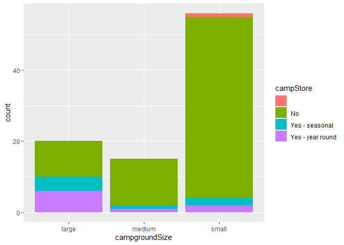

National Parks API Vignette
================
Kelley Breeze and Zhiyuan Yang
2022-09-22

``` r
knitr::opts_chunk$set(echo = TRUE)
```

# Let’s Learn How To Use APIs!

This vignette is dedicated to helping better understand APIs.
Specifically, we will be looking at how to contact an API using
user-generated functions to query, parse and return well structured
data. The second portion of this vignette will look at how to use
functions to do some exploratory data analysis on the data obtained from
the API.

## Requirements

In order to follow along with this vignette, the user will need to load
the following packages using the `library()` function.

1.  The `jsonlite` package - The `jsonlite` package will allow us to
    contact the API via URL and help to parse the data returned from our
    API. The National Parks API only returns data in the form of JSON
    files, so the `jsonlite` package will work nicely with this API. If
    you are working with another API it will be important to understand
    what type of data the API will return and identify the appropriate
    package to parse your raw data that your API returns.  
2.  The `tidyverse` package - The `tidyverse` package will allow us to
    perform basic exploratory data analysis.  
3.  The `stringr` package will help with error handling for our state
    names/abbreviations. We can use this to work with strings provided
    by the user to the state argument to help identify and reformat user
    provided information.

``` r
library(jsonlite)
library(tidyverse)
library(stringr)
```

## National Parks Service API

**Background Information on the National Parks Service API**

For this vignette we are using the [National Parks Service’s
API](https://www.nps.gov/subjects/developer/api-documentation.htm). This
API is designed to provide data about US National Parks and their
facilities, events, news, alerts, activities, and much more. With over
20 different endpoints, this API provides a wide array of different
types of data that one might be interested in working with when trying
to learn about how to interact with and use APIs in R. Users do need an
API key (provided for free if you register) to use the National Parks
API. It returns data in the form of JSON files only.

## A Quick Note About API Keys and `.Renviron`

Most APIs will require a user to enter an API key when contacting the
API. An API key is unique to each user. For some APIs these are provided
free and are able to be used for essentially unlimited calls to an API.
In other cases, a user may be limited in the number of calls allowed to
an API or may even be charged for access to the APIs data. In any case,
you **SHOULD ALWAYS KEEP YOUR API KEY PRIVATE!!!** The easiest way to do
this when working on a project in Rstudio/github is to create a
`.Renviron` file in your working directory for your project that stores
your API key. You can then update your `gitignore` to include your
`.Renviron` file, thereby allowing you to access your API key for use
during calls to the API, while at the same time keeping your API key
secret and preventing the key from being uploaded to github. You can
also store other useful objects in `.Reviron`, such as a baseURL, that
you can then access for use in different functions that you create to
contact your API. This prevents having to rewrite the same baseURL over
and over again, and can also allow you to easily update functions that
use this baseURL if the API itself decides to change the baseURL
required.

## Writing Functions to Contact the API

We first need to write functions to contact the API an return
well-formatted, parsed data in the form of data frames. We will
demonstrate how to write functions that allow the user to customize
their query and return specific data. Additionally, we will show how to
tackle error handling and allow for a more flexible user interface that
allows the user to specify state by either the two letter state
abbreviation, or the full state name.

### Learning How to Create a Function to Contact and Return Data From an API

**NOTE: The purpose of the `getParksData()` function is to demonstrate
how one would go about constructing a function to contact a user
specified endpoint of an API and to return parsed data via the
`fromJSON` function of the `jsonlite` package. As this function is for
demonstration purposes only, we will not use it after this point in the
vignette.**

In order to contact an API a user must send a URL in the correct format
during the call to the API. You can find specifics for how your API
wants the URL request formatted by looking at the documentation for your
API. The `getParksData` function provides an example of how we can
construct our `searchURL` from the user specified `endpoint`. Knowing
how to correctly format a URL from user input is the first step in
writing functions to work with APIs. In this example, the `getParksData`
function demonstrates how to contact an API to return initial data from
an endpoint using the `fromJSON` function from the `jsonlite` package.
This function will allow a user to specify any endpoint from the
National Parks Service API and return formatted data from that endpoint.
The `getParksData()` function will format our request to the API with
the specified endpoint, contact the API to and return and parse the data
into a more usable format.

``` r
getParksData<- function(endpoint){
  # baseURL<-"https://developer.nps.gov/api/v1/"
  limit<- "700"
  apiKey<-Sys.getenv("apiKey")
  baseURL<-Sys.getenv("baseURL")
  searchURL<- paste0(baseURL, endpoint, "?","&", limit,"&", apiKey)
  endpointData<- fromJSON(searchURL)
  
  return(endpointData)
  }
```

### `getState` Helper Function

The `getState` helper function will allow us to handle different types
of inputs for our state value, including a two state abbreviation or a
state name that are both not case sensitive. We want to allow a user to
specify state using either a two letter state code or the full state
name (not case sensitive). In addition to returning data on the
specified state, it will also print a message alerting the user what
state they are returning data on. If no state is specified the
`getState` function will return a N`NULL` value for `retState`, which
will be important when we use this helper function in future calls to
the National Parks API. In a call to the API a `NULL` value for the
state argument will return information on all states. The `getState`
function will return an error message if a user did not specify a valid
value for a state, and provide information about correct formatting for
the state argument.

``` r
getState <- function(state) {
  if(is.null(state)) {
    return(NULL)
  }
  
  retState <-NULL
  
  # State is a state name, find abbreviation.
  if(str_to_title(state) %in% state.name) {
    # Match state code with state name using state.abb and state.name built in to R.
    retState <- state.abb[match(str_to_title(state),state.name)]
  } else if(toupper(state) %in% state.abb) {
    retState <- toupper(state)
  } else {
    stop("ERROR: Value for state argument was not a valid US state name or state two letter abbreiation. Try again. For example, NC or North Carolina will return campsites in North Carolina. NOTE: state argument is NOT case sensitive!")
  }
}
```

When we look at the list that is returned with the `getParksData`
function, we can see that the data of interest is stored in a list
element called `data` Now that we know that our data is stored in the
list element called `data` we can go ahead and create a function to
further parse the data into topics of interest. In this example we are
returning data from the `campgrounds` endpoint of the National Parks
Service API, but we can use the same basic format to return data from
other endpoints, we just need to look at the documentation from the API
to understand the types of information that we need to enter when
writing these types of functions.

### Contacting the `campgrounds` Endpoint

This function allows user to access the `campgrounds` endpoint on the
National Parks Service API. They can specify three arguments, one for
`stateAbbreviation`, a second for `limitResultsTo`, and a third for
`searchTerm` that will allow a user to search by a certain term (this
could be related to a type of activity, a park name, etc). If no
information is entered for these, the default will return information
for all states and limit the results to 40.

``` r
getCampgrounds<- function(state=NULL, limitResultsTo="40", searchTerm=FALSE){
  # baseURL<-"https://developer.nps.gov/api/v1/campgrounds?"
  baseURL <- paste0(Sys.getenv("baseURL"), "campgrounds?")
  state<- paste0("stateCode=", getState(state))
  limit<- paste0("limit=", limitResultsTo)
  searchTerm <- paste0("q=", searchTerm)
  apiKey<-Sys.getenv("apiKey")
  # baseURL<-Sys.getenv("baseURL")
  searchURL<- paste0(baseURL,state,"&", limit, "&", searchTerm, "&", apiKey)
  campgrounds<- fromJSON(searchURL)
  
  return(as_tibble(campgrounds$data))
}
```

Before we move on to the next step, let’s take a look at what this data
looks like when returned using the `getCampgrounds()` function using
defaults and when a user specifies a state and number of results to
return.

**`getCampgrounds()` using defaults**

``` r
defaultSettings<-getCampgrounds()

defaultSettings
```

    ## # A tibble: 40 × 31
    ##    id         url   name  parkC…¹ descr…² latit…³ longi…⁴ latLong
    ##    <chr>      <chr> <chr> <chr>   <chr>   <chr>   <chr>   <chr>  
    ##  1 EA81BC45-… "htt… 277 … amis    17 sit… "29.51… "-100.… "{lat:…
    ##  2 1241C56B-… ""    Abra… grsm    Abrams… "35.61… "-83.9… "{lat:…
    ##  3 ABDC6E2A-… "htt… Adir… cato    Reserv… "39.67… "-77.4… "{lat:…
    ##  4 4F9ED6A5-… "htt… Afte… bica    - Near… "45.31… "-107.… "{lat:…
    ##  5 9FAE941D-… "htt… Aker… ozar    Group … "37.37… "-91.5… "{lat:…
    ##  6 6EAB2A34-… "htt… Alam… orpi    Primit… "32.07… "-112.… "{lat:…
    ##  7 AB15EC6C-… "htt… Alle… ozar    Campgr… "37.14… "-91.4… "{lat:…
    ##  8 4F9E59DF-… "htt… Alum… biso    Alum F… "36.76… "-84.5… "{lat:…
    ##  9 B0B25595-… ""    Amer… amme    There … ""      ""      ""     
    ## 10 E7CC7363-… "htt… Anac… chis    Primit… "34.01… "-119.… "{lat:…
    ## # … with 30 more rows, 23 more variables:
    ## #   audioDescription <chr>, isPassportStampLocation <chr>,
    ## #   passportStampLocationDescription <chr>,
    ## #   passportStampImages <list>, geometryPoiId <chr>,
    ## #   reservationInfo <chr>, reservationUrl <chr>,
    ## #   regulationsurl <chr>, regulationsOverview <chr>,
    ## #   amenities <df[,14]>, contacts <df[,2]>, fees <list>, …

**`getCampgrounds()` looking at California and limiting results to 20**

``` r
getCampgrounds("CA", 20)
```

    ## # A tibble: 20 × 31
    ##    id         url   name  parkC…¹ descr…² latit…³ longi…⁴ latLong
    ##    <chr>      <chr> <chr> <chr>   <chr>   <chr>   <chr>   <chr>  
    ##  1 E7CC7363-… "htt… Anac… chis    Primit… 34.014… -119.3… {lat:3…
    ##  2 BC707FA3-… "htt… Atwe… seki    The ca… 36.464… -118.6… {lat:3…
    ##  3 D82D2D01-… "htt… Azal… seki    Azalea… 36.741… -118.9… {lat:3…
    ##  4 07E7E764-… "htt… Bell… jotr    This s… 34.001… -116.0… {lat:3…
    ##  5 2AFC7456-… "htt… Bice… goga    Bicent… 37.824… -122.5… {lat:3…
    ##  6 BF423B82-… ""    Blac… moja    While … 35.048… -115.3… {lat:3…
    ##  7 33AA5642-… "htt… Blac… jotr    This l… 34.072… -116.3… {lat:3…
    ##  8 3EC422D6-… "htt… Bran… whis    This t… 40.617… -122.5… {lat:4…
    ##  9 520460C8-… "htt… Bran… whis    A secl… 40.617… -122.5… {lat:4…
    ## 10 58B9591C-… "htt… Brid… yose    The Br… 37.663… -119.6… {lat:3…
    ## 11 6BCF7F8D-… "htt… Buck… seki    Buckey… 36.522… -118.7… {lat:3…
    ## 12 8AA8C347-… "htt… Butt… lavo    Butte … 40.564… -121.3… {lat:4…
    ## 13 8F36DEB6-… "htt… Camp… yose    Camp 4… 37.742… -119.6… {lat:3…
    ## 14 3851B132-… "htt… Cany… seki    Canyon… 36.787… -118.6… {lat:3…
    ## 15 14084144-… ""    Circ… samo    Circle… 34.111… -118.9… {lat:3…
    ## 16 6EBE4D11-… "htt… Coas… pore    Coast … 38.017… -122.8… {lat:3…
    ## 17 E43BEB8F-… "htt… Cold… seki    Nestle… 36.451… -118.6… {lat:3…
    ## 18 9B5A7B2B-… "htt… Cott… jotr    The Co… 33.744… -115.8… {lat:3…
    ## 19 B1396AAB-… "htt… Cran… yose    The Cr… 37.749… -119.8… {lat:3…
    ## 20 4A67F766-… "htt… Crys… whis    The Cr… 40.6422 -122.6… {lat:4…
    ## # … with 23 more variables: audioDescription <chr>,
    ## #   isPassportStampLocation <chr>,
    ## #   passportStampLocationDescription <chr>,
    ## #   passportStampImages <list>, geometryPoiId <chr>,
    ## #   reservationInfo <chr>, reservationUrl <chr>,
    ## #   regulationsurl <chr>, regulationsOverview <chr>,
    ## #   amenities <df[,14]>, contacts <df[,2]>, fees <list>, …

## Data Exploration

Next, we will walk through some basic exploratory data analysis. In the
data exploration steps we will demonstrate:

1.  How to pull data from at least two calls to our data obtaining
    function.  
2.  How to create a new variable that is a function of other
    variables.  
3.  How to create contingency tables based on data returned from the
    API.  
4.  How to create numerical summaries for quantitative variables at each
    setting of a categorical variable.  
5.  How to create plots with nice labels and titles, utilizing coloring,
    grouping, faceting, etc. and including the following plot types:
    -   Bar plots  
    -   Histograms  
    -   Box plots  
    -   Scatter plots

## Creating New Variables as a Function of Other Variables

**Reformatting Variables**

The data from the API needs some reformatting before it can be used for
our analysis. All data was read in as character data, so we will need to
coerce some of this data to numeric for our analysis. We also want to
demonstrate how you might create some new variables from existing
variables. We will do this in a couple of different ways, through the
creation of a new variable for campground size (small, medium, or large)
as well as creating new variables for `cellService` and `campStore` that
will be factors with specified levels.

### How to Create New Varaibles

Create a new numeric variable for `totalSites` from the previous
character vector `campsites$totalSites`. Using the new `totalSites`
variable, create a new campsite size variable `campgroundSize` that
classifies campsites as small if there are fewer than 50 campsites,
medium if there are between 50 and 100 campsites, and large if there are
more that 100 campsites.

``` r
campSize<- function(outputgetCampgrounds){
  campgroundSize<- outputgetCampgrounds%>%
      mutate(
    totalSites = (as.numeric(campsites$totalSites)
  ),
  campgroundSize = if_else(totalSites>100, "large",
                         if_else(totalSites>50, "medium", "small")))

  return(campgroundSize)
}
```

### `cleaningData` Funtion

The `cleaningData` function will convert the variables listed below from
character (how they were read in) to numeric so that we can perform some
exploratory data analysis.The variables that we will convert from
character to numeric are:

-   `campsites$walkBoatTo`

``` r
cleaningData<- function(campSizeOutput, characterVector){
  CampgroundData<- campSizeOutput%>%
    mutate(
      boatOrWalk = (as.numeric(campsites$walkBoatTo)),
      RVonly = (as.numeric(campsites$rvOnly)),
      electric = (as.numeric(campsites$electricalHookups)),
      reservable = (as.numeric(numberOfSitesReservable)),
      noReservation = (as.numeric(numberOfSitesFirstComeFirstServe)),
      cellService = (as.factor(amenities$cellPhoneReception)),
      campStore = (as.factor(amenities$campStore)),
      totalSites = (as.numeric(campsites$totalSites)),
      campgroundSize = if_else(totalSites>100, "large",
                         if_else(totalSites>50, "medium", "small"))
      )
    
  return(CampgroundData)
}
```

Test `getCampgrounds()` function with user specifications of
`stateAbbreviation` of `CA` and `limitResultsTo` of `30`.

``` r
testCampResultsCA100<-getCampgrounds(state = "CA", limitResultsTo = "100")

#CAcamp<-testCampResultsCA100%>%
#  mutate(
#    sites = as.numeric(numberOfSitesReservable)
#  )


#totalSites<- testCampResultsCA100%>%
#  mutate(
#    totalSites = as.numeric(campsites$totalSites)
#  )
```

### Numerical Summaries

We are going to look at some numeric summaries related to our campsite
data. The first thing that we want to do is to use our `cleaningData`
function to make sure that we have numeric data to work with for our
numerical summaries.

``` r
CAnum<-cleaningData(testCampResultsCA100)
```

Ok, so now let’s look at some numeric summaries for `totalSites` across
each setting of our `campgroundSize` variable.

``` r
campSizeSum<- CAnum%>%
  group_by(campgroundSize)%>%
  summarise(avg = mean(totalSites), med = median(totalSites), sd = sd(totalSites))

campSizeSum
```

    ## # A tibble: 3 × 4
    ##   campgroundSize   avg   med    sd
    ##   <chr>          <dbl> <dbl> <dbl>
    ## 1 large          160.  140.   56.5
    ## 2 medium          76.8  75    15.1
    ## 3 small           17.5  14.5  14.0

### Contingency Tables

Next let’s see how to create a contingency table from our data using the
`table()` function. Here we are creating a contingency table looking at
our `campStore` and `campgroundSize` variables.

``` r
table(CAnum$campgroundSize, CAnum$campStore)
```

    ##         
    ##             No Yes - seasonal Yes - year round
    ##   large   0 10              4                6
    ##   medium  0 13              1                1
    ##   small   1 51              2                2

## Creating Numerical Summaries for Quantivative Variables at Each Setting of a Categorical Variable

## Data Visualization with `ggplot2`

### Creating a Bar Plot

Let’s create a bar plot to visualize the information from our
contingency table. Here we can see the number of campgrounds in each of
our `camgroundSize` categories, as well as visualize how this relates to
our `campStore` variable.

``` r
ggplot(CAnum, aes(x=campgroundSize))+
  geom_bar(aes(fill=campStore))
```

<!-- -->

### Creating a Histogram

Let’s look at a histogram of our `totalSites` variable.

``` r
ggplot(CAnum, aes(x=totalSites)) + 
  geom_histogram(binwidth = 20)
```

<!-- -->

### Creating a Boxplot

### Creating a Scatterplot

### Creating Plots Comparing Numeric Variables Across Settings of A Categorical Variable

Looking at total sites and electrical hookups

``` r
plot1<- ggplot(CAnum, aes(x=totalSites, y=reservable, color=cellService)) + 
  geom_point(position = "jitter") + 
  facet_wrap(~campStore)

plot1
```

<!-- -->
