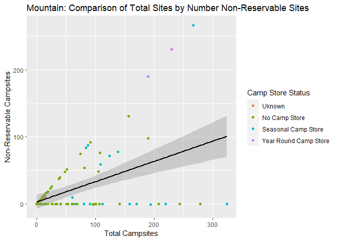

National Parks API Vignette
================
Kelley Breeze and Zhiyuan Yang
2022-09-22

-   <a href="#lets-learn-how-to-use-apis"
    id="toc-lets-learn-how-to-use-apis">Let’s Learn How To Use APIs!</a>
    -   <a href="#requirements" id="toc-requirements">Requirements</a>
    -   <a href="#national-parks-service-api"
        id="toc-national-parks-service-api">National Parks Service API</a>
    -   <a href="#a-quick-note-about-api-keys-and-renviron"
        id="toc-a-quick-note-about-api-keys-and-renviron">A Quick Note About API
        Keys and <code>.Renviron</code></a>
    -   <a href="#writing-functions-to-contact-the-api"
        id="toc-writing-functions-to-contact-the-api">Writing Functions to
        Contact the API</a>
        -   <a
            href="#learning-how-to-create-a-function-to-contact-and-return-data-from-an-api"
            id="toc-learning-how-to-create-a-function-to-contact-and-return-data-from-an-api">Learning
            How to Create a Function to Contact and Return Data From an API</a>
        -   <a href="#getstate-helper-function"
            id="toc-getstate-helper-function"><code>getState</code> Helper
            Function</a>
    -   <a href="#functions-to-contact-the-national-parks-api"
        id="toc-functions-to-contact-the-national-parks-api">Functions to
        Contact the National Parks API</a>
        -   <a href="#contacting-the-parks-endpoint-and-allowing-for-modifications"
            id="toc-contacting-the-parks-endpoint-and-allowing-for-modifications">Contacting
            the <code>parks</code> Endpoint and Allowing for Modifications</a>
        -   <a href="#contacting-the-events-endpoint-and-allowing-for-modifications"
            id="toc-contacting-the-events-endpoint-and-allowing-for-modifications">Contacting
            the <code>events</code> Endpoint and Allowing for Modifications</a>
        -   <a
            href="#contacting-the-thingstodo-endpoint-and-allowing-for-modifications"
            id="toc-contacting-the-thingstodo-endpoint-and-allowing-for-modifications">Contacting
            the <code>thingstodo</code> Endpoint and Allowing for Modifications</a>
        -   <a
            href="#contacting-the-campgrounds-endpoint-and-allowing-for-modifications"
            id="toc-contacting-the-campgrounds-endpoint-and-allowing-for-modifications">Contacting
            the <code>campgrounds</code> Endpoint and Allowing for Modifications</a>
    -   <a href="#data-exploration" id="toc-data-exploration">Data
        Exploration</a>
    -   <a href="#creating-new-variables-as-a-function-of-other-variables"
        id="toc-creating-new-variables-as-a-function-of-other-variables">Creating
        New Variables as a Function of Other Variables</a>
        -   <a href="#creating-variables-with-the-cleaningdata-funtion"
            id="toc-creating-variables-with-the-cleaningdata-funtion">Creating
            Variables with the <code>cleaningData</code> Funtion</a>
        -   <a href="#getcleancampground-wrapper-function"
            id="toc-getcleancampground-wrapper-function"><code>getCleanCampground()</code>
            Wrapper Function</a>
        -   <a
            href="#pulling-data-from-the-api-using-our-data-obtaining-function-getcleancampground"
            id="toc-pulling-data-from-the-api-using-our-data-obtaining-function-getcleancampground">Pulling
            Data From the API Using Our Data Obtaining Function
            <code>getCleanCampground()</code></a>
    -   <a href="#numerical-summaries" id="toc-numerical-summaries">Numerical
        Summaries</a>
        -   <a
            href="#creating-numerical-summaries-for-quantivative-variables-at-each-setting-of-a-categorical-variable"
            id="toc-creating-numerical-summaries-for-quantivative-variables-at-each-setting-of-a-categorical-variable">Creating
            Numerical Summaries for Quantivative Variables at Each Setting of a
            Categorical Variable</a>
        -   <a href="#contingency-tables" id="toc-contingency-tables">Contingency
            Tables</a>
    -   <a href="#data-visualization-with-ggplot2"
        id="toc-data-visualization-with-ggplot2">Data Visualization with
        <code>ggplot2</code></a>
        -   <a href="#creating-bar-plots" id="toc-creating-bar-plots">Creating Bar
            Plots</a>
        -   <a href="#creating-a-histogram" id="toc-creating-a-histogram">Creating a
            Histogram</a>
        -   <a href="#creating-a-boxplot" id="toc-creating-a-boxplot">Creating a
            Boxplot</a>
        -   <a href="#creating-scatterplots" id="toc-creating-scatterplots">Creating
            Scatterplots</a>

# Let’s Learn How To Use APIs!

This vignette is dedicated to helping better understand APIs.
Specifically, we will be looking at how to contact an API using
user-generated functions to query, parse and return well structured
data. The second portion of this vignette will look at how to use
functions to do some exploratory data analysis on data obtained from the
API.

## Requirements

In order to follow along with this vignette, the user will need to load
the following packages using the `library()` function.

1.  The `jsonlite` package - The `jsonlite` package will allow us to
    contact the API via URL and help to parse the data returned from our
    API. The National Parks API only returns data in the form of JSON
    files, so the `jsonlite` package will work nicely with this API. If
    you are working with another API it will be important to understand
    what type of data the API will return and identify the appropriate
    package to parse your raw data that your API returns.  
2.  The `tidyverse` package - The `tidyverse` package will allow us to
    perform basic exploratory data analysis.  
3.  The `stringr` package will help with error handling for our state
    names/abbreviations. We can use this to work with strings provided
    by the user to the state argument to help identify and reformat user
    provided information.  
4.  The `knitr` package will help with making our tables display in a
    much easier to read format.

In addition to the libraries listed above the user will need to create
their own `.Renviron` file to store their private API Key to protect it
from accidentally being shared publicly on github. You will want to make
sure that you add `.Renviron` to your `.gitignore` file so that it will
not be committed to github. Within the `.Renviron` file you can store
your API key using the following line of code: `apiKey="YourNPSAPIKey"`.
More detail on API keys and the `.Renviron` file can be found below in
the **Quick Note About API Keys and `.Renviron`** section.

``` r
library(jsonlite)
library(tidyverse)
library(stringr)
library(knitr)
```

## National Parks Service API

**Background Information on the National Parks Service API**

For this vignette we are using the [National Parks Service’s
API](https://www.nps.gov/subjects/developer/api-documentation.htm). This
API is designed to provide data about US National Parks and their
facilities, events, news, alerts, activities, and much more. With over
20 different endpoints, this API provides a wide array of different
types of data that one might be interested in working with when trying
to learn about how to interact with and use APIs in R. Users do need an
API key (provided for free if you register) to use the National Parks
API. It returns data JSON format only.

## A Quick Note About API Keys and `.Renviron`

Most APIs will require a user to enter an API key when contacting the
API. An API key is unique to each user. For some APIs these are provided
free and are able to be used for essentially unlimited calls to an API.
In other cases, a user may be limited in the number of calls allowed to
an API or may even be charged for access to the APIs data. In any case,
you **SHOULD ALWAYS KEEP YOUR API KEY PRIVATE!** The easiest way to do
this when working on a project in Rstudio/github is to create a
`.Renviron` file in your working directory for your project that stores
your API key. You can then update your `.gitignore` to include your
`.Renviron` file, thereby allowing you to access your API key for use
during calls to the API, while at the same time keeping your API key
secret and preventing the key from being uploaded to github. You can add
files directly to your `.gitignore` file or you can use menu options in
RStudio.

You can also store other useful objects in `.Reviron`, such as a
baseURL, that you can then access for use in different functions that
you create to contact your API. This prevents having to rewrite the same
baseURL over and over again, and can also allow you to easily update
functions that use this baseURL if the API itself decides to change the
baseURL required.

## Writing Functions to Contact the API

We first need to write functions to contact the API an return
well-formatted, parsed data in the form of data frames. We will
demonstrate how to write functions that allow the user to customize
their query and return specific data. Additionally, we will show how to
tackle error handling and allow for a more flexible user interface that
allows the user to specify state by either the two letter state
abbreviation, or the full state name.

### Learning How to Create a Function to Contact and Return Data From an API

**NOTE: The purpose of the `getEndpointData()` function is to
demonstrate how one would go about constructing a function to contact a
user specified endpoint of an API and to return parsed data via the
`fromJSON` function of the `jsonlite` package. As this function is for
demonstration purposes only, we will not use it after this point in the
vignette.**

In order to contact an API a user must send a URL in the correct format
during the call to the API. You can find specifics for how your API
wants the URL request formatted by looking at the documentation for your
API. The `getEndpointData()` function provides an example of how we can
construct our `searchURL` from the user specified `endpoint`. Knowing
how to correctly format a URL from user input is the first step in
writing functions to work with APIs. Notice that within the
`getEndpointData()` function we are using `Sys.getenv()` to access our
`apiKey` and our `baseURL` that have been stored in our `.Renviron`
file. This protects the privacy of our API key and makes later changes
to our baseURL much easier to handle. In this example, the
`getEndpointData()` function demonstrates how to contact an API to
return initial data from an endpoint using the `fromJSON()` function
from the `jsonlite` package. This function will allow a user to specify
any endpoint from the National Parks Service API and return formatted
data from that endpoint. The `getEndpointData()` function will format
our request to the API with the specified endpoint, contact the API to
and return and parse the data into a more usable format.

``` r
getEndpointInfo<- function(endpoint){
  limit<- "50"
  apiKey<-Sys.getenv("apiKey")
  baseURL<-Sys.getenv("baseURL")
  searchURL<- paste0(baseURL, endpoint, "?","&", apiKey)
  #At this point we have built our URL query string given the user input of endpoint. If we were returning data from the activities endpoint the searchURL that the function is generating at this point looks like the code below:
  
  #https://developer.nps.gov/api/v1/activities?api_key=YOUR_API_KEY
  
  #We then use this URL to return the data we want from our API using the fromJSON function from the jsnolite package.
  endpointInfo<- fromJSON(searchURL)
  
  return(endpointInfo)
  }
```

Let’s see what the data looks like from the `getEndpointInfo()`
function. When we use the `str()` function to take a look at what our
function returns on our `actitivites` endpoint, we can see the it
returns a list of 4 elements containing our total results(`40`), the
limit of the number of results that would be returned (`50`), the start
of our results (`0`), and then our `data`. This shows that to access the
information that we need from this endpoint we need to specify to return
`activities$data` in our function. Lets revise our initial function so
that we are only returning the `data` element of our endpoint.

``` r
str(getEndpointInfo("activities"))
```

    ## List of 4
    ##  $ total: chr "40"
    ##  $ limit: chr "50"
    ##  $ start: chr "0"
    ##  $ data :'data.frame':   40 obs. of  2 variables:
    ##   ..$ id  : chr [1:40] "09DF0950-D319-4557-A57E-04CD2F63FF42" "13A57703-BB1A-41A2-94B8-53B692EB7238" "5F723BAD-7359-48FC-98FA-631592256E35" "7CE6E935-F839-4FEC-A63E-052B1DEF39D2" ...
    ##   ..$ name: chr [1:40] "Arts and Culture" "Astronomy" "Auto and ATV" "Biking" ...

\*\*Updated to return just our `data` element from our specified
endpoint.

``` r
getEndpointData<- function(endpoint){
  limit<- "50"
  apiKey<-Sys.getenv("apiKey")
  baseURL<-Sys.getenv("baseURL")
  searchURL<- paste0(baseURL, endpoint, "?", "&", apiKey)
  endpointData<- fromJSON(searchURL)
  
  return(endpointData$data)
  }
```

**Ok, now to look again to see what the new returned results look like
from our `getEndPointData` function.**

``` r
str(getEndpointData("activities"))
```

    ## 'data.frame':    40 obs. of  2 variables:
    ##  $ id  : chr  "09DF0950-D319-4557-A57E-04CD2F63FF42" "13A57703-BB1A-41A2-94B8-53B692EB7238" "5F723BAD-7359-48FC-98FA-631592256E35" "7CE6E935-F839-4FEC-A63E-052B1DEF39D2" ...
    ##  $ name: chr  "Arts and Culture" "Astronomy" "Auto and ATV" "Biking" ...

We can see that the updated function will return a dataframe object from
the `activities` endpoint with 40 observations on two variables, in this
case the activity `id` and the activity `name`. We have successfully
returned only the `data` portion from the `actitivites` endpoint. This
is what we will want to work with from our endpoints when we move on to
the data exploration and analysis steps. Again, the `getEndpointInfo()`
and `getEndpointData()` functions written here are simply to demonstrate
how you would want to construct a simple call to an API. We will not be
using these specific functions going forward in the vignette, although
the `getEndpointData()` function was very convenient for quickly looking
through the types of information found at each endpoint and allowing us
to narrow down which endpoints might be good to use for our data
exploration and analysis steps.

### `getState` Helper Function

The `getState` helper function will allow us to handle different types
of inputs for our state value, including a two state abbreviation or a
state name that are both not case sensitive. We want to allow a user to
specify state using either a two letter state code or the full state
name (not case sensitive). If no state is specified the `getState`
function will return a `NULL` value for `retState`, which will be
important when we use this helper function in future calls to the
National Parks API. In a call to the National Parks API, a `NULL` value
for the state argument will return information on all states. The
`getState` function will return an error message if a user did not
specify a valid value for a state, and provide information about correct
formatting for the state argument.

``` r
getState <- function(state) {
  if(is.null(state)) {
    return(NULL)
  }
  
  retState <-NULL
  
  # State is a state name, find abbreviation.
  if(str_to_title(state) %in% state.name) {
    # Match state code with state name using state.abb and state.name built in to R.
    retState <- state.abb[match(str_to_title(state),state.name)]
  } else if(toupper(state) %in% state.abb) {
    retState <- toupper(state)
  } else {
    stop("ERROR: Value for state argument was not a valid US state name or state two letter abbreiation. Try again. For example, NC or North Carolina will return campsites in North Carolina. NOTE: state argument is NOT case sensitive!")
  }
}
```

## Functions to Contact the National Parks API

We have written four functions to connect to four different endpoints
(`parks`, `events`, `thingstodo`, and `campgrounds`) and allow for user
modifications on each endpoint when contacting the API. All of these
functions will return data in the form of a tibble.

### Contacting the `parks` Endpoint and Allowing for Modifications

The `parks` endpoint on the National Parks API returns information about
the national parks including addresses, contacts, hours of operation,
websites, activities and more. The `getParksInfo` function contacts the
`parks` endpoint and allows the user to enter up to three modifications
of that endpoint. The modifications available for the `parks` endpoint
allow a user to specify the state returned (`state`), specify the number
of results returned (`limit`), and to enter a search term to apply (such
as hiking or mountains) that will return data from the API that match
the `searchTerm` entered. The default value for the `state` modification
is `NULL`, which will result in data from all states being returned. The
default value for the `limit` modification is `30`, which will limit the
results returned to 30. The default value for the `searchTerm`
modification is `NULL`, and will return results from the `parks`
endpoint without limiting by a `searchTerm`. Note that we are using the
`getState()` function to ensure that the state value entered is a valid
value and to return an error if a non-state is entered. We are also
relying on our `.Renviron` file to retrieve our `baseURL` and our
`apiKey`.

``` r
getParksInfo <- function(state=NULL, limit=30, searchTerm=NULL) {
  searchURL <- paste0(Sys.getenv("baseURL"), "parks?", Sys.getenv("apiKey"), "&")

  searchState <- getState(state)
  
  if(!is.null(searchState)) {
    searchURL <- paste0(searchURL, "stateCode=", searchState, "&")
  }
  
  searchURL <- paste0(searchURL, "limit=", limit, "&")
  
  if(!is.null(searchTerm)){
    searchURL<- paste0(searchURL, "q=", searchTerm)
  }

  parks<- fromJSON(searchURL)
  
  return(as_tibble(parks$data))
}
```

#### Testing `getParksInfo()` Function with Different Modifications

**Using `getParksInfo()` with the default values for `state`, `limit`,
and `searchTerm`.**

``` r
getParksInfo()
```

<div data-pagedtable="false">

<script data-pagedtable-source type="application/json">
{"columns":[{"label":["id"],"name":[1],"type":["chr"],"align":["left"]},{"label":["url"],"name":[2],"type":["chr"],"align":["left"]},{"label":["fullName"],"name":[3],"type":["chr"],"align":["left"]},{"label":["parkCode"],"name":[4],"type":["chr"],"align":["left"]},{"label":["description"],"name":[5],"type":["chr"],"align":["left"]},{"label":["latitude"],"name":[6],"type":["chr"],"align":["left"]},{"label":["longitude"],"name":[7],"type":["chr"],"align":["left"]},{"label":["latLong"],"name":[8],"type":["chr"],"align":["left"]},{"label":["activities"],"name":[9],"type":["list"],"align":["right"]},{"label":["topics"],"name":[10],"type":["list"],"align":["right"]},{"label":["states"],"name":[11],"type":["chr"],"align":["left"]},{"label":["contacts"],"name":[12],"type":["df[,2]"],"align":["right"]},{"label":["entranceFees"],"name":[13],"type":["list"],"align":["right"]},{"label":["entrancePasses"],"name":[14],"type":["list"],"align":["right"]},{"label":["fees"],"name":[15],"type":["list"],"align":["right"]},{"label":["directionsInfo"],"name":[16],"type":["chr"],"align":["left"]},{"label":["directionsUrl"],"name":[17],"type":["chr"],"align":["left"]},{"label":["operatingHours"],"name":[18],"type":["list"],"align":["right"]},{"label":["addresses"],"name":[19],"type":["list"],"align":["right"]},{"label":["images"],"name":[20],"type":["list"],"align":["right"]},{"label":["weatherInfo"],"name":[21],"type":["chr"],"align":["left"]},{"label":["name"],"name":[22],"type":["chr"],"align":["left"]},{"label":["designation"],"name":[23],"type":["chr"],"align":["left"]}],"data":[{"1":"77E0D7F0-1942-494A-ACE2-9004D2BDC59E","2":"https://www.nps.gov/abli/index.htm","3":"Abraham Lincoln Birthplace National Historical Park","4":"abli","5":"For over a century people from around the world have come to rural Central Kentucky to honor the humble beginnings of our 16th president, Abraham Lincoln. His early life on Kentucky's frontier shaped his character and prepared him to lead the nation through Civil War. Visit our country's first memorial to Lincoln, built with donations from young and old, and the site of his childhood home.","6":"37.5858662","7":"-85.67330523","8":"lat:37.5858662, long:-85.67330523","9":"<df[,2] [14 × 2]>","10":"<df[,2] [9 × 2]>","11":"KY","12":"<df[,2] [30 × 2]>","13":"<df[,3] [1 × 3]>","14":"<df[,0] [0 × 0]>","15":"<list [0]>","16":"The Birthplace Unit of the park is located approximately 2 miles south of the town of Hodgenville on U.S. Highway 31E South. The Boyhood Home Unit at Knob Creek is located approximately 10 miles northeast of the Birthplace Unit of the park.","17":"http://www.nps.gov/abli/planyourvisit/directions.htm","18":"<df[,4] [2 × 4]>","19":"<df[,7] [2 × 7]>","20":"<df[,5] [4 × 5]>","21":"There are four distinct seasons in Central Kentucky. However, temperature and weather conditions can vary widely within those seasons. Spring and Fall are generally pleasant with frequent rain showers. Summer is usually hot and humid. Winter is moderately cold with mixed precipitation.","22":"Abraham Lincoln Birthplace","23":"National Historical Park"},{"1":"6DA17C86-088E-4B4D-B862-7C1BD5CF236B","2":"https://www.nps.gov/acad/index.htm","3":"Acadia National Park","4":"acad","5":"Acadia National Park protects the natural beauty of the highest rocky headlands along the Atlantic coastline of the United States, an abundance of habitats, and a rich cultural heritage. At 4 million visits a year, it's one of the top 10 most-visited national parks in the United States. Visitors enjoy 27 miles of historic motor roads, 158 miles of hiking trails, and 45 miles of carriage roads.","6":"44.409286","7":"-68.247501","8":"lat:44.409286, long:-68.247501","9":"<df[,2] [46 × 2]>","10":"<df[,2] [31 × 2]>","11":"ME","12":"<df[,2] [30 × 2]>","13":"<df[,3] [3 × 3]>","14":"<df[,3] [1 × 3]>","15":"<list [0]>","16":"From Boston take I-95 north to Augusta, Maine, then Route 3 east to Ellsworth, and on to Mount Desert Island. For an alternate route, continue on I-95 north to Bangor, Maine, then take I-395 to U.S. Route 1A east to Ellsworth. In Ellsworth, take Route 3 to Mount Desert Island.","17":"http://www.nps.gov/acad/planyourvisit/directions.htm","18":"<df[,4] [1 × 4]>","19":"<df[,7] [2 × 7]>","20":"<df[,5] [4 × 5]>","21":"Located on Mount Desert Island in Maine, Acadia experiences all four seasons. Summer temperatures range from 45-90F (7-30C). Fall temperatures range from 30-70F (-1-21C). Typically the first frost is in mid-October and first snowfall begins in November and can continue through April with an average accumulation of 73 inches (185 cm). Winter temperatures range from 14-35F (-10 - 2C). Spring temperatures range from 30-70F (-1-21C).","22":"Acadia","23":"National Park"},{"1":"E4C7784E-66A0-4D44-87D0-3E072F5FEF43","2":"https://www.nps.gov/adam/index.htm","3":"Adams National Historical Park","4":"adam","5":"From the sweet little farm at the foot of Penn’s Hill to the gentleman’s country estate at Peace field, Adams National Historical Park is the story of “heroes, statesman, philosophers … and learned women” whose ideas and actions helped to transform thirteen disparate colonies into one united nation.","6":"42.2553961","7":"-71.01160356","8":"lat:42.2553961, long:-71.01160356","9":"<df[,2] [6 × 2]>","10":"<df[,2] [2 × 2]>","11":"MA","12":"<df[,2] [30 × 2]>","13":"<df[,3] [1 × 3]>","14":"<df[,0] [0 × 0]>","15":"<list [0]>","16":"Traveling on U.S. Interstate 93, take exit 7 - Route 3 South to Braintree and Cape Cod. Take the first exit off Route 3 south - exit 42 - and follow signs toward Quincy Center. Continue straight on Burgin Parkway through six traffic lights. At the seventh traffic light, turn right onto Dimmock Street. Follow Dimmock Street one block and turn right onto Hancock Street. The National Park Service Visitor Center, located at 1250 Hancock Street on your left. Validated parking is in the garage to the rear.","17":"http://www.nps.gov/adam/planyourvisit/directions.htm","18":"<df[,4] [1 × 4]>","19":"<df[,7] [2 × 7]>","20":"<df[,5] [8 × 5]>","21":"Be prepared for hot, humid weather. The historic homes are not air conditioned. While the visitor center remains open all year, the historic homes are closed from November 1 through April 30.","22":"Adams","23":"National Historical Park"},{"1":"1A47416F-DAA3-4137-9F30-14AF86B4E547","2":"https://www.nps.gov/afam/index.htm","3":"African American Civil War Memorial","4":"afam","5":"Over 200,000 African-American soldiers and sailors served in the U.S. Army and Navy during the Civil War. Their service helped to end the war and free over four million slaves. The African American Civil War Memorial honors their service and sacrifice.","6":"38.9166","7":"-77.026","8":"lat:38.9166, long:-77.026","9":"<df[,2] [2 × 2]>","10":"<df[,2] [4 × 2]>","11":"DC","12":"<df[,2] [30 × 2]>","13":"<df[,3] [1 × 3]>","14":"<df[,3] [1 × 3]>","15":"<list [0]>","16":"The memorial is located at the corner of Vermont Avenue, 10th St, and U Street NW, near the U Street/African-American Civil War Memorial/Cardozo Metro Station.","17":"http://www.nps.gov/afam/planyourvisit/directions.htm","18":"<df[,4] [1 × 4]>","19":"<df[,7] [2 × 7]>","20":"<df[,5] [5 × 5]>","21":"Washington DC gets to see all four seasons. Humidity will make the temps feel hotter in summer and colder in winter. Spring (March - May) Temp: Average high is 65.5 degrees with a low of 46.5 degrees Summer (June - August) Temp: Average high is 86 degrees with a low of 68.5 degrees Fall (September - November) Temp: Average high is 68 degrees with a low of 51.5 degrees Winter (December - February) Temp: Average high is 45 degrees with a low of 30 degrees (Source: www.usclimatedata.com)","22":"African American Civil War Memorial","23":""},{"1":"E6E1D22A-7A89-47F8-813C-B611059A8CF9","2":"https://www.nps.gov/afbg/index.htm","3":"African Burial Ground National Monument","4":"afbg","5":"African Burial Ground is the oldest and largest known excavated burial ground in North America for both free and enslaved Africans. It protects the historic role slavery played in building New York","6":"40.71452681","7":"-74.00447358","8":"lat:40.71452681, long:-74.00447358","9":"<df[,2] [7 × 2]>","10":"<df[,2] [9 × 2]>","11":"NY","12":"<df[,2] [30 × 2]>","13":"<df[,3] [1 × 3]>","14":"<df[,3] [1 × 3]>","15":"<list [0]>","16":"The African Burial Ground National Monument is located on the first floor of the Ted Weiss Federal Building located at 290 Broadway in Lower Manhattan; close to Foley Square and just north of City Hall. Our visitor center is located mid-block on Broadway between the cross streets of Duane Street and Reade Streets.","17":"http://www.nps.gov/afbg/planyourvisit/directions.htm","18":"<df[,4] [2 × 4]>","19":"<df[,7] [2 × 7]>","20":"<df[,5] [5 × 5]>","21":"http://forecast.weather.gov/MapClick.php?CityName=New+York&state=NY&site=OKX&lat=40.7198&lon=-73.993#.Vqj8OvkrJlZ","22":"African Burial Ground","23":"National Monument"},{"1":"64B9F127-31ED-43C9-882D-D7CD471AF314","2":"https://www.nps.gov/agfo/index.htm","3":"Agate Fossil Beds National Monument","4":"agfo","5":"In the early 1900s, paleontologists unearthed the Age of Mammals when they found full skeletons of extinct Miocene mammals in the hills of Nebraska -- species previously only known through fragments. At the same time, an age of friendship began between rancher James Cook and Chief Red Cloud of the Lakota. These two unprecedented events are preserved and protected here... at Agate Fossil Beds.","6":"42.42170419","7":"-103.753886","8":"lat:42.42170419, long:-103.753886","9":"<df[,2] [16 × 2]>","10":"<df[,2] [16 × 2]>","11":"NE","12":"<df[,2] [30 × 2]>","13":"<df[,3] [1 × 3]>","14":"<df[,0] [0 × 0]>","15":"<list [0]>","16":"From US 20: 22 miles south of Harrison, NE on State Hwy 29, then three miles east on River Road (paved) From US 26: 34 miles north of Mitchell, NE on State Hwy 29, then three miles east on River Road (paved). From State Hwy 71: 25 miles west on the unpaved portion of River Road.","17":"http://www.nps.gov/agfo/planyourvisit/directions.htm","18":"<df[,4] [2 × 4]>","19":"<df[,7] [2 × 7]>","20":"<df[,5] [5 × 5]>","21":"Summers can be very warm, high 90's to 100 with the frequent afternoon thunderstorms. Plan to hike early and come down from the higher points if storms threaten. Winter temperatures can dip as low as -20 with snow and wind. Heaviest snows can be expected in late Spring.","22":"Agate Fossil Beds","23":"National Monument"},{"1":"3B8307B3-54AB-4E5F-ACBC-8DECB98AD5F1","2":"https://www.nps.gov/alka/index.htm","3":"Ala Kahakai National Historic Trail","4":"alka","5":"Established in 2000 to preserve, protect and interpret traditional Native Hawaiian culture and natural resources, Ala Kahakai National Historic Trail is a 175 mile corridor encompassing a network of culturally and historically significant trails. This \"trail by the sea\" traverses wahi pana (storied landscapes), ancient Hawaiian sites and over 200 ahupuaʻa (traditional land divisions). Connect now!","6":"19.144668109","7":"-155.890734294","8":"lat:19.144668109, long:-155.890734294","9":"<df[,2] [43 × 2]>","10":"<df[,2] [26 × 2]>","11":"HI","12":"<df[,2] [30 × 2]>","13":"<df[,3] [1 × 3]>","14":"<df[,3] [1 × 3]>","15":"<list [0]>","16":"Open sections of the Ala Kahakai NHT can be accessed through the four Hawai'i Island National Parks: Hawaiʻi Volcanoes NP, Pu'uhonua o Hōnaunau NHP, Kaloko-Honokōhau NHP and Pu'ukoholā Heiau NHS. The Nā Ala Hele State Trails and Access Programʻs \"Ala Kahakai Trail\" in South Kohala is also open to the public. Additional sections of the trail are opened as they are sufficiently managed to protect the trail and associated areas.","17":"http://home.nps.gov/alka/planyourvisit/directions.htm","18":"<df[,4] [1 × 4]>","19":"<df[,7] [2 × 7]>","20":"<df[,5] [5 × 5]>","21":"Hawaiʻiʻs coast is generally sunny and hot. Be prepared with sun protection (hat, mineral-based sunscreen, sunglasses and long sleeves) and water (minimum 2 liters of water per person per day for short hikes). Before visiting the Trail, check weather forecasts and follow all warnings and advisories: - https://www.weather.gov/hfo/ - www.hawaiicounty.gov/active-alerts","22":"Ala Kahakai","23":"National Historic Trail"},{"1":"C4E1A9A4-D121-4734-94FA-7788A93C2AAA","2":"https://www.nps.gov/alag/index.htm","3":"Alagnak Wild River","4":"alag","5":"The headwaters of Alagnak Wild River lie within the rugged Aleutian Range of neighboring Katmai National Park and Preserve. Meandering west towards Bristol Bay and the Bering Sea, the Alagnak traverses the beautiful Alaska Peninsula, providing an unparalleled opportunity to experience the unique wilderness, wildlife, and cultural heritage of southwest Alaska.","6":"59.05180188","7":"-156.112002","8":"lat:59.05180188, long:-156.112002","9":"<df[,2] [12 × 2]>","10":"<df[,2] [10 × 2]>","11":"AK","12":"<df[,2] [30 × 2]>","13":"<df[,3] [1 × 3]>","14":"<df[,0] [0 × 0]>","15":"<list [0]>","16":"Alagnak Wild River is located in a remote part of the Alaska Peninsula, about 290 miles southwest of Anchorage. Access is by boat or small floatplane.","17":"http://www.nps.gov/alag/planyourvisit/directions.htm","18":"<df[,4] [1 × 4]>","19":"<df[,7] [2 × 7]>","20":"<df[,5] [3 × 5]>","21":"Located between the stormy north Pacific Ocean and the even stormier Bering Sea, the Alagnak Wild River is often a battleground between weather systems. When you visit, be prepared to encounter all types of weather.  On average, wet and cool conditions predominate in spring, summer, and fall. Winters are drier and colder.","22":"Alagnak","23":"Wild River"},{"1":"7D6098F9-3F75-4775-A56D-CD9C7F9A9488","2":"https://www.nps.gov/anch/index.htm","3":"Alaska Public Lands","4":"anch","5":"Alaska’s parks, forests, and refuges are rich and varied. The Alaska Public Lands Information Centers help visitors and residents to have meaningful, safe, enjoyable experiences on public lands, and encourages them to sustain the natural and cultural resources of Alaska. These centers provide trip-planning, interpretation, and education for all ages.","6":"61.2188","7":"-149.894536","8":"lat:61.2188, long:-149.894536","9":"<df[,0] [0 × 0]>","10":"<df[,0] [0 × 0]>","11":"AK","12":"<df[,2] [30 × 2]>","13":"<df[,3] [1 × 3]>","14":"<df[,0] [0 × 0]>","15":"<list [0]>","16":"Anchorage APLIC is located in downtown Anchorage on 4th Avenue, in the Federal Building. Fairbanks APLIC is located in downtown Fairbanks on the corner of Dunkel Street and Wendell Avenue, near the Chena River.","17":"http://alaskacenters.gov/anchorage-directions.cfm","18":"<df[,4] [2 × 4]>","19":"<df[,7] [2 × 7]>","20":"<df[,5] [3 × 5]>","21":"Visitors center is located inside the Federal Building and weather conditions are seasonal conditions of the Anchorage area, outside the facility.","22":"Alaska Public Lands","23":""},{"1":"C08AD828-98FF-478E-A63C-614E7534274B","2":"https://www.nps.gov/alca/index.htm","3":"Alcatraz Island","4":"alca","5":"Alcatraz reveals stories of American incarceration, justice, and our common humanity. This small island was once a fort, a military prison, and a maximum security federal penitentiary. In 1969, the Indians of All Tribes occupied Alcatraz for 19 months in the name of freedom and Native American civil rights. We invite you to explore Alcatraz's complex history and natural beauty.","6":"37.82676234","7":"-122.4230206","8":"lat:37.82676234, long:-122.4230206","9":"<df[,2] [5 × 2]>","10":"<df[,2] [17 × 2]>","11":"CA","12":"<df[,2] [30 × 2]>","13":"<df[,3] [3 × 3]>","14":"<df[,0] [0 × 0]>","15":"<list [0]>","16":"The Alcatraz Ferry Terminal is located on The Embarcadero near the intersection of Bay Street at Pier 33.","17":"http://home.nps.gov/alca/planyourvisit/directions.htm","18":"<df[,4] [1 × 4]>","19":"<df[,7] [2 × 7]>","20":"<df[,5] [5 × 5]>","21":"The climate on Alcatraz is unpredictable and can change suddenly. Cold, foggy mornings may give way to sunny afternoons, which in turn can shift quickly back to more fog and blustery winds. The most pleasant weather usually occurs in spring and fall. Summers tend to be cool and foggy, winter is our rainy season. Temperatures on Alcatraz seldom rise above 75°F (24°C) or fall below 38°","22":"Alcatraz Island","23":""},{"1":"94B046DC-2AFD-4ECB-A60D-CE210A8550B1","2":"https://www.nps.gov/aleu/index.htm","3":"Aleutian Islands World War II National Historic Area","4":"aleu","5":"During World War II the remote Aleutian Islands, home to the Unangax̂ (Aleut) people for over 8,000 years, became a fiercely contested battleground in the Pacific. This thousand-mile-long archipelago saw invasion by Japanese forces, the occupation of two islands; a mass relocation of Unangax̂ civilians; a 15-month air war; and one of the deadliest battles in the Pacific Theater.","6":"53.9143","7":"-166.5197","8":"lat:53.9143, long:-166.5197","9":"<df[,2] [7 × 2]>","10":"<df[,2] [30 × 2]>","11":"AK","12":"<df[,2] [30 × 2]>","13":"<df[,3] [2 × 3]>","14":"<df[,0] [0 × 0]>","15":"<list [0]>","16":"The park is located on Amaknak Island in the Aleutian Island chain. The island is located 800 miles west of Anchorage. The island can be reached by commercial or charter air flights from Anchorage. Commercial flights to Unalaska include Pen Air and Alaska Airlines. The Alaska Marine Highway is a ferry service that is operated by the state that can be used to reach the island. The Aleutian World War II Visitor Center is located at the Unalaska airport.","17":"http://www.nps.gov/aleu/planyourvisit/directions.htm","18":"<df[,4] [1 × 4]>","19":"<df[,7] [2 × 7]>","20":"<df[,5] [6 × 5]>","21":"The Aleutian Islands are known for unpredictable and stormy weather. Rain, fog, and wind are common. Dress warmly and carry rain gear even in summer. Summer temperatures range from 45 to 65 degrees F. Early summer and fall often have clear sunny days with spectacular views of the surrounding volcanoes. See forecast: https://forecast.weather.gov/MapClick.php?lon=-166.52406692504883&lat=53.91748321582622#.X0aTYsi6OUk","22":"Aleutian Islands World War II","23":"National Historic Area"},{"1":"6D82D070-995A-4524-A56E-C1CE182E7D9B","2":"https://www.nps.gov/alfl/index.htm","3":"Alibates Flint Quarries National Monument","4":"alfl","5":"13,000 years ago, this site was well-known by mammoth hunters as a source of flint for tools. Centuries passed, but the colorful flint never lost its value or usefulness in the Texas Panhandle. Learn how important this site was to the survival, commerce and culture of the people of the High Plains.","6":"35.5819662","7":"-101.6717008","8":"lat:35.5819662, long:-101.6717008","9":"<df[,2] [7 × 2]>","10":"<df[,2] [2 × 2]>","11":"TX","12":"<df[,2] [30 × 2]>","13":"<df[,3] [1 × 3]>","14":"<df[,3] [1 × 3]>","15":"<list [0]>","16":"Alibates Flint Quarries is located approximately 35 miles north of Amarillo, Texas. From I-40 in Amarillo, take Lakeside exit north towards Lake Meredith National Recreation Area. Exit on TX 136 north towards Borger. After about 30 miles, turn west from TX 136 onto Cas Johnson Road. Park Service signs will be visible. Proceed approximately 3 miles to \"Y\" intersection and bear to right. Go northwest approximately 2 miles to the Alibates Flint Quarries National Monument Visitor Center.","17":"http://www.nps.gov/alfl/planyourvisit/directions.htm","18":"<df[,4] [1 × 4]>","19":"<df[,7] [2 × 7]>","20":"<df[,5] [5 × 5]>","21":"The Texas Panhandle experiences a wide variety of weather conditions throughout the year. Winters are cold and windy, and summers are hot and dry. It is usually a good idea to bring a jacket with you if you are planning on hiking to the quarries with a ranger because the mesa gets very windy, even in the summer.","22":"Alibates Flint Quarries","23":"National Monument"},{"1":"3350C18C-8E07-487B-930E-37AD873D31AD","2":"https://www.nps.gov/alpo/index.htm","3":"Allegheny Portage Railroad National Historic Site","4":"alpo","5":"The first railroad to circumvent the Allegheny Mountains, the Allegheny Portage Railroad was the finishing piece of the Pennsylvania Main Line Canal. \"The Portage\" opened in 1834, marking the first time that there was one, direct route between Philadelphia and Pittsburgh. All things to all people, it served merchants, passengers, slaves in pursuit of freedom, and soldiers from the Mexican War.","6":"40.42977467","7":"-78.57431622","8":"lat:40.42977467, long:-78.57431622","9":"<df[,2] [16 × 2]>","10":"<df[,2] [26 × 2]>","11":"PA","12":"<df[,2] [30 × 2]>","13":"<df[,3] [1 × 3]>","14":"<df[,3] [1 × 3]>","15":"<list [0]>","16":"The park is located just off U.S. Route 22 approximately 12 miles west of Altoona and 10 miles east of Ebensburg. Take the Gallitzin Exit and turn right, following the signs. Visitors prior to 1992 accessed the park in other ways, but the GALLITZIN EXIT of US Route 22 is now the way to access the visitor center and historic area.","17":"http://www.nps.gov/alpo/planyourvisit/directions.htm","18":"<df[,4] [1 × 4]>","19":"<df[,7] [2 × 7]>","20":"<df[,5] [10 × 5]>","21":"The park is located in Cambria County, PA, and is at the summit of the Allegheny Mountains. Therefore, the park often takes on winter extremes. If planning on traveling from a long distance, please contact the park beforehand to ensure that the facilities are open. Please consult weather forecasts to ensure conditions are safe to travel in. Spring, summer, and fall are generally uneventful, but severe thunderstorms can occur.","22":"Allegheny Portage Railroad","23":"National Historic Site"},{"1":"D35004EF-5F5A-4DA4-8716-5141BE5C933C","2":"https://www.nps.gov/amch/index.htm","3":"Amache National Historic Site","4":"amch","5":"Amache, also known as the Granada Relocation Center, near Granada, Colorado was one of ten incarceration sites established by the War Relocation Authority during World War II to unjustly incarcerate Japanese Americans. Over 10,000 people, most American citizens, were incarcerated at Amache from 1942-1945. Amache - a place to reflect, recommit, and further the pursuit of freedom and justice.","6":"38.04962","7":"-102.32903","8":"lat:38.04962, long:-102.32903","9":"<df[,0] [0 × 0]>","10":"<df[,2] [2 × 2]>","11":"CO","12":"<df[,2] [30 × 2]>","13":"<df[,3] [1 × 3]>","14":"<df[,0] [0 × 0]>","15":"<list [0]>","16":"Amache National Historic Site is in southeastern Colorado about 1.5 miles west of the town of Granada, 17.5 miles east of Lamar, and half an hour drive from the Kansas border. The site is located off Highway 385/50 along the Santa Fe Trail.","17":"https://www.nps.gov/amch/planyourvisit/directions.htm","18":"<df[,4] [1 × 4]>","19":"<df[,7] [2 × 7]>","20":"<df[,5] [1 × 5]>","21":"The site is located in Colorado on the High Plains, an arid, windy, and sunny environment. Temperatures and conditions can be extreme in this region, with hot, arid summers that include occasional thunderstorms and tornadoes, as well as cold and snowy winters.","22":"Amache","23":"National Historic Site"},{"1":"A0B4CA5E-608A-4DF2-8EFB-E2E4619EA243","2":"https://www.nps.gov/amme/index.htm","3":"American Memorial Park","4":"amme","5":"American Memorial Park honors the American and Marianas people who gave their lives during the Marianas Campaign of World War II. At the park, memorials stand in tribute to the courage and sacrifice of the US Servicemen and Chamorro and Carolinian civilians who were killed in the battles between the United States and Japan that took place on Saipan, Tinian, and the Philippine Sea in 1944.","6":"15.21680033","7":"145.7231096","8":"lat:15.21680033, long:145.7231096","9":"<df[,2] [22 × 2]>","10":"<df[,2] [21 × 2]>","11":"MP","12":"<df[,2] [30 × 2]>","13":"<df[,3] [1 × 3]>","14":"<df[,0] [0 × 0]>","15":"<list [0]>","16":"The park is centrally located along the western shoreline of Saipan, adjacent to downtown Garapan. From airport, proceed north on Airport Road (Tun Herman Pan Highway) until the road ends at Monsignor Guerrero Road (Highway 16). Turn left and continue until the road ends at Beach Road. Turn right until the road ends at the American Memorial Park Mall. Turn left onto Micro Beach Road. The parking lot is on the right.","17":"https://www.nps.gov/amme/planyourvisit/directions.htm","18":"<df[,4] [1 × 4]>","19":"<df[,7] [2 × 7]>","20":"<df[,5] [5 × 5]>","21":"The temperature varies from 75°F to 88°F and is rarely below 73°F or above 90°F.The climate is tropical, hot and humid throughout the year, with a relatively cool and dry season from December to June, and a warmer and rainy season from July to November. The temperatures are stable throughout the year.","22":"American Memorial","23":"Park"},{"1":"34CB30BA-8A5F-4563-AA34-6633708DD9DC","2":"https://www.nps.gov/amis/index.htm","3":"Amistad National Recreation Area","4":"amis","5":"An oasis in the desert, Amistad National Recreation Area consists of the US portion of the International Amistad Reservoir. Amistad, whose name comes from the Spanish word meaning friendship, is best known for excellent water-based recreation, camping, hiking, rock art viewing, and its rich cultural history. Amistad is also home to a wide variety of plant and animal life above and below the water.","6":"29.53539777","7":"-101.075821","8":"lat:29.53539777, long:-101.075821","9":"<df[,2] [23 × 2]>","10":"<df[,2] [27 × 2]>","11":"TX","12":"<df[,2] [30 × 2]>","13":"<df[,3] [1 × 3]>","14":"<df[,3] [2 × 3]>","15":"<list [0]>","16":"Six miles west of the HWY 90 and 277 North intersection at 10477 Highway 90 West.","17":"https://www.nps.gov/amis/planyourvisit/directions.htm","18":"<df[,4] [1 × 4]>","19":"<df[,7] [2 × 7]>","20":"<df[,5] [5 × 5]>","21":"Weather in Southwest Texas can change in a matter of minutes. It is best to check the local weather report. Amistad National Recreation Area usually has hot summers and mild winters. For more information, please visit our Current Conditions page at https://www.nps.gov/amis/planyourvisit/conditions.htm.","22":"Amistad","23":"National Recreation Area"},{"1":"9463E25C-7342-4A34-9537-4A6DA74B2B06","2":"https://www.nps.gov/anac/index.htm","3":"Anacostia Park","4":"anac","5":"Welcome to Anacostia Park, your neighborhood national park in the heart of Washington, DC! Enjoy exercise along the river trail or relax by the water, Anacostia Park is a breath of fresh air and a space to unwind amid a bustling city.","6":"38.8782","7":"-76.9703","8":"lat:38.8782, long:-76.9703","9":"<df[,2] [15 × 2]>","10":"<df[,2] [12 × 2]>","11":"DC","12":"<df[,2] [30 × 2]>","13":"<df[,3] [1 × 3]>","14":"<df[,3] [1 × 3]>","15":"<list [0]>","16":"Anacostia Park is located in South East Washington DC running parallel to the Anacostia river. The park can be accessed from the South Capitol bridge over the Anacostia river across from the Nationals baseball stadium. You can also enter the park from the Baltimore-Washington Parkway (295). You can enter the park from Good Hope Road or from Nicholson Street.","17":"http://www.nps.gov/anac/planyourvisit/directions.htm","18":"<df[,4] [1 × 4]>","19":"<df[,7] [2 × 7]>","20":"<df[,5] [5 × 5]>","21":"Spring brings mild temperatures and a light breeze along with springtime flower blooms. Summer can be hot and humid. Fall cools down and changing of the seasons brings changing of the colors in leaves. Winter gets cold and temperatures may drop below freezing.","22":"Anacostia","23":"Park"},{"1":"00E65872-53F7-4C9B-BD29-B9BC99930D0D","2":"https://www.nps.gov/ande/index.htm","3":"Andersonville National Historic Site","4":"ande","5":"Nearly 13,000 men died on these grounds, a site that became infamous even before the Civil War ended. Their burial grounds became Andersonville National Cemetery, where veterans continue to be buried today. This place, where tens of thousands suffered captivity so others could be free, is also home to the National Prisoner of War Museum and serves as a memorial to all American prisoners of war.","6":"32.19831758","7":"-84.12988898","8":"lat:32.19831758, long:-84.12988898","9":"<df[,2] [19 × 2]>","10":"<df[,2] [27 × 2]>","11":"GA","12":"<df[,2] [30 × 2]>","13":"<df[,3] [1 × 3]>","14":"<df[,3] [1 × 3]>","15":"<list [0]>","16":"Andersonville National Historic Site is located in southwest Georgia. The park is approximately 12 miles north of Americus and 11 miles south of Montezuma on GA-49.","17":"http://www.nps.gov/ande/planyourvisit/directions.htm","18":"<df[,4] [1 × 4]>","19":"<df[,7] [2 × 7]>","20":"<df[,5] [8 × 5]>","21":"Summer temperatures reach highs in the 80s-90s and high humidity. Winter temperatures tend to be in the 40s and below. Snow can occur but is rare. Average annual precipitation is 46.24 inches and is fairly evenly distributed throughout the year. The National Prisoner of War Museum is maintained at a cool temperature to help preserve artifacts; dressing in layers is recommended.","22":"Andersonville","23":"National Historic Site"},{"1":"2ED6E071-57AA-4B08-8DDA-5CB09FBB75C8","2":"https://www.nps.gov/anjo/index.htm","3":"Andrew Johnson National Historic Site","4":"anjo","5":"Andrew Johnson's complex presidency (1865-69) illustrates the Constitution at work following the Civil War. As the President and Congress disagreed on Reconstruction methods, the Constitution served as their guide on balance of powers, vetoes, and impeachment. In the end, it evolved as a living document with pivotal amendments on freedom, citizenship, and voting rights - topics still vital today.","6":"36.15624509","7":"-82.83709021","8":"lat:36.15624509, long:-82.83709021","9":"<df[,2] [5 × 2]>","10":"<df[,2] [8 × 2]>","11":"TN","12":"<df[,2] [30 × 2]>","13":"<df[,3] [1 × 3]>","14":"<df[,3] [1 × 3]>","15":"<list [0]>","16":"GPS The GPS setting for Andrew Johnson NHS may be listed as 121 Monument Ave, which is the park HQ in the National Cemetery. To arrive at the Visitor Center, use 101 North College Street, Greeneville, TN. Plane The closest airport is the Tri-Cities Regional Airport, 43 miles NE of Greeneville. From the airport, take I-81 South to exit 36 and follow the signs to Greeneville. Car From I-81S take exit 36 to Rt. 172 south to Greeneville. From I-81N take exit 23 to Rt. 11E north to Greeneville.","17":"http://www.nps.gov/anjo/planyourvisit/directions.htm","18":"<df[,4] [1 × 4]>","19":"<df[,7] [2 × 7]>","20":"<df[,5] [7 × 5]>","21":"There are four distinct seasons in East Tennessee, but temperature and weather conditions can vary widely within those seasons. Spring and Fall are generally pleasant with frequent rain showers. Summer and Winter ranges can be extreme. The President's Homestead is not climate controlled and may be closed at times during excessive highs or lows in the summer and winter.","22":"Andrew Johnson","23":"National Historic Site"},{"1":"7FF37F14-88C8-469E-A447-ACE6D9AF44D2","2":"https://www.nps.gov/ania/index.htm","3":"Aniakchak National Monument & Preserve","4":"ania","5":"Given its remote location and challenging weather conditions, Aniakchak is one of the most wild and least visited places in the National Park System. This landscape is a vibrant reminder of Alaska's location in the volcanically active \"Ring of Fire,\" as it is home to an impressive six mile (10 km) wide, 2,500 ft (762 m) deep caldera formed during a massive volcanic eruption 3,500 years ago.","6":"56.85317675","7":"-157.5544362","8":"lat:56.85317675, long:-157.5544362","9":"<df[,2] [11 × 2]>","10":"<df[,2] [8 × 2]>","11":"AK","12":"<df[,2] [30 × 2]>","13":"<df[,3] [1 × 3]>","14":"<df[,0] [0 × 0]>","15":"<list [0]>","16":"Located on the Alaska Peninsula, 450 miles southwest of Anchorage, Aniakchak National Monument and Preserve is inaccessible by road. Notoriously bad weather makes access to Aniakchak unpredictable. Drop-offs and/or pick-ups may be significantly delayed.","17":"http://www.nps.gov/ania/planyourvisit/directions.htm","18":"<df[,4] [1 × 4]>","19":"<df[,7] [2 × 7]>","20":"<df[,5] [5 × 5]>","21":"When you visit, be prepared to encounter all types of weather. On average, wet and cool conditions predominate in spring, summer, and fall. Strong winds can delay the departure and arrival of boats and floatplanes.","22":"Aniakchak","23":"National Monument & Preserve"},{"1":"8415526C-C932-4236-A634-2D89DF718936","2":"https://www.nps.gov/anti/index.htm","3":"Antietam National Battlefield","4":"anti","5":"23,000 soldiers were killed, wounded or missing after twelve hours of savage combat on September 17, 1862. The Battle of Antietam ended the Confederate Army of Northern Virginia's first invasion into the North and led Abraham Lincoln to issue the preliminary Emancipation Proclamation.","6":"39.46763452","7":"-77.73828017","8":"lat:39.46763452, long:-77.73828017","9":"<df[,2] [17 × 2]>","10":"<df[,2] [19 × 2]>","11":"MD","12":"<df[,2] [30 × 2]>","13":"<df[,3] [3 × 3]>","14":"<df[,3] [6 × 3]>","15":"<list [0]>","16":"Ten miles south of I-70 on Maryland Route 65","17":"http://www.nps.gov/anti/planyourvisit/directions.htm","18":"<df[,4] [1 × 4]>","19":"<df[,7] [2 × 7]>","20":"<df[,5] [9 × 5]>","21":"The weather is fairly mild. Summers can be very warm and humid and winters cold and snowy. We have four distinct seasons with the fall and spring being the best times to visit the battlefield.","22":"Antietam","23":"National Battlefield"},{"1":"D84122DD-1B0E-4D13-927C-5D6D2A0D200E","2":"https://www.nps.gov/apis/index.htm","3":"Apostle Islands National Lakeshore","4":"apis","5":"Imagine that moment, being in that perfect spot as the sun rises, and everything comes into focus. A rocky shoreline suddenly reflects the world around you. Waiting for you among the water, land, forests, and history is that moment. How will the islands inspire you?","6":"46.96240467","7":"-90.66045665","8":"lat:46.96240467, long:-90.66045665","9":"<df[,2] [29 × 2]>","10":"<df[,2] [35 × 2]>","11":"WI","12":"<df[,2] [30 × 2]>","13":"<df[,3] [1 × 3]>","14":"<df[,0] [0 × 0]>","15":"<list [0]>","16":"Apostle Islands National Lakeshore features several points of interest with much of it only accessible by water.","17":"http://www.nps.gov/apis/planyourvisit/directions.htm","18":"<df[,4] [1 × 4]>","19":"<df[,7] [2 × 7]>","20":"<df[,5] [5 × 5]>","21":"Lake Superior is renowned for its cold temperatures, rough seas, fog, and sudden squalls. Boaters and paddlers should monitor marine weather forecasts and be constantly alert to changing conditions. Average daytime high temperatures range from 60 degrees Fahrenheit in May, to the upper 80s in mid-summer, to the mid-60s in September. Average lows vary from 40 degrees in May, to the upper 50s in mid-summer, to 50 degrees in September. Average water temperatures in May and June are only in the 40s.","22":"Apostle Islands","23":"National Lakeshore"},{"1":"FAEF5684-83A4-4CF2-A701-60CF8D4014BD","2":"https://www.nps.gov/appa/index.htm","3":"Appalachian National Scenic Trail","4":"appa","5":"The Appalachian Trail is a 2,180+ mile long public footpath that traverses the scenic, wooded, pastoral, wild, and culturally resonant lands of the Appalachian Mountains. Conceived in 1921, built by private citizens, and completed in 1937, today the trail is managed by the National Park Service, US Forest Service, Appalachian Trail Conservancy, numerous state agencies and thousands of volunteers.","6":"40.41029575","7":"-76.4337548","8":"lat:40.41029575, long:-76.4337548","9":"<df[,2] [18 × 2]>","10":"<df[,2] [20 × 2]>","11":"CT,GA,MA,MD,ME,NC,NH,NJ,NY,PA,TN,VA,VT,WV","12":"<df[,2] [30 × 2]>","13":"<df[,3] [1 × 3]>","14":"<df[,3] [1 × 3]>","15":"<list [0]>","16":"There are many points of access along the Appalachian Trail, whether it is by car, train, bus or plane. For more detailed directions, please refer to the \"Directions\" section of our park webpage.","17":"http://www.nps.gov/appa/planyourvisit/directions.htm","18":"<df[,4] [1 × 4]>","19":"<df[,7] [2 × 7]>","20":"<df[,5] [5 × 5]>","21":"It is your responsibility to be prepared for all weather conditions, including extreme and unexpected weather changes year-round. As the trail runs from Georgia to Maine there will be different weather conditions depending on your location. For weather along specific sections of the trail and at specific shelters, please refer to: http://www.atweather.org/","22":"Appalachian","23":"National Scenic Trail"},{"1":"16CCCC56-1DC1-47D6-AE91-E939955BFC53","2":"https://www.nps.gov/apco/index.htm","3":"Appomattox Court House National Historical Park","4":"apco","5":"On April 9, 1865, the surrender of the Army of Northern Virginia in the McLean House in the village of Appomattox Court House, Virginia signaled the end of the nation's largest war. Two important questions about its future were answered. Could the nation survive a civil war intact, and would that nation exist without slavery? The answer to both was yes and a new nation was born.","6":"37.38022164","7":"-78.79856982","8":"lat:37.38022164, long:-78.79856982","9":"<df[,2] [26 × 2]>","10":"<df[,2] [32 × 2]>","11":"VA","12":"<df[,2] [30 × 2]>","13":"<df[,3] [1 × 3]>","14":"<df[,0] [0 × 0]>","15":"<list [0]>","16":"Appomattox Court House NHP is located 3 miles east of U.S. Highway 460, and 3 miles east of the modern town of Appomattox, Virginia along Rt. 24.","17":"http://www.nps.gov/apco/planyourvisit/directions.htm","18":"<df[,4] [1 × 4]>","19":"<df[,7] [2 × 7]>","20":"<df[,5] [4 × 5]>","21":"The park may close due to emergency weather conditions (typically snow or ice). For updated information about possible closure or altered hours due to weather, please call 434-352-8987 ext. 245.","22":"Appomattox Court House","23":"National Historical Park"},{"1":"36240051-018E-4915-B6EA-3F1A7F24FBE4","2":"https://www.nps.gov/arch/index.htm","3":"Arches National Park","4":"arch","5":"Discover a landscape of contrasting colors, land forms, and textures unlike any other. The park has over 2,000 natural stone arches, hundreds of soaring pinnacles, massive rock fins, and giant balanced rocks. This red-rock wonderland will amaze you with its formations, refresh you with its trails, and inspire you with its sunsets.","6":"38.72261844","7":"-109.5863666","8":"lat:38.72261844, long:-109.5863666","9":"<df[,2] [18 × 2]>","10":"<df[,2] [11 × 2]>","11":"UT","12":"<df[,2] [30 × 2]>","13":"<df[,3] [3 × 3]>","14":"<df[,3] [1 × 3]>","15":"<list [0]>","16":"Arches National Park is located in southeast Utah, five miles north of Moab on US 191. From Moab, Utah, drive five miles north on Main Street/US 191. Turn right at the stoplight. From Interstate 70, take exit 182 (Crescent Junction), then drive south 28 miles on US 191. Turn left at the stoplight.","17":"http://www.nps.gov/arch/planyourvisit/directions.htm","18":"<df[,4] [1 × 4]>","19":"<df[,7] [2 × 7]>","20":"<df[,5] [5 × 5]>","21":"Arches is part of the Colorado Plateau, a \"high desert\" region that experiences wide temperature fluctuations, sometimes over 40 degrees in a single day. The temperate (and most popular) seasons are spring (April-May) and fall (mid-September-October), when daytime highs average 60 to 80 F and lows average 30 to 50 F. Summer temperatures often exceed 100 F, making strenuous exercise difficult. Winters are cold, with highs averaging 30 to 50 F, and lows averaging 0 to 20 F.","22":"Arches","23":"National Park"},{"1":"6876F4F4-9B8F-4648-89EA-C1BBF770C494","2":"https://www.nps.gov/arpo/index.htm","3":"Arkansas Post National Memorial","4":"arpo","5":"Located at the confluence of two rivers, Arkansas Post has served as a gathering place for many cultures throughout human history - it represents cultural cooperation, conflict, synthesis, and diversity.","6":"34.00389998","7":"-91.30837178","8":"lat:34.00389998, long:-91.30837178","9":"<df[,2] [25 × 2]>","10":"<df[,2] [40 × 2]>","11":"AR","12":"<df[,2] [30 × 2]>","13":"<df[,3] [1 × 3]>","14":"<df[,0] [0 × 0]>","15":"<list [0]>","16":"Arkansas Post National Memorial is located in southeastern Arkansas. The entrance to the park is on Arkansas Hwy 169, seven miles south of Gillett, via US Hwy 165 (The Great River Road), and about 20 miles northeast of Dumas, via US 165.","17":"http://www.nps.gov/arpo/planyourvisit/directions.htm","18":"<df[,4] [1 × 4]>","19":"<df[,7] [2 × 7]>","20":"<df[,5] [5 × 5]>","21":"Arkansas shares the same climate classification as the rest of the southeastern United States: humid subtropical. This type of climate features relatively mild winters and hot, steamy summers.","22":"Arkansas Post","23":"National Memorial"},{"1":"E84B1E08-CCE8-4FFF-8DB6-B92F40953225","2":"https://www.nps.gov/arho/index.htm","3":"Arlington House, The Robert E. Lee Memorial","4":"arho","5":"Arlington House is the nation’s memorial to Robert E. Lee. It honors him for specific reasons, including his role in promoting peace and reunion after the Civil War. In a larger sense it exists as a place of study and contemplation of the meaning of some of the most difficult aspects of American history: military service; sacrifice; citizenship; duty; loyalty; slavery and freedom.","6":"38.8822021484","7":"-77.0734786987","8":"lat:38.8822021484, long:-77.0734786987","9":"<df[,2] [3 × 2]>","10":"<df[,2] [14 × 2]>","11":"VA","12":"<df[,2] [30 × 2]>","13":"<df[,3] [1 × 3]>","14":"<df[,0] [0 × 0]>","15":"<list [0]>","16":"Public Transportation: The Memorial is accessible by the Blue Line of the Metro subway system. The Arlington Cemetery subway station is near the Visitor Center for the cemetery. Car: Arlington House is located inside Arlington National Cemetery. If you plan to come in a vehicle, the nearest parking is in the Arlington National Cemetery parking garage. From the entrance and Welcome Center at Arlington National Cemetery, one can walk up the hill to Arlington House (approximately 15 minutes-steep)","17":"https://www.nps.gov/arho/planyourvisit/directions.htm","18":"<df[,4] [1 × 4]>","19":"<df[,7] [2 × 7]>","20":"<df[,5] [5 × 5]>","21":"Summers at Arlington House are generally hot and humid, with daytime highs frequently above 90 degrees Fahrenheit and scattered afternoon thunderstorms. Please carry water while participating in physical activity and be prepared to take shelter from lightning. Winters at Arlington are generally cold, with nighttime lows frequently near freezing and occasional snowfall. Please be alert for snowplows and icy spots on roadways. Weather during spring and fall is generally moderate, but can change quickly.","22":"Arlington House, The Robert E. Lee Memorial","23":""},{"1":"307BE169-345D-472C-8128-20F1D59864A7","2":"https://www.nps.gov/asis/index.htm","3":"Assateague Island National Seashore","4":"asis","5":"Want to live on the edge? Visit a place recreated each day by ocean wind and waves. Life on Assateague Island has adapted to an existence on the move. Explore sandy beaches, salt marshes, maritime forests and coastal bays. Rest, relax, recreate and enjoy some time on the edge of the continent.","6":"38.05593172","7":"-75.24524611","8":"lat:38.05593172, long:-75.24524611","9":"<df[,2] [41 × 2]>","10":"<df[,2] [11 × 2]>","11":"MD,VA","12":"<df[,2] [30 × 2]>","13":"<df[,3] [3 × 3]>","14":"<df[,3] [3 × 3]>","15":"<list [0]>","16":"There are two entrances to Assateague Island National Seashore. Assateague's north entrance is at the end of Route 611, eight miles south of Ocean City, MD. The south entrance is at the end of Route 175, two miles east of Chincoteague, VA. There is no vehicle access between the two entrances on Assateague Island. Vehicles must return to the mainland to access either the north or south entrance.","17":"http://www.nps.gov/asis/planyourvisit/directions.htm","18":"<df[,4] [2 × 4]>","19":"<df[,7] [2 × 7]>","20":"<df[,5] [5 × 5]>","21":"Spring: Often windy and cool with lows in the 40's and highs in the 60's. Summer: Hot and humid with lows in the 60's and highs in the 80's. Fall: Warm with lows in the 50's and highs in the 70's. Winter: Damp cold and often windy. Lows in the 20's, highs in the 40's.","22":"Assateague Island","23":"National Seashore"},{"1":"CD54150B-24F6-4B96-8D6F-B23AF92A70F2","2":"https://www.nps.gov/azru/index.htm","3":"Aztec Ruins National Monument","4":"azru","5":"Pueblo people describe this site as part of their migration journey. Today you can follow their ancient passageways to a distant time. Explore a 900-year old ancestral Pueblo Great House of over 400 masonry rooms. Look up and see original timbers holding up the roof. Search for the fingerprints of ancient workers in the mortar. Listen for an echo of ritual drums in the reconstructed Great Kiva.","6":"36.83682216","7":"-107.9999245","8":"lat:36.83682216, long:-107.9999245","9":"<df[,2] [11 × 2]>","10":"<df[,2] [11 × 2]>","11":"NM","12":"<df[,2] [30 × 2]>","13":"<df[,3] [1 × 3]>","14":"<df[,0] [0 × 0]>","15":"<list [0]>","16":"From Albuquerque/Bloomfield, NM: Follow Hwy 550 north into Aztec, turn left onto Highway 516, drive 3/4 mile, then turn right onto Ruins Road. Follow Ruins Road 1/2 mile to the monument. From Durango, CO: Follow Hwy 550 south into Aztec, where it will become 516. Turn right onto Ruins Road. Follow Ruins Road 1/2 mile to the monument. From Farmington, NM Follow Highway 516 east into Aztec. 1/4 mile past Lightplant Road, turn left onto Ruins Road. Follow Ruins Road 1/2 mile to the monument.","17":"http://www.nps.gov/azru/planyourvisit/directions.htm","18":"<df[,4] [1 × 4]>","19":"<df[,7] [2 × 7]>","20":"<df[,5] [6 × 5]>","21":"Summer High temperatures range between 80°F and 99°F degrees with a few days over 100°F. Afternoon thunderstorms usually cool things down in late July and August. Fall Usually pleasant, with mild days and crisp nights. Winter Daytime temperatures range between 20°F and 50°F with cold nights that can reach 0°F. Snow is periodic, but accumulations are typically only 1-2 inches. Spring Weather is especially unpredictable: it can be windy, cold, and wet, or still, warm, and dry.","22":"Aztec Ruins","23":"National Monument"},{"1":"B170CCF7-7AB9-48FF-950E-31815FD4DBB2","2":"https://www.nps.gov/badl/index.htm","3":"Badlands National Park","4":"badl","5":"The rugged beauty of the Badlands draws visitors from around the world. These striking geologic deposits contain one of the world’s richest fossil beds. Ancient horses and rhinos once roamed here. The park’s 244,000 acres protect an expanse of mixed-grass prairie where bison, bighorn sheep, prairie dogs, and black-footed ferrets live today.","6":"43.68584846","7":"-102.482942","8":"lat:43.68584846, long:-102.482942","9":"<df[,2] [21 × 2]>","10":"<df[,2] [36 × 2]>","11":"SD","12":"<df[,2] [30 × 2]>","13":"<df[,3] [7 × 3]>","14":"<df[,3] [1 × 3]>","15":"<list [0]>","16":"Badlands National Park is located 75 miles east of Rapid City, South Dakota. Physical Addresses for GPS* Park Headquarters: 25216 Ben Reifel Road, Interior, SD 57750. Northeast Entrance (I-90, Exit 131): 21020 SD Hwy 240, Interior, SD 57750. Pinnacles Entrance (I-90, Exit 110): 24240 Hwy 240, Wall, SD 57790. Interior Entrance: 20640 SD Hwy 377, Interior, SD 57750.","17":"http://www.nps.gov/badl/planyourvisit/directions.htm","18":"<df[,4] [1 × 4]>","19":"<df[,7] [2 × 7]>","20":"<df[,5] [5 × 5]>","21":"The Badlands weather is variable and unpredictable with temperature extremes ranging from 116° F to -40° F. Summers are hot and dry with occasional violent thunderstorms. Hailstorms and occasional tornadoes can descend on the Badlands with sudden fury. Winters are typically cold with 12 to 24 inches of total snowfall.","22":"Badlands","23":"National Park"}],"options":{"columns":{"min":{},"max":[10]},"rows":{"min":[10],"max":[10]},"pages":{}}}
  </script>

</div>

**Using `getParksInfo()` with the default values for `state`, `limit`,
and specifying `searchTerm="redwoods"`.**

``` r
print(getParksInfo(searchTerm = "redwoods"))
```

    ## # A tibble: 2 × 23
    ##   id           url   fullN…¹ parkC…² descr…³
    ##   <chr>        <chr> <chr>   <chr>   <chr>  
    ## 1 126A6227-E3… http… Muir W… muwo    Walk a…
    ## 2 041B325C-A3… http… Redwoo… redw    Most p…
    ## # … with 18 more variables: latitude <chr>,
    ## #   longitude <chr>, latLong <chr>,
    ## #   activities <list>, topics <list>,
    ## #   states <chr>, contacts <df[,2]>,
    ## #   entranceFees <list>,
    ## #   entrancePasses <list>, fees <list>,
    ## #   directionsInfo <chr>, …

**Using `getParksInfo()` entering `"california"` for the `state` value,
`100` for the `limit`, and using the default value for the
`searchTerm`.**

``` r
print(getParksInfo(state = "california", limit = 100))
```

    ## # A tibble: 33 × 23
    ##    id          url   fullN…¹ parkC…² descr…³
    ##    <chr>       <chr> <chr>   <chr>   <chr>  
    ##  1 C08AD828-9… http… Alcatr… alca    Alcatr…
    ##  2 2DB09FB7-0… http… Cabril… cabr    Climbi…
    ##  3 B39C368F-C… http… Califo… cali    Follow…
    ##  4 872417E6-2… http… Castle… camo    Castle…
    ##  5 5595FC7A-F… http… Channe… chis    Channe…
    ##  6 D1EAA1D1-E… http… César … cech    Yes, w…
    ##  7 FFC9F9C4-D… http… Death … deva    In thi…
    ##  8 2DC9444C-8… http… Devils… depo    Establ…
    ##  9 353241CC-4… http… Eugene… euon    Americ…
    ## 10 7FF57085-3… http… Fort P… fopo    From i…
    ## # … with 23 more rows, 18 more variables:
    ## #   latitude <chr>, longitude <chr>,
    ## #   latLong <chr>, activities <list>,
    ## #   topics <list>, states <chr>,
    ## #   contacts <df[,2]>, entranceFees <list>,
    ## #   entrancePasses <list>, fees <list>,
    ## #   directionsInfo <chr>, …

### Contacting the `events` Endpoint and Allowing for Modifications

The `getEvents` function allows users to contact the `events` endpoint
from the National Parks API. It will allow modifications of the `state`
input (default value of `NULL`), the `pageSize` input that controls the
results returned per page (default is set to `5`) and the `searchTerm`
(default set to `NULL`).

``` r
getEvents <- function(state=NULL, pageSize=5, searchTerm=NULL) {
  searchURL <- paste0(Sys.getenv("baseURL"), "events?", Sys.getenv("apiKey"), "&")
  
  searchState <- getState(state)
  
  if(!is.null(searchState)) {
    searchURL <- paste0(searchURL, "stateCode=", searchState, "&")
  }
  
  searchURL <- paste0(searchURL, "pageSize=", pageSize, "&")
  
  if(!is.null(searchTerm)){
    searchURL<- paste0(searchURL, "q=", searchTerm)
  }
  
  events<- fromJSON(searchURL)
  
  return(as_tibble(events$data))
}
```

**Testing the `getEvents()` function to return results using
`searchTerm="holiday"`**

``` r
print(getEvents(searchTerm = "holiday"))
```

    ## # A tibble: 5 × 43
    ##   location   updat…¹ conta…² conta…³ recur…⁴
    ##   <chr>      <chr>   <chr>   <chr>   <chr>  
    ## 1 Meet outs… ""      ""      ""      2022-1…
    ## 2 Meet at t… ""      ""      ""      2022-1…
    ## 3 From the … ""      "Deb W… "928-5… 2023-1…
    ## 4 Robert J.… ""      ""      "805-6… 2030-1…
    ## 5 Wetlands … ""      ""      ""      2022-1…
    ## # … with 38 more variables:
    ## #   longitude <chr>, datestart <chr>,
    ## #   isrecurring <chr>,
    ## #   datetimeupdated <chr>,
    ## #   portalname <chr>, types <list>,
    ## #   createuser <chr>, isfree <chr>,
    ## #   contactemailaddress <chr>, …

### Contacting the `thingstodo` Endpoint and Allowing for Modifications

The `thingstodo` endpoint has information on suggested things to do
recommended by and for specific national parks. The `getThingsToDo()`
function will allow the user up to three modifications on this endpoint.
The user can specify a state, specify the maximum number of results
returned, and also search the things to do by a specific term (for
example, families may want to search by “kids” to find things to do that
are recommended for kids).

``` r
getThingsToDo <- function(state=NULL, limit=60, searchTerm=NULL) {
  searchURL <- paste0(Sys.getenv("baseURL"), "thingstodo?", Sys.getenv("apiKey"), "&")
  
  searchState <- getState(state)
  
  if(!is.null(searchState)) {
    searchURL <- paste0(searchURL, "stateCode=", searchState, "&")
  }
  
  searchURL <- paste0(searchURL, "limit=", limit, "&")
  
  if(!is.null(searchTerm)){
    searchURL<- paste0(searchURL, "q=", searchTerm)
  }
  
  thingsToDo<- fromJSON(searchURL)
  
  return(as_tibble(thingsToDo$data))
}
```

Let’s see an example of what data will look like when returned from the
`thingstodo` endpoint with a couple of modifications using our function.
The modifications here will return up to 200 results that match our
`searchTerm` `"kids"`. Because we did not enter a state and instead
relied on the default `state` value, we will be returning data from all
states. The `searchTerm = "kids"` will return `141` results from our
API, we can see the first 6 that are returned below.

``` r
print(getThingsToDo(limit = 200, searchTerm = "kids"))
```

    ## # A tibble: 142 × 35
    ##    id     url   title short…¹ images relat…²
    ##    <chr>  <chr> <chr> <chr>   <list> <list> 
    ##  1 BF4CD… http… Plac… You co… <df>   <df>   
    ##  2 9DB7D… http… Hike… The tr… <df>   <df>   
    ##  3 0585F… http… Kid-… Lookin… <df>   <df>   
    ##  4 4053A… http… Fami… Whethe… <df>   <df>   
    ##  5 09749… http… Hike… Sarato… <df>   <df>   
    ##  6 C3241… http… Earn… Becomi… <df>   <df>   
    ##  7 93643… http… Beco… Come t… <df>   <df>   
    ##  8 C3157… http… Beco… Did yo… <df>   <df>   
    ##  9 95B1D… http… Ride… Steamt… <df>   <df>   
    ## 10 5DC9C… http… Hike… Stroll… <df>   <df>   
    ## # … with 132 more rows, 29 more variables:
    ## #   relatedOrganizations <list>,
    ## #   tags <list>, latitude <chr>,
    ## #   longitude <chr>, geometryPoiId <chr>,
    ## #   amenities <list>, location <chr>,
    ## #   seasonDescription <chr>,
    ## #   accessibilityInformation <chr>, …

### Contacting the `campgrounds` Endpoint and Allowing for Modifications

This function allows user to access the `campgrounds` endpoint on the
National Parks Service API. They can specify three modifications of this
endpoint, one for `state`, a second for `limit`, and a third for
`searchTerm` that will allow a user to search by a certain term (this
could be related to a type of activity, a park name, etc). If no
information is entered for these, the default will return information
for all states (`state=NULL`), will `limit` the results to `40`, and the
default value for `searchTerm` will also be `NULL`, which will not limit
our returned results by any term.

``` r
getCampgrounds <- function(state=NULL, limit=40, searchTerm=NULL) {
  searchURL <- paste0(Sys.getenv("baseURL"), "campgrounds?", Sys.getenv("apiKey"), "&")
  
  searchState <- getState(state)
  
  if(!is.null(searchState)) {
    searchURL <- paste0(searchURL, "stateCode=", searchState, "&")
  }
  
  searchURL <- paste0(searchURL, "limit=", limit, "&")
  
  if(!is.null(searchTerm)){
    searchURL<- paste0(searchURL, "q=", searchTerm)
  }
  
  campgrounds<- fromJSON(searchURL)
  
  return(as_tibble(campgrounds$data))
}
```

Before we move on to the next step, let’s take a look at what our data
looks like when returned using the`getCampgrounds()` function:

1.  Using defaults  
2.  When a user specifies a state and number of results to return  
3.  When a user specifies a `searchTerm`

**`getCampgrounds()` using defaults**

``` r
print(getCampgrounds())
```

    ## # A tibble: 40 × 31
    ##    id    url   name  parkC…¹ descr…² latit…³
    ##    <chr> <chr> <chr> <chr>   <chr>   <chr>  
    ##  1 EA81… "htt… 277 … amis    17 sit… "29.51…
    ##  2 1241… ""    Abra… grsm    Abrams… "35.61…
    ##  3 ABDC… "htt… Adir… cato    Reserv… "39.67…
    ##  4 4F9E… "htt… Afte… bica    - Near… "45.31…
    ##  5 9FAE… "htt… Aker… ozar    Group … "37.37…
    ##  6 6EAB… "htt… Alam… orpi    Primit… "32.07…
    ##  7 AB15… "htt… Alle… ozar    Campgr… "37.14…
    ##  8 4F9E… "htt… Alum… biso    Alum F… "36.76…
    ##  9 B0B2… ""    Amer… amme    There … ""     
    ## 10 E7CC… "htt… Anac… chis    Primit… "34.01…
    ## # … with 30 more rows, 25 more variables:
    ## #   longitude <chr>, latLong <chr>,
    ## #   audioDescription <chr>,
    ## #   isPassportStampLocation <chr>,
    ## #   passportStampLocationDescription <chr>,
    ## #   passportStampImages <list>,
    ## #   geometryPoiId <chr>, …

**`getCampgrounds()` looking at California and limiting results to 20**

``` r
print(getCampgrounds("CA", 20))
```

    ## # A tibble: 20 × 31
    ##    id    url   name  parkC…¹ descr…² latit…³
    ##    <chr> <chr> <chr> <chr>   <chr>   <chr>  
    ##  1 E7CC… "htt… Anac… chis    Primit… 34.014…
    ##  2 BC70… "htt… Atwe… seki    The ca… 36.464…
    ##  3 D82D… "htt… Azal… seki    Azalea… 36.741…
    ##  4 07E7… "htt… Bell… jotr    This s… 34.001…
    ##  5 2AFC… "htt… Bice… goga    Bicent… 37.824…
    ##  6 BF42… ""    Blac… moja    While … 35.048…
    ##  7 33AA… "htt… Blac… jotr    This l… 34.072…
    ##  8 3EC4… "htt… Bran… whis    This t… 40.617…
    ##  9 5204… "htt… Bran… whis    A secl… 40.617…
    ## 10 58B9… "htt… Brid… yose    The Br… 37.663…
    ## 11 6BCF… "htt… Buck… seki    Buckey… 36.522…
    ## 12 8AA8… "htt… Butt… lavo    Butte … 40.564…
    ## 13 8F36… "htt… Camp… yose    Camp 4… 37.742…
    ## 14 3851… "htt… Cany… seki    Canyon… 36.787…
    ## 15 1408… ""    Circ… samo    Circle… 34.111…
    ## 16 6EBE… "htt… Coas… pore    Coast … 38.017…
    ## 17 E43B… "htt… Cold… seki    Nestle… 36.451…
    ## 18 9B5A… "htt… Cott… jotr    The Co… 33.744…
    ## 19 B139… "htt… Cran… yose    The Cr… 37.749…
    ## 20 4A67… "htt… Crys… whis    The Cr… 40.6422
    ## # … with 25 more variables:
    ## #   longitude <chr>, latLong <chr>,
    ## #   audioDescription <chr>,
    ## #   isPassportStampLocation <chr>,
    ## #   passportStampLocationDescription <chr>,
    ## #   passportStampImages <list>,
    ## #   geometryPoiId <chr>, …

**`getCampgrounds()` using the `searchTerm="redwoods"`**

``` r
print(getCampgrounds(searchTerm = "redwoods"))
```

    ## # A tibble: 4 × 31
    ##   id     url   name  parkC…¹ descr…² latit…³
    ##   <chr>  <chr> <chr> <chr>   <chr>   <chr>  
    ## 1 1734D… http… Elk … redw    Locate… 41.359…
    ## 2 2D58D… http… Gold… redw    Locate… 41.382…
    ## 3 A2B6D… http… Jede… redw    Locate… 41.795…
    ## 4 66567… http… Mill… redw    Locate… 41.702…
    ## # … with 25 more variables:
    ## #   longitude <chr>, latLong <chr>,
    ## #   audioDescription <chr>,
    ## #   isPassportStampLocation <chr>,
    ## #   passportStampLocationDescription <chr>,
    ## #   passportStampImages <list>,
    ## #   geometryPoiId <chr>, …

## Data Exploration

Next, we will walk through some basic exploratory data analysis. As this
vignette is meant to show how you would go about using an API to collect
data and how you could then do some basic data exploration, we will
focus on the mechanics of creating the various plots, tables and
summaries. We will spend less time focusing on the details of or
possible conclusions about the specific data that we are using. For this
section we will focus on data that we will collect from the
`campgrounds` endpoint, using the `getCleanCampground()` function that
we will create below. In the data exploration steps we will demonstrate:

1.  How to pull data from multiple calls to our data obtaining function
    (using our `getCleanCampground()` function).  
2.  How to create a new variable that is a function of other variables
    (using our `cleaningData()` function).  
3.  How to create contingency tables based on data returned from the
    API.  
4.  How to create numerical summaries for quantitative variables at each
    setting of a categorical variable.  
5.  How to create plots with nice labels and titles, utilizing coloring,
    grouping, etc. and including the following plot types:
    -   Bar plots  
    -   Histograms  
    -   Box plots  
    -   Scatter plots

## Creating New Variables as a Function of Other Variables

**Reformatting Variables**

The data from the API needs some reformatting before it can be used for
our analysis. All data was read in as character data, so we will need to
coerce some of this data to numeric for our analysis. We also want to
demonstrate how you might create some new variables from existing
variables. We will do this in a couple of different ways, through the
creation of a new variable for campground size (small, medium, or large)
as well as creating new variables for `cellService` and `campStore` that
will be factors with specified levels.

### Creating Variables with the `cleaningData` Funtion

The `cleaningData` function will take the output from the
`getCampgrouns()` function and create new numeric variables from the
variables `walkBoatTo`, `rvOnly`, `electricalHookups`,
`numberOfSitesReservable`, `numberOfSitesFirstComeFirstServe`, and
`totalSites`. The purpose of this is to transform character data (how
these variables were read in) to numeric data so that we can perform
some exploratory data analysis. We will also convert two variables
(`cellService` and `campStore`) to factors with 4 levels each. This
function will also use the new `totalSites` numeric variable to create a
new campsite size variable `campgroundSize` that classifies campgrounds
as small if there are fewer than 50 campsites, medium if there are
between 50 and 100 campsites, and large if there are more that 100
campsites.

``` r
cleaningData<- function(getCampgroundsOutput){
  CampgroundData<- getCampgroundsOutput%>%
    mutate(
      boatOrWalk = as.numeric(campsites$walkBoatTo),
      RVonly = as.numeric(campsites$rvOnly),
      electric = as.numeric(campsites$electricalHookups),
      reservable = as.numeric(numberOfSitesReservable),
      noReservation = as.numeric(numberOfSitesFirstComeFirstServe),
      cellService = factor(amenities$cellPhoneReception, 
                            levels=c("", "No", "Yes - seasonal", "Yes - year round"), 
                            labels = c("Uknown", "No Cell Service", "Seasonal Cell Service", "Year Round Cell Service")),
      campStore = factor(amenities$campStore, 
                          levels=c("", "No", "Yes - seasonal", "Yes - year round"), 
                          labels = c("Uknown", "No Camp Store", "Seasonal Camp Store", "Year Round Camp Store" )),
      totalSites = as.numeric(campsites$totalSites),
      campgroundSize = if_else(totalSites>100, "Large",
                         if_else(totalSites>50, "Medium", "Small"))
      )
    
  return(CampgroundData)
}
```

### `getCleanCampground()` Wrapper Function

Next, we will combine our `getCampgrounds()` function and our
`cleaningData()` function into one call that will allow us to return
data that can be easily used for our data exploration.

``` r
getCleanCampground<- function(state=NULL, limit=50, searchTerm=NULL){
  campgroundData<- getCampgrounds(state, limit, searchTerm)
  cleanCampData<- cleaningData(campgroundData)
  
  return(cleanCampData)
}
```

Let’s test this out to make sure things are working as expected. Here we
are specifying the state as California and that we want to limit the
results to 100. Everything looks good, so we are ready to move on to
working with the data from our API!

``` r
print(getCleanCampground("CA", limit = 100))
```

    ## # A tibble: 91 × 40
    ##    id    url   name  parkC…¹ descr…² latit…³
    ##    <chr> <chr> <chr> <chr>   <chr>   <chr>  
    ##  1 E7CC… "htt… Anac… chis    Primit… 34.014…
    ##  2 BC70… "htt… Atwe… seki    The ca… 36.464…
    ##  3 D82D… "htt… Azal… seki    Azalea… 36.741…
    ##  4 07E7… "htt… Bell… jotr    This s… 34.001…
    ##  5 2AFC… "htt… Bice… goga    Bicent… 37.824…
    ##  6 BF42… ""    Blac… moja    While … 35.048…
    ##  7 33AA… "htt… Blac… jotr    This l… 34.072…
    ##  8 3EC4… "htt… Bran… whis    This t… 40.617…
    ##  9 5204… "htt… Bran… whis    A secl… 40.617…
    ## 10 58B9… "htt… Brid… yose    The Br… 37.663…
    ## # … with 81 more rows, 34 more variables:
    ## #   longitude <chr>, latLong <chr>,
    ## #   audioDescription <chr>,
    ## #   isPassportStampLocation <chr>,
    ## #   passportStampLocationDescription <chr>,
    ## #   passportStampImages <list>,
    ## #   geometryPoiId <chr>, …

### Pulling Data From the API Using Our Data Obtaining Function `getCleanCampground()`

The code below sets up a few calls to our data obtaining function
`getCleanCampground()`. We will use our `getCleanCampground()` function
to contact the `campgrounds` endpoint on National Parks API, and return
and clean our data so that we will be able to do numerical summaries and
other data analysis. We will limit our data exploration to the
`campgrounds` endpoint, but this should give a good idea of how you
could go about data exploration using an endpoint of your choosing. In
the calls listed below we will create data frames for later use
throughout the data exploration phase that have the following
modifications:

1.  `campgroundsCA` will contain data on all National Parks campgrounds
    in California. In the call to the API we will specify the `state` as
    `california` and set the limit of results returned to `100`. We will
    not enter a `searchTerm` for this example.  
2.  `campgroundsTX` will contain data on all National Parks campgrounds
    in Texas. In the call to the API we will specify the `state` as `TX`
    and set the limit of results returned to `100`. We will not enter a
    `searchTerm` for this example.  
3.  `campgroundAll` will contain data on all National Parks campgrounds
    in the country. The only input we need to enter here is `limit=700`
    in order to return the complete dataset.  
4.  `campgoundMountains` will return data on all national parks
    campgrounds in the country that match our `searchTerm="mountains"`.
    We have set the `limit` of the results to `200` to make sure that we
    are returning all campgrounds that match our search criteria.

``` r
campgroundsCA<-getCleanCampground("california", 100)

campgroundAll<- getCleanCampground(limit = 700)

campgroundsTX<- getCleanCampground("TX", 100)

campgroundMountains<-getCleanCampground(limit = 200, searchTerm = "mountains")
```

## Numerical Summaries

We are going to look at some numerical summaries related to our campsite
data. We want to see how to create numerical summaries for quantitative
variables at each setting of a categorical variable. One easy way to
achieve this goal is by using `group_by()` with the `summarise()`
function. There are four different examples below. These examples are
meant to demonstrate how to write the code to create these types of
summaries for different variables, and so we will not spend too much
time analyzing the results.

### Creating Numerical Summaries for Quantivative Variables at Each Setting of a Categorical Variable

Ok, so now let’s look at some numeric summaries for `totalSites` across
each setting of our `campgroundSize` variable. We will first look at
this information for campsites in California, and then we will look at
the same summaries for all campsites in the country combined.

**Mean, Median and Standard Deviation of Total Campsites by Campground
Size in California**

We can see that the mean number of campsites at `Large` campgrounds is
just under `160`, for `Medium` campgrounds the mean is about `77`, and
for `Small` campgrounds the mean is `17.5`. We can compare the mean
values to the median values across our data and it tells us that there
is a larger positive skew in the data for our `Large` campgrounds,
likely due to a large outlier in the data in the `Large` campground
group.

``` r
campCASizeSum<- campgroundsCA%>%
  group_by(campgroundSize)%>%
  summarise("Mean Number of Sites" = mean(totalSites), "Median Number of Sites" = median(totalSites), SD = sd(totalSites))

campCASizeSum
```

<div data-pagedtable="false">

<script data-pagedtable-source type="application/json">
{"columns":[{"label":["campgroundSize"],"name":[1],"type":["chr"],"align":["left"]},{"label":["Mean Number of Sites"],"name":[2],"type":["dbl"],"align":["right"]},{"label":["Median Number of Sites"],"name":[3],"type":["dbl"],"align":["right"]},{"label":["SD"],"name":[4],"type":["dbl"],"align":["right"]}],"data":[{"1":"Large","2":"159.75000","3":"140.5","4":"56.53120"},{"1":"Medium","2":"76.80000","3":"75.0","4":"15.14784"},{"1":"Small","2":"17.51786","3":"14.5","4":"13.96618"}],"options":{"columns":{"min":{},"max":[10]},"rows":{"min":[10],"max":[10]},"pages":{}}}
  </script>

</div>

**Mean, Median and Standard Deviation of Total Campsites by Campground
Size in the United States**

Here we can see an even bigger difference between mean number of
campsites and median number of campsites at `Large` campgrounds. This is
due to one large outlier in the dataset, which is a campground called
`Lone Rock Beach Primitive Camping Area` with `totalSites` of `5000`.
More will be discussed about this outlier in the histogram portion of
the vignette.

``` r
campAllSizeSum<- campgroundAll%>%
  group_by(campgroundSize)%>%
  summarise("Mean Number of Sites" = mean(totalSites), "Median Number of Sites" = median(totalSites), SD = sd(totalSites))

campAllSizeSum
```

<div data-pagedtable="false">

<script data-pagedtable-source type="application/json">
{"columns":[{"label":["campgroundSize"],"name":[1],"type":["chr"],"align":["left"]},{"label":["Mean Number of Sites"],"name":[2],"type":["dbl"],"align":["right"]},{"label":["Median Number of Sites"],"name":[3],"type":["dbl"],"align":["right"]},{"label":["SD"],"name":[4],"type":["dbl"],"align":["right"]}],"data":[{"1":"Large","2":"235.78571","3":"161.0","4":"530.87956"},{"1":"Medium","2":"74.74419","3":"74.5","4":"15.83383"},{"1":"Small","2":"12.41667","3":"7.5","4":"12.95511"}],"options":{"columns":{"min":{},"max":[10]},"rows":{"min":[10],"max":[10]},"pages":{}}}
  </script>

</div>

Next we will look at numerical summaries for the `totalSites` variable
across the different settings of our `cellService` variable. Remember,
the `cellService` variable was converted to a factor variable with four
levels (`Uknown`, `No Cell Service`, `Seasonal Cell Service`, and
`Year Round Cell Service`) by the `cleaningData()` function, which was
used in the `getCleanCampground()` wrapper function.

**Mean, Median and Standard Deviation of Total Campsites by Cell Service
Coverage in the United States**

When we look at these summaries we can see some strange things when
comparing our mean and median values. The `cellService` variable has a
lot of values for `totalSites` in all categories (`Uknown`,
`No Cell Service`, `Seasonal Cell Service`, and
`Year Round Cell Service`) of `0`, which is causing our median to be so
much lower than the mean in this example. In addition, we can see that
the `SD` value for all levels of our `cellService` variable is fairly
high. While it is unexpected that so many `totalSites` would have a
value of `0`, particularly given that we are pulling data on
`campgrounds` endpoint, this is an anomaly in the `totalSites` variable
in our dataset. Even though the data was stored in a variable called
`totalSites` when it was returned from the API, these are not in fact
the total number of all campsites within a particular campground. We
perhaps would not have discovered this without this initial data
exploration into some numberic summaries of our `totalSites` variable.

``` r
campAllCellSum<- campgroundAll%>%
  group_by(cellService)%>%
  summarise("Mean Number of Sites" = mean(totalSites), "Median Number of Sites" = median(totalSites), SD = sd(totalSites))

campAllCellSum
```

<div data-pagedtable="false">

<script data-pagedtable-source type="application/json">
{"columns":[{"label":["cellService"],"name":[1],"type":["fct"],"align":["left"]},{"label":["Mean Number of Sites"],"name":[2],"type":["dbl"],"align":["right"]},{"label":["Median Number of Sites"],"name":[3],"type":["dbl"],"align":["right"]},{"label":["SD"],"name":[4],"type":["dbl"],"align":["right"]}],"data":[{"1":"Uknown","2":"8.514286","3":"0.0","4":"22.02188"},{"1":"No Cell Service","2":"52.220779","3":"15.0","4":"258.93124"},{"1":"Seasonal Cell Service","2":"85.968750","3":"21.5","4":"127.97063"},{"1":"Year Round Cell Service","2":"50.241379","3":"20.0","4":"64.18992"}],"options":{"columns":{"min":{},"max":[10]},"rows":{"min":[10],"max":[10]},"pages":{}}}
  </script>

</div>

**Mean, Median and Standard Deviation of Total Campsites by Cell Service
Coverage in Texas**

Here we can see that Texas does not have any campgrounds with
`Seasonal Cell Service`, and so that factor is not included on our
summary table. We can also see that our mean and median values are much
closer together. If we look at the dataset itself we can see that there
are no values in our dataset when the number of campsites is 0.

``` r
campTXCellSum<- campgroundsTX%>%
  group_by(cellService)%>%
  summarise("Mean Number of Sites" = mean(totalSites), "Median Number of Sites" = median(totalSites), SD = sd(totalSites))

campTXCellSum
```

<div data-pagedtable="false">

<script data-pagedtable-source type="application/json">
{"columns":[{"label":["cellService"],"name":[1],"type":["fct"],"align":["left"]},{"label":["Mean Number of Sites"],"name":[2],"type":["dbl"],"align":["right"]},{"label":["Median Number of Sites"],"name":[3],"type":["dbl"],"align":["right"]},{"label":["SD"],"name":[4],"type":["dbl"],"align":["right"]}],"data":[{"1":"Uknown","2":"33.00000","3":"33.0","4":"25.45584"},{"1":"No Cell Service","2":"25.66667","3":"18.5","4":"23.59010"},{"1":"Year Round Cell Service","2":"16.44444","3":"15.0","4":"17.36456"}],"options":{"columns":{"min":{},"max":[10]},"rows":{"min":[10],"max":[10]},"pages":{}}}
  </script>

</div>

### Contingency Tables

Next let’s see how to create a contingency table from our `campgroundCA`
data using the `table()` function. Here we are creating a contingency
table looking at our `campStore` and `campgroundSize` variables from our
`campgroundsCA` data. We can see that across all categories it is much
more common for campgrounds to no camp store than to have either a
seasonal or year round camp store.

``` r
knitr::kable(table(campgroundsCA$campgroundSize, campgroundsCA$campStore))
```

|        | Uknown | No Camp Store | Seasonal Camp Store | Year Round Camp Store |
|:-------|-------:|--------------:|--------------------:|----------------------:|
| Large  |      0 |            10 |                   4 |                     6 |
| Medium |      0 |            13 |                   1 |                     1 |
| Small  |      1 |            51 |                   2 |                     2 |

Let’s compare this to the same contingency table for all national parks
(not just national parks in California) using the `campgroundsAll` data.
Here we can see the same trends as we saw in the previous table, with it
being more likely that a campground will not have a store than it will
have a camp store. We can also see in these tables that the chances of
having a camp store are higher given you are looking at a large
campground as compared to the chances of having a camp store given that
you are looking at a small campground.

``` r
knitr::kable(table(campgroundAll$campgroundSize, campgroundAll$campStore))
```

|        | Uknown | No Camp Store | Seasonal Camp Store | Year Round Camp Store |
|:-------|-------:|--------------:|--------------------:|----------------------:|
| Large  |      1 |            46 |                  27 |                    10 |
| Medium |      1 |            64 |                  17 |                     4 |
| Small  |     33 |           393 |                  24 |                     6 |

## Data Visualization with `ggplot2`

### Creating Bar Plots

Let’s create a bar plot to visualize the information from our California
campground and camp store contingency table from above. Here we can see
the number of campgrounds in each of our `camgroundSize` categories, as
well as visualize how this relates to our `campStore` variable. We can
easiliy see that the majority of campgrounds do not have a camp store,
regardless of size. We can also see that of the three types of
campgrounds, the large campgrounds are more likely to have a camp store,
while the small campgrounds are less likely to have a camp store.

``` r
ggplot(campgroundsCA, aes(x=campgroundSize))+
  geom_bar(aes(fill=campStore)) + 
  labs(y="Number of Campgrounds", 
       title= "Comparing Campground Size and Campstore Availability")  + 
  scale_fill_discrete(name="Camp Store Availability") + 
  scale_x_discrete(name = "Campground Size by Number of Campsites", 
                   labels=c("Small (50 or Fewer)", "Medium (51-100)", "Large (101+)"),  
                   limits=c("Small", "Medium", "Large"))
```

<!-- -->

Let’s create a similar bar plot but this time let’s visualize how
`cellService` availability relates to `camgroundSize` for all
campgrounds in the national parks. We see similar trends in cell service
availability. `Large` and `Medium` campgrounds have about the same ratio
of cell service available to not available. The `Small` campgrounds are
much more likely to have no cell service available.

``` r
ggplot(campgroundAll, aes(x=campgroundSize))+
  geom_bar(aes(fill=cellService)) + 
  labs(y="Number of Campgrounds", 
       title= "Comparing Campground Size and Cell Service Availability") + 
  scale_fill_discrete(name="Cell Service Availability")  + 
  scale_x_discrete(name = "Campground Size by Number of Campsites", 
                   labels=c("Small (50 or Fewer)", "Medium (51-100)", "Large (101+)"),  
                   limits=c("Small", "Medium", "Large"))
```

<!-- -->

### Creating a Histogram

Let’s look at a histogram of our `totalSites` variable. In this example
we have on huge outlier, which is a campground with `5000` sites called
`Lone Rock Beach Primitive Camping Area`. Since the campground with the
next highest number of sites is the `Bridge Bay Campground` with `432`
we can reasonably assume that this outlier is likely the result of a
typo during data entry or an anomaly with how this park reports its
data. A quick google search can tell us that the
`Lone Rock Beach Primitive Camping Area` is a very large area that
offers primitive camping only. In looking at the information entered for
some of the other variables, all that have very high numbers, it appears
that these values are not directly tied to actual points on a map or
designated sites. As a result we will remove the single data point for
the `Lone Rock Beach Primitive Camping Area` when creating our
histogram. Before we remove this outlier in our data let’s look at the
impact that this one value has on the creation of our histogram.

``` r
ggplot(campgroundAll, aes(x=totalSites)) + 
  geom_histogram(binwidth = 20) +
  labs(x="Total Campsites Per Campground", y="Number of Campgrounds", title = "Total Campsites per Campground Including Large Outlier")
```

<!-- -->

Now let’s remove the outlier to see how our visualization changes. In
the histogram below we have used `xlim` to set the x-axis values from 0
to 450, as the second highest data point in our set (and the largest one
that we plan on plotting here) is a campground containing `432`
campsites. We will also add color to our bins using the `fill` and
`color` arguments. As we can easily see from this histogram, the vast
majority of the campgrounds returned from the National Parks API have
fewer than 100 campsites.

``` r
ggplot(campgroundAll, aes(x=totalSites)) + 
  geom_histogram(binwidth = 20, fill="dark green", color="black") + 
    scale_x_continuous(breaks = seq(0, 450, 20), limits = c(0, 450)) + 
    scale_y_continuous(breaks = seq(0, 150, 10), limits = c(0, 150)) + 
    labs(x="Total Campsites Per Campground", y="Number of Campgrounds", title = "Total Campsites per Campground Excluding Large Outlier")
```

    ## Warning: Removed 1 rows containing non-finite
    ## values (stat_bin).

    ## Warning: Removed 1 rows containing missing values
    ## (geom_bar).

<!-- -->

### Creating a Boxplot

Boxplots can be useful in getting an idea of the center, spead, and skew
of our data. Boxplots provide a quick and easy way to visualize the five
number summary (minimum, maximum, Q1, Q3, and median values) for our
data. In this example we will see how to create a boxplot from our data,
this time using the `campgroundCA100` data that we returned from our API
earlier. This dataset contains the cleaned data for campgrounds in
California, with information on 91 campgrounds total. Below we can see
boxplots that we created showing information about `totalSites` by the
`campgroundSize` variable. We can see that the `Large` campgrounds have
a larger range in terms of the number of `totalSites` present as
compared to the `Small` and `Medium` campgrounds.

``` r
ggplot(campgroundsCA, aes(x=campgroundSize, y=totalSites)) + 
  geom_boxplot(fill="blue", 
               color="red") + 
  scale_x_discrete(name = "Campground Size", 
                   labels=c("Small (50 or Fewer)", "Medium (51-100)", "Large (101+)"),  
                   limits=c("Small", "Medium", "Large")) + 
  labs(title="Comparison of Total Sites by Campground Size", 
       y="Total Campsites") 
```

<!-- -->

### Creating Scatterplots

The last bit of data exploration we are going to learn how to do is to
create scatterplots of some numeric data and color by one of our other
variables. For both of the scatterplots we will use the data from the
`campgroundMountains` data set. We will add trend lines to each
scatterplot using the `geom_smooth()` function.

In this scatterplot we will compare the `totalSites` and `reservable`
sites variables and color by our `cellService` variable for out
`campgroundMountain` data set.

``` r
plot1<- ggplot(campgroundMountains, aes(x=totalSites, y=reservable, color=cellService)) + 
  geom_point(position = "jitter") + 
  geom_smooth(method = lm, color="black") + 
    labs(title="Mountain: Comparison of Total Sites by Number of Sites Reservable", 
       y="Reservable Campsites",
       x= "Total Campsites") + 
  scale_color_discrete(name = "Cell Service Availability")

plot1
```

    ## `geom_smooth()` using formula 'y ~ x'

<!-- -->

In this scatterplot we will compare the `totalSites` and `noReservation`
sites variables and color by our `campStore` variable for out
`campgroundMountain` data set.

``` r
plot2<- ggplot(campgroundMountains, aes(x=totalSites, y=noReservation, color=campStore)) + 
  geom_point(position = "jitter") + 
    geom_smooth(method = lm, color="black") + 
      labs(title="Mountain: Comparison of Total Sites by Number Non-Reservable Sites", 
       y="Non-Reservable Campsites",
       x= "Total Campsites") + 
  scale_color_discrete(name = "Camp Store Status")

plot2
```

    ## `geom_smooth()` using formula 'y ~ x'

<!-- -->
